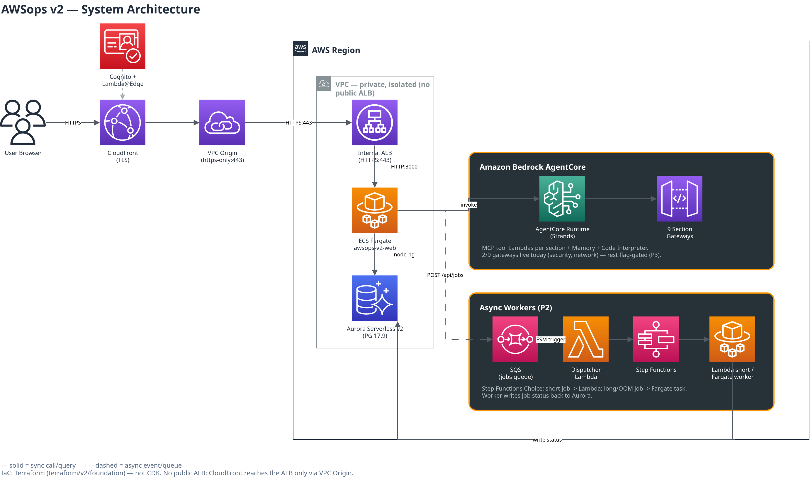

# AWSops Dashboard

[](https://github.com/Atom-oh/awsops/stargazers)
[](https://github.com/Atom-oh/awsops/network/members)
[](https://github.com/Atom-oh/awsops/issues)
[](LICENSE)
[](https://github.com/Atom-oh/awsops/releases)
[](https://github.com/Atom-oh/awsops/commits/main)
[](https://github.com/Atom-oh/awsops/actions/workflows/pr-review.yml)

<a href="#english"></a>
<a href="#korean"></a>

AWS + Kubernetes operations dashboard with real-time monitoring, a private CloudFront/Fargate edge, Aurora Serverless v2 state, and AI-powered diagnosis via Amazon Bedrock AgentCore. | 비공개 CloudFront/Fargate 엣지, Aurora Serverless v2 상태 저장, Amazon Bedrock AgentCore 기반 AI 진단을 갖춘 실시간 모니터링 AWS + Kubernetes 운영 대시보드입니다.

---

<a id="english"></a>

# English

## Overview

AWSops v2 is a single-pane operations dashboard for AWS and Kubernetes, rebuilt as a Terraform-based MSA: a private edge (CloudFront VPC Origin → internal ALB → ECS Fargate), Cognito + Lambda@Edge auth, Aurora Serverless v2 persistent state, AgentCore section agents for live AWS queries, and an OOM-safe async worker tier. The previous v1 architecture (single EC2, CDK, embedded Steampipe) is being decommissioned per ADR-016 — see [docs/decisions/016-v1-decommission.md](docs/decisions/016-v1-decommission.md).



```
Internet -> CloudFront (TLS, Lambda@Edge Cognito auth) -> VPC Origin (https-only) -> internal ALB (HTTPS)
  -> ECS Fargate: Next.js 14 thin-BFF :3000 (arm64, no basePath) -> Aurora Serverless v2 (PG 17.9, node-pg)
  -> Amazon Bedrock AgentCore: Runtime (Strands) + 9 section Gateways + Memory + Code Interpreter
  -> async workers: POST /api/jobs -> SQS -> Step Functions -> Lambda or Fargate worker
```

Stats: 21 pages, 65 API routes, 72 components (`web/`), 16 consolidated ADRs, Terraform-managed (`terraform/v2/foundation`, no CDK).

> **No public ALB.** The edge is fully private — CloudFront reaches the ALB only through a VPC Origin, and the ALB only accepts traffic from CloudFront's managed security group. v2's posture is a **read-only ops dashboard + AI diagnosis**: AWS-resource mutation and autonomous remediation are FROZEN by design (ADR-005) — infra changes stay with the operator's own IaC/Change Manager, with one narrowly-scoped exception for self-healing service restarts (ADR-015).

## Features

- **Resource inventory** -- EC2, EKS, Lambda, ECS clusters/tasks, ECR, storage/DB, network, and security groupings, derived from Aurora-persisted inventory snapshots (with an optional flag-gated Steampipe sync layer).
- **AI assistant** -- Bedrock AgentCore Runtime (Strands agent) routes each question to 1-3 of 9 section gateways in parallel and synthesizes the result, with SSE streaming, AgentCore Memory (conversation history), and a Python Code Interpreter.
- **CIS compliance** -- Powerpipe benchmark runs with history (`compliance_runs`/`compliance_results`), flag-gated.
- **Cost and FinOps** -- Cost Explorer, Bedrock usage/spend tracking, and 14-day resource-trend charts on the dashboard.
- **Async diagnosis and jobs** -- long-running work (AI diagnosis reports, compliance scans) is enqueued via `POST /api/jobs` to an SQS + Step Functions + Lambda/Fargate worker tier — the web tier never blocks on OOM-risk work.
- **EKS onboarding** -- interactive `configure.mjs` flow grants the web task role an EKS Access Entry with view access, per cluster.

### AI Gateways (Amazon Bedrock AgentCore)

9 section gateways are defined in Terraform (`ai.tf`); each is provisioned idempotently and routes to Lambda-backed MCP tools. **Only 2 of the 9 are live today** (the rest are flag-gated behind `agentcore_enabled`/`integrations_enabled`, default off) — the table below is the target shape, not the current deployed state.

| Gateway | Capabilities | Status |
|---------|--------------|--------|
| network | VPC, ENI, reachability, flow logs, TGW, VPN, firewall | ✅ live (flow-monitor slice) |
| security | IAM, policy simulation, CIS/benchmark | ✅ live (iam-mcp slice, 14 tools) |
| container | EKS, ECS, Istio, Kubernetes | flag-gated |
| data | DynamoDB, RDS/Aurora, ElastiCache, MSK, OpenSearch | flag-gated |
| cost | Cost Explorer, forecast, budgets, container cost | flag-gated |
| monitoring | CloudWatch, CloudTrail | flag-gated |
| iac | CloudFormation, CDK, Terraform | flag-gated |
| ops | Steampipe SQL listing/status/docs/inventory | flag-gated |
| external-obs | External observability & integrations (Prometheus, ClickHouse, Notion) | flag-gated |

Models: Claude Sonnet 5 (default), Opus 4.8 (deep analysis), Haiku 4.5 (fast/low-cost).

## Prerequisites

- Terraform >= 1.15 (S3 native state locking via `use_lockfile`)
- Node.js >= 18 (configurator TUI, migration scripts)
- Docker with buildx (arm64 image builds)
- AWS CLI configured with credentials for the target account
- kubectl and a kubeconfig, if onboarding EKS clusters

## Installation

```bash
# Clone the repository
git clone https://github.com/Atom-oh/awsops.git
cd awsops

# Interactive TUI: choose new/existing VPC, domain, bucket, EKS clusters
make configure          # -> terraform.tfvars + backend.hcl

# Provision the foundation stack
terraform -chdir=terraform/v2/foundation init -backend-config=backend.hcl
terraform -chdir=terraform/v2/foundation plan -out tfplan
terraform -chdir=terraform/v2/foundation apply tfplan

# Build + push the web image, roll ECS, wait for /api/health
make deploy

# After apply: build/push the agent image, run the idempotent AgentCore provisioner
make agentcore

# After apply with workers_enabled=true: build/push the worker image
make workers
```

## Usage

```bash
make help              # list all available targets
make migrate-status    # offline: app version + each pending migration's release
DRY_RUN=1 make migrate  # preview pending DB migrations before applying
make upgrade            # safe release upgrade: RDS snapshot -> migrate -> deploy
```

## Configuration

Runtime configuration is **flag-gated in Terraform** (`variables.tf`), all default `false` so a fresh `plan` is a no-op:

| Flag | Gates |
|------|-------|
| `agentcore_enabled` | 21 of the AgentCore Lambda slices |
| `integrations_enabled` | remaining 6 AgentCore Lambda slices |
| `workers_enabled` | the async worker tier (SQS/SFN/Lambda/Fargate) |
| `steampipe_enabled` | the Steampipe inventory-sync data layer |

AgentCore's own config (runtime ARN, Memory ID, Code Interpreter ID) is written to SSM (`/ops/awsops-v2/agentcore/*`) by the provisioner and read by the web BFF at runtime — never passed via task-def `valueFrom` (avoids a startup race).

## Project Structure

```
awsops/
  web/                    # Next.js 14 thin-BFF: 21 pages, 65 API routes, 72 components
  agent/                  # Strands Agent (Runtime source) + MCP Lambda tool sources
  terraform/v2/foundation/  # single Terraform root: network, edge, auth, data, workload, ai, workers, eks
  scripts/v2/             # configure/deploy/migrate/agentcore/workers tooling (all Node.js/Python)
  tests/                  # repo-wide hook/structure tests + PR-review/Steampipe/ExternalId wiring checks
  docs/                   # guides, runbooks, decisions/ (BASELINE.md + 16 consolidated ADRs)
  docs-site/              # Docusaurus user guide (deployed separately)
```

## Testing

```bash
bash scripts/v2/merge-verify.sh   # Python pytest (scripts/v2 + agent) + web vitest + terraform validate
bash tests/run-all.sh             # repo-wide hook/structure tests + agent Python unittests
cd web && npx vitest run          # web unit tests only
```

## API Documentation

The 65 API routes live under `web/app/api/`. Key routes: `health` (public), `stream` (SSE chat), `db` (Aurora ping), `jobs` (+`/[id]`, async job submission/status), `security`, `compliance`, `auth/login`. See the docs site for user-facing guidance and [docs/decisions/BASELINE.md](docs/decisions/BASELINE.md) for architectural decisions.

## Contributing

1. Fork the repository
2. Create your branch (`git checkout -b feat/amazing-feature`)
3. Commit your changes (`git commit -m 'feat: add amazing feature'`)
4. Push to the branch (`git push origin feat/amazing-feature`)
5. Open a Pull Request

## License

Licensed under the MIT License. See [LICENSE](LICENSE) for details.

## Contact

- Maintainer: [Atom-oh](https://github.com/Atom-oh)
- Issues: [github.com/Atom-oh/awsops/issues](https://github.com/Atom-oh/awsops/issues)

---

<a id="korean"></a>

# 한국어

## 개요

AWSops v2는 AWS와 Kubernetes를 위한 단일 화면 운영 대시보드로, Terraform 기반 MSA로 재구축되었습니다: 비공개 엣지(CloudFront VPC Origin → 내부 ALB → ECS Fargate), Cognito + Lambda@Edge 인증, Aurora Serverless v2 영속 상태, 라이브 AWS 조회를 수행하는 AgentCore 섹션 에이전트, OOM-안전 비동기 워커 계층으로 구성됩니다. 이전 v1 아키텍처(단일 EC2, CDK, 내장 Steampipe)는 ADR-016에 따라 폐기 진행 중입니다 — [docs/decisions/016-v1-decommission.md](docs/decisions/016-v1-decommission.md) 참조.


```
Internet -> CloudFront (TLS, Lambda@Edge Cognito 인증) -> VPC Origin (https-only) -> 내부 ALB (HTTPS)
  -> ECS Fargate: Next.js 14 thin-BFF :3000 (arm64, basePath 없음) -> Aurora Serverless v2 (PG 17.9, node-pg)
  -> Amazon Bedrock AgentCore: Runtime (Strands) + 9 섹션 Gateway + Memory + Code Interpreter
  -> 비동기 워커: POST /api/jobs -> SQS -> Step Functions -> Lambda 또는 Fargate 워커
```

현황: 21 페이지, 65 API 라우트, 72 컴포넌트(`web/`), 16개 통합 ADR, Terraform 관리(`terraform/v2/foundation`, CDK 없음).

> **공개 ALB 없음.** 엣지는 완전히 비공개입니다 — CloudFront는 VPC Origin을 통해서만 ALB에 도달하고, ALB는 CloudFront 관리형 보안 그룹의 트래픽만 허용합니다. v2의 자세는 **read-only 운영 대시보드 + AI 진단**입니다: AWS 리소스 변경·자율 조치는 설계상 FROZEN(ADR-005) — 인프라 변경은 운영자 자신의 IaC/Change Manager가 담당하며, 자가치유 서비스 재시작 하나만 좁게 예외 허용됩니다(ADR-015).

## 주요 기능

- **리소스 인벤토리** -- EC2, EKS, Lambda, ECS 클러스터/태스크, ECR, 스토리지/DB, 네트워크, 보안 그룹핑을 Aurora에 저장된 인벤토리 스냅샷 기반으로 제공(선택적 flag-gated Steampipe sync 계층 포함).
- **AI 어시스턴트** -- Bedrock AgentCore Runtime(Strands 에이전트)이 각 질문을 9개 섹션 게이트웨이 중 1~3개로 병렬 라우팅한 뒤 결과를 통합하며, SSE 스트리밍·AgentCore Memory(대화 히스토리)·Python Code Interpreter를 지원합니다.
- **CIS 컴플라이언스** -- Powerpipe 벤치마크 실행 이력 관리(`compliance_runs`/`compliance_results`), flag-gated.
- **비용 및 FinOps** -- Cost Explorer, Bedrock 사용량/비용 추적, 대시보드의 14일 리소스 트렌드 차트.
- **비동기 진단·작업** -- AI 진단 리포트, 컴플라이언스 스캔 등 장시간 작업은 `POST /api/jobs`로 SQS + Step Functions + Lambda/Fargate 워커 계층에 큐잉 — 웹 티어는 OOM 위험 작업을 절대 직접 실행하지 않습니다.
- **EKS 온보딩** -- 대화형 `configure.mjs` 플로우로 클러스터별 웹 태스크 역할에 view 권한 EKS Access Entry를 부여합니다.

### AI 게이트웨이 (Amazon Bedrock AgentCore)

Terraform(`ai.tf`)에 9개 섹션 게이트웨이가 정의되어 있으며, 각각 멱등하게 프로비저닝되어 Lambda 기반 MCP 도구로 라우팅됩니다. **현재 9개 중 2개만 live**입니다(나머지는 `agentcore_enabled`/`integrations_enabled` 플래그 뒤에 게이트, 기본 비활성) — 아래 표는 목표 형태이며 현재 배포 상태가 아닙니다.

| Gateway | 주요 기능 | 상태 |
|---------|-----------|------|
| network | VPC, ENI, reachability, flow logs, TGW, VPN, firewall | ✅ live (flow-monitor 슬라이스) |
| security | IAM, 정책 시뮬레이션, CIS/benchmark | ✅ live (iam-mcp 슬라이스, 14 도구) |
| container | EKS, ECS, Istio, Kubernetes | flag-gated |
| data | DynamoDB, RDS/Aurora, ElastiCache, MSK, OpenSearch | flag-gated |
| cost | Cost Explorer, forecast, budgets, 컨테이너 비용 | flag-gated |
| monitoring | CloudWatch, CloudTrail | flag-gated |
| iac | CloudFormation, CDK, Terraform | flag-gated |
| ops | Steampipe SQL listing/status/docs/inventory | flag-gated |
| external-obs | 외부 옵저버빌리티 & 연동(Prometheus, ClickHouse, Notion) | flag-gated |

모델: Claude Sonnet 5(기본), Opus 4.8(심층 분석), Haiku 4.5(빠르고 저렴).

## 사전 요구 사항

- Terraform >= 1.15 (S3 native state locking, `use_lockfile`)
- Node.js >= 18 (구성 TUI, 마이그레이션 스크립트)
- Docker with buildx (arm64 이미지 빌드)
- 대상 계정 자격 증명이 설정된 AWS CLI
- EKS 클러스터를 온보딩한다면 kubectl 및 kubeconfig

## 설치 방법

```bash
# 저장소 복제
git clone https://github.com/Atom-oh/awsops.git
cd awsops

# 대화형 TUI: VPC/도메인/버킷/EKS 클러스터 선택
make configure          # -> terraform.tfvars + backend.hcl

# foundation 스택 프로비저닝
terraform -chdir=terraform/v2/foundation init -backend-config=backend.hcl
terraform -chdir=terraform/v2/foundation plan -out tfplan
terraform -chdir=terraform/v2/foundation apply tfplan

# web 이미지 빌드+푸시, ECS 롤링, /api/health 대기
make deploy

# apply 이후: agent 이미지 빌드+푸시, 멱등 AgentCore provisioner 실행
make agentcore

# workers_enabled=true로 apply 이후: worker 이미지 빌드+푸시
make workers
```

## 사용법

```bash
make help               # 사용 가능한 전체 타겟 목록
make migrate-status     # 오프라인: 앱 버전 + 각 미적용 마이그레이션의 release
DRY_RUN=1 make migrate  # DB 마이그레이션 적용 전 미리보기
make upgrade             # 안전한 릴리스 업그레이드: RDS 스냅샷 -> migrate -> deploy
```

## 환경 설정

런타임 설정은 **Terraform에서 flag-gated**(`variables.tf`)이며, 모두 기본값 `false`라 갓 받은 상태에서 `plan`은 no-op입니다:

| Flag | 게이트 대상 |
|------|-------------|
| `agentcore_enabled` | AgentCore Lambda 슬라이스 21개 |
| `integrations_enabled` | 나머지 AgentCore Lambda 슬라이스 6개 |
| `workers_enabled` | 비동기 워커 계층(SQS/SFN/Lambda/Fargate) |
| `steampipe_enabled` | Steampipe 인벤토리 sync 데이터 계층 |

AgentCore 자체 설정(runtime ARN, Memory ID, Code Interpreter ID)은 provisioner가 SSM(`/ops/awsops-v2/agentcore/*`)에 기록하고 web BFF가 런타임에 읽습니다 — 시작 시 레이스를 피하기 위해 task-def `valueFrom`으로는 절대 전달하지 않습니다.

## 프로젝트 구조

```
awsops/
  web/                      # Next.js 14 thin-BFF: 21 페이지, 65 API 라우트, 72 컴포넌트
  agent/                    # Strands Agent(Runtime 소스) + MCP Lambda 도구 소스
  terraform/v2/foundation/  # 단일 Terraform 루트: network, edge, auth, data, workload, ai, workers, eks
  scripts/v2/               # configure/deploy/migrate/agentcore/workers 도구(전부 Node.js/Python)
  tests/                    # repo 전반의 hook/structure 테스트 + PR-review/Steampipe/ExternalId 배선 체크
  docs/                     # 가이드, 런북, decisions/(BASELINE.md + 통합 ADR 16개)
  docs-site/                # Docusaurus 사용자 가이드(별도 배포)
```

## 테스트

```bash
bash scripts/v2/merge-verify.sh   # Python pytest(scripts/v2 + agent) + web vitest + terraform validate
bash tests/run-all.sh             # repo 전반 hook/structure 테스트 + agent Python unittest
cd web && npx vitest run          # web 유닛 테스트만
```

## API 문서

65개 API 라우트가 `web/app/api/`에 있습니다. 주요 라우트: `health`(공개), `stream`(SSE 채팅), `db`(Aurora ping), `jobs`(+`/[id]`, 비동기 작업 제출/상태), `security`, `compliance`, `auth/login`. 사용자 가이드는 docs site를, 아키텍처 결정은 [docs/decisions/BASELINE.md](docs/decisions/BASELINE.md)를 참고하세요.

## 기여 방법

1. 저장소를 Fork 합니다
2. 브랜치를 생성합니다 (`git checkout -b feat/amazing-feature`)
3. 변경 사항을 커밋합니다 (`git commit -m 'feat: add amazing feature'`)
4. 브랜치에 Push 합니다 (`git push origin feat/amazing-feature`)
5. Pull Request를 엽니다

## 라이선스

MIT License로 배포됩니다. 자세한 내용은 [LICENSE](LICENSE)를 참고하세요.

## 연락처

- 메인테이너: [Atom-oh](https://github.com/Atom-oh)
- 이슈: [github.com/Atom-oh/awsops/issues](https://github.com/Atom-oh/awsops/issues)
