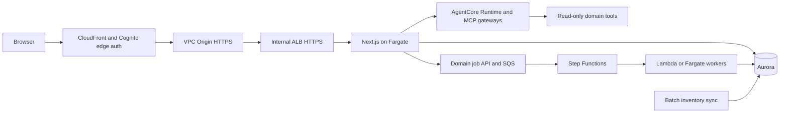

# AWSops Dashboard

AWS and Kubernetes operations dashboard with inventory, monitoring, topology,
security/compliance visibility and AI-assisted diagnosis. The application proposes
remediation; AWS-resource mutation and autonomous remediation remain frozen under
[ADR-005](docs/decisions/005-aws-mutation-autonomy-frozen.md). The only default-off
owner exception is the host web-service restart after its own Aurora secret rotation,
with unchanged image/task definition ([ADR-015](docs/decisions/015-operational-self-healing.md)).

## Architecture


```mermaid
flowchart LR
  Browser --> CF[CloudFront and Cognito edge auth]
  CF --> VO[VPC Origin HTTPS]
  VO --> ALB[Internal ALB HTTPS]
  ALB --> Web[Next.js on Fargate]
  Web --> DB[(Aurora)]
  Web --> AI[AgentCore Runtime and MCP gateways]
  AI --> Read[Read-only domain tools]
  Web --> Jobs[Domain job API and SQS]
  Jobs --> SFN[Step Functions]
  SFN --> Workers[Lambda or Fargate workers]
  Workers --> DB
  Sync[Batch inventory sync] --> DB
```

The web application serves `/` and `/api/*` from an arm64 standalone container.
CloudFront reaches an internal ALB through a VPC Origin; the ALB must remain internal.
Aurora holds application state and inventory snapshots. AgentCore MCP tools provide
live domain reads. Heavy diagnosis/compliance jobs run outside the web process.

Steampipe supplies optional **batch inventory ingestion** and the Powerpipe CIS
worker's FDW query path. Disabling it also removes that benchmark dependency. The old live SQL chat and
collector paths remain disabled. Cross-account reads use registered target roles;
the host account uses its execution role directly. External observability connectors
are governed separately from AWS-resource mutation by
[ADR-007](docs/decisions/007-external-data-integration-governance.md).

## Capabilities

- Inventory and detail views across compute, Kubernetes, storage, databases, network
  and security, with account/region scoping and collection freshness.
- AI chat and asynchronous diagnosis using configured Bedrock models and AgentCore
  section gateways, with streamed progress and persisted reports.
- Topology combines resource relationships, service traces and network evidence.
  A configured relationship does not prove traffic; partial/unavailable telemetry
  must remain visible. See [observability reference](docs/reference/observability-e2e.md).
- Cost analysis, security/compliance findings and diagnosis evidence help operators
  prioritize investigations. Unassessed checks are not successful checks.
- Curated external connectors and narrowly governed notifications. Availability
  depends on feature gates, IAM, configured data sources and telemetry coverage.

These are supported code paths, not a claim that every deployment enables them.
[BASELINE.md](docs/decisions/BASELINE.md) defines the gate/freeze register. Default-off
features do not make a newly provisioned foundation cost-free.

`legacy_email_owner_match` is a default-true migration switch. `make backfill-owner-sub`
creates a preview only; disable the switch only after a completed reviewed apply and
zero residual legacy rows. The current tool cannot apply an empty plan; a zero-row
preview alone does not authorize cutover. See [ADR-009](docs/decisions/009-async-worker-backbone.md).

## Development

Use Node.js 20 (matching CI and the web image), Python with the subsystem requirements,
and Docker for disposable PostgreSQL integration tests. Deployment additionally
requires AWS CLI credentials, Terraform matching
`terraform/v2/foundation/backend.tf`, and Docker buildx with arm64 support.

```bash
npm ci --prefix web
(cd web && npm run dev)
(cd web && npx vitest run)
(cd web && npm run build)
python3 -m unittest discover -s scripts/pr-review -p 'test_*.py' -v
bash scripts/v2/merge-verify.sh
```

There is no root package.json or web lint command. Configuration and connection
requirements are in [onboarding](docs/onboarding.md); verification boundaries are in
[merge verification](docs/v2-merge-verification.md).

## Deployment

This origin repository uses `terraform/v2/foundation/`. The
`aws-samples/sample-awsops` public sample uses `terraform/foundation/`; follow the
target repository's README and CI rather than copying paths between layouts.

```bash
make configure
terraform -chdir=terraform/v2/foundation init -backend-config=backend.hcl
terraform -chdir=terraform/v2/foundation validate
terraform -chdir=terraform/v2/foundation plan -out tfplan
# Review tfplan, then the controller applies that exact saved plan.
make deploy
```

`make deploy` runs migrations, builds/pushes the arm64 web image, rolls ECS, waits
for stability and checks `/api/health`. AgentCore and worker images have separate
Make targets; `make agentcore` requires prior Terraform apply and `make migrate`.
MCP Lambda code is shipped by Terraform. See the
[deployment commands and prerequisites](CLAUDE.md) before operating a live stack.

## Documentation and review

[Documentation map](docs/README.md) -> [architecture](docs/architecture.md) ->
[decision baseline](docs/decisions/BASELINE.md) -> [implementation references](docs/reference/README.md).
`CLAUDE.md` is the context source; generated `AGENTS.md` is shared across reviewers.
Developer docs use English; multilingual product guides under `docs-site/` remain.
Historical plans/reviews are not current policy or proof of deployment.

PRs require review of their latest HEAD, resolution of verified Critical/Major
findings and passing required checks. Missing or partial AI coverage is not a pass.
[CHANGELOG.md](CHANGELOG.md) records local integration changes under `[Unreleased]`;
imported upstream releases do not establish this deployment's version.

v1 app code is archived in git at `v1-pre-code-removal-20260712`. Its CDK/EC2,
`/awsops` basePath and local JSON/Steampipe rules do not apply to v2.

See [LICENSE](LICENSE).
