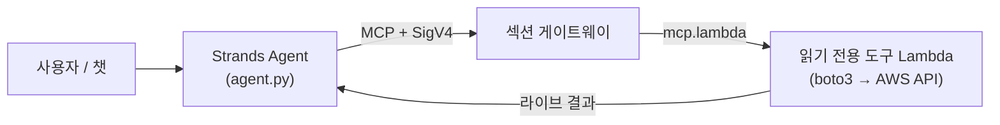
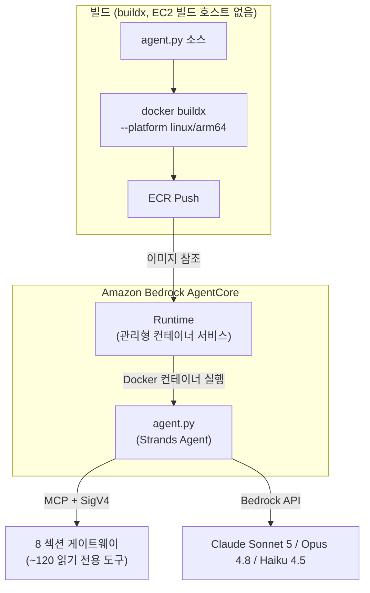
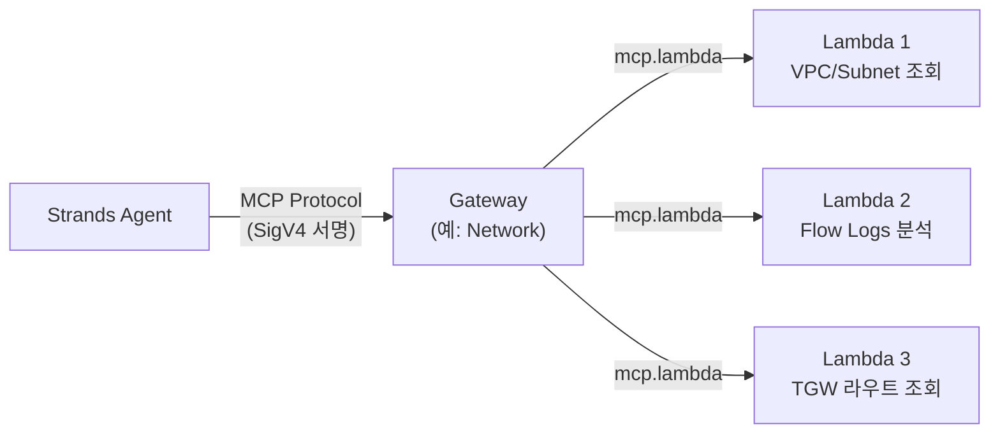
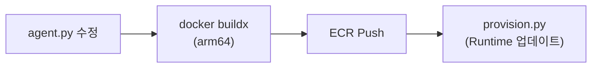
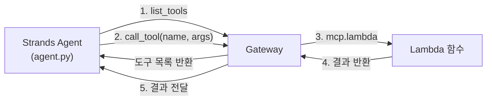
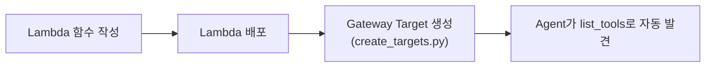
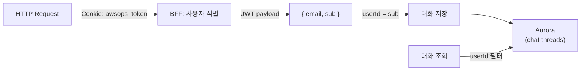

# AgentCore & 메모리 기술 FAQ

AgentCore Runtime, Gateway, 라이브 AWS 조회 경로, Memory Store 등 AI 엔진 내부 동작에 대한 심화 질문과 답변입니다.

## AgentCore가 라이브 AWS 조회의 기본(primary) 경로인 이유는?

AWSops의 **라이브 AWS 데이터는 AgentCore MCP Lambda 도구를 통해 조회**됩니다. 과거 레거시 앱이 임베디드 Steampipe로 직접 쿼리하던 방식을 대체한 것입니다.



### 핵심 포인트

| 항목 | 내용 |
|------|------|
| **라이브 조회** | AgentCore MCP Lambda 도구(약 120개, 읽기 전용)가 boto3로 AWS API를 직접 호출 |
| **Steampipe의 역할** | 라이브 쿼리 엔진이 **아님**. `steampipe_enabled` 플래그로만 켜지는 **인벤토리 sync**(기본 OFF)일 뿐 — 로컬 9193 서비스/pg Pool 없음 |
| **게이트** | AgentCore 전체는 `agentcore_enabled` Terraform 플래그로 게이트(기본 OFF → `plan` = No changes, $0) |
| **읽기 전용** | 모든 도구는 read-only (ADR-041 / 2026-06-11 번복: AWS-리소스 변경+자율은 영구 동결) |

:::info Steampipe는 더 이상 라이브 엔진이 아닙니다
라이브 AWS 상태는 항상 AgentCore 도구가 답합니다. Steampipe는 켜질 경우 Fargate에서 워밍업되어 인벤토리를 Aurora로 sync하는 보조 경로일 뿐이며, 기본값은 비활성입니다.
:::

## AgentCore Runtime은 무엇이고, Strands Agent와의 관계는?

AgentCore Runtime과 Strands Agent는 서로 다른 레이어에서 동작합니다.



### AgentCore Runtime

- AWS가 관리하는 **서버리스 컨테이너 실행 환경**
- Docker 이미지(ECR)를 지정하면 자동으로 컨테이너를 실행/스케일링
- Cold Start 관리, 네트워크 설정, IAM Role 등을 처리
- `InvokeAgentRuntime`으로 호출

### Strands Agent Framework

- **Python 기반 AI 에이전트 프레임워크** (`agent/agent.py`)
- LLM(Bedrock)에게 도구를 제공하고, 도구 호출 결과를 다시 LLM에 전달하는 루프
- MCP 프로토콜로 게이트웨이에 연결하여 도구를 사용

### 관계 정리

| 항목 | AgentCore Runtime | Strands Agent |
|------|------------------|---------------|
| 역할 | 컨테이너 실행 환경 | AI 에이전트 로직 |
| 레벨 | 인프라 | 애플리케이션 |
| 관리 주체 | AWS | 개발자 |
| 코드 위치 | AWS 서비스 | `agent/agent.py` |
| 설정 | Terraform / 멱등 provisioner | Python 코드 |

## Gateway와 Lambda는 어떤 관계인가요? 게이트웨이는 몇 개인가요?

Gateway는 **MCP 프로토콜 라우터**이고, Lambda는 **실제 AWS API를 실행하는 읽기 전용 백엔드**입니다.



### 섹션 게이트웨이는 8개입니다 (ADR-004)

`network · container · data · security · cost · monitoring · iac · ops` — 총 **8개**입니다.

| 항목 | 내용 |
|------|------|
| **게이트웨이 수** | ADR-004에 따라 **8개로 고정** |
| **도구 수** | 약 **120개**, 전부 읽기 전용 — 함대가 확장되면 변동(고정 수치 아님) |
| **외부 관측성** | 9번째 게이트웨이가 **아님** — 별도의 **Integrations 축**(ADR-039)으로 분리 |
| **프로토콜** | MCP(Model Context Protocol) 표준 |

- Agent가 `list_tools`로 사용 가능한 도구 목록을 조회
- Agent가 도구를 선택하면 Gateway가 해당 Lambda를 호출
- Gateway Target 생성 시 `mcp.lambda` 프로토콜과 `credentialProviderConfigurations` 지정

### 왜 Lambda를 사용하나요?

| 이유 | 설명 |
|------|------|
| **격리** | 각 도구가 독립 실행, 하나가 실패해도 다른 도구에 영향 없음 |
| **권한 분리** | Lambda별로 최소 권한 IAM Role 부여 가능 |
| **스케일링** | 동시 호출 시 자동 스케일링 |
| **비용** | 호출 시에만 과금, 유휴 비용 없음 |

:::caution Gateway Target 생성 시 주의
CLI의 `--inline-payload` 옵션은 JSON 파싱 이슈가 있습니다. **Python/boto3**로 생성해야 합니다. 또한 갓 만든 게이트웨이가 `READY` 전이면 첫 Target 생성이 `ValidationException`을 던질 수 있는데, provisioner가 멱등하므로 재실행으로 해소됩니다.
:::

## 단일 계정인데 "cross-account 차단" 오류가 나는 이유는?

AWSops 라이브 환경은 **단일 계정**(`123456789012`)입니다. 그런데 챗에서 **호스트 계정 자신**을 대상 계정으로 고르면, 과거 도구가 호스트에 존재하지 않는 크로스 어카운트 역할을 self-assume하려다 `AccessDenied`가 발생하고, 에이전트가 이를 "cross-account 차단"으로 **오진**했습니다.

### 무엇이 문제였나

- `agent.py`가 `target_account_id = <호스트 계정>`을 강제
- 도구가 `arn:...:role/AWSopsReadOnlyRole`을 self-assume 시도
- 이 역할은 **온보딩된 *타깃* 계정에만** 존재하고 호스트에는 없음 → `AccessDenied`
- 에이전트가 원인을 오해 → "cross-account 차단" 메시지

### 수정 (defense-in-depth)

| 위치 | 동작 |
|------|------|
| `cross_account.get_role_arn()` | 대상 == 호스트면 **`None` 반환** → AssumeRole 없이 Lambda 실행 역할 직접 사용 |
| `agent.py effective_account_id()` | 호스트 계정을 `__all__`처럼 **blank** 처리 → 같은 계정 접근에는 prefix 미부여 |
| 호스트 판별 | `AWSOPS_HOST_ACCOUNT_ID` env → 없으면 STS `GetCallerIdentity` 폴백 (웜 컨테이너 캐시) |

진짜 *다른* 계정을 assume하는 정상 경로는 그대로 유지됩니다.

:::tip 단일 계정에서 "내 계정"을 고른 경우
이제 호스트 계정 선택은 self-assume 없이 실행 역할을 직접 쓰므로 정상 동작합니다. 다른(온보딩된) 계정 선택만 STS AssumeRole 경로를 탑니다.
:::

## AgentCore 설정값은 어디에 저장되나요?

**SSM Parameter Store가 source of truth**입니다. 멱등 provisioner(`scripts/v2/agentcore/provision.py`)가 생성한 리소스 식별자를 SSM에 기록하고, 웹 thin-BFF가 런타임에 읽습니다.

### SSM 경로 (`/ops/awsops-v2/agentcore/...`)

| 파라미터 | 값 |
|----------|-----|
| `/ops/awsops-v2/agentcore/runtime_arn` | AgentCore Runtime ARN |
| `/ops/awsops-v2/agentcore/interpreter_id` | Code Interpreter ID |
| `/ops/awsops-v2/agentcore/memory_id` | Memory Store ID |

### 왜 SSM인가? (valueFrom 레이스 회피)

- provisioner가 **apply 이후** 리소스를 생성 → 식별자를 SSM에 기록
- 웹 BFF는 런타임에 SSM에서 read (캐싱)
- ECS task def의 `secrets` `valueFrom`을 쓰지 않음 → provision 시점과 task 시작 시점 사이의 **레이스 컨디션 회피**

:::info SSM 예약 prefix 주의
`aws...`로 시작하는 SSM 경로는 예약어로 거부됩니다. 그래서 `/ops/${project}/...` 형태를 사용합니다.
:::

## Docker arm64 빌드가 필수인 이유는? (EC2 빌드 호스트는 없습니다)

AgentCore Runtime은 **AWS Graviton(ARM64)** 프로세서에서 실행됩니다.

```bash
# 올바른 빌드 명령 — buildx로 arm64 크로스 빌드
docker buildx build --platform linux/arm64 -t awsops-agent .

# ECR 푸시
docker tag awsops-agent:latest $ECR_URI:latest
docker push $ECR_URI:latest
```

### x86(amd64)로 빌드하면?

컨테이너가 시작되지 않거나 `exec format error`가 발생합니다. Runtime 상태가 `FAILED`로 전환됩니다.

### 전용 EC2 빌드 인스턴스는 없습니다

레거시 앱과 달리 AWSops에는 **별도의 t4g 빌드 호스트가 없습니다.** web/agent/worker 이미지 모두 `docker buildx --platform linux/arm64`로 빌드합니다. Apple Silicon(M1/M2/M3)은 네이티브 ARM64이지만, Intel Mac 등 amd64 환경에서도 `--platform linux/arm64`만 명시하면 동일하게 arm64 이미지를 만들 수 있습니다.

## agent.py를 수정하면 어떻게 재배포하나요?

`make agentcore`가 arm64 이미지를 빌드/푸시하고 멱등 provisioner를 실행합니다.



### 절차

```bash
make agentcore          # arm64 agent 이미지 빌드/푸시 + 멱등 provisioner
make agentcore --smoke  # 추가로 호출 검증
```

provisioner는 멱등하므로 안전하게 재실행할 수 있습니다(예: 첫 Target 생성이 게이트웨이 미준비로 실패했을 때).

:::tip 게이트웨이 라우팅은 환경변수로 주입
`agent.py`는 게이트웨이 URL을 코드에 하드코딩하지 않고 `GATEWAYS_JSON` 환경변수로 주입받습니다. 따라서 게이트웨이 라우팅 변경이 곧바로 Docker 재빌드를 요구하지는 않습니다.
:::

## MCP 프로토콜이란? 도구 디스커버리는 어떻게 동작하나요?

### MCP (Model Context Protocol)

MCP는 AI 에이전트가 외부 도구를 **표준화된 방식으로 호출**하기 위한 프로토콜입니다. AWSops에서는 Strands Agent가 MCP를 통해 게이트웨이의 읽기 전용 도구에 접근합니다.



### SigV4 서명 통신

Gateway 연결은 AWS SigV4 서명이 필요합니다(`agent/streamable_http_sigv4.py`). 에이전트의 자격증명으로 서명한 MCP StreamableHTTP 전송을 사용합니다.

### 도구 디스커버리 (Tool Discovery)

Agent가 Gateway에 연결하면 **페이지네이션**으로 전체 도구 목록을 조회한 뒤, 이를 LLM에 제공합니다. LLM(Bedrock)이 사용자 질문을 보고 **어떤 도구를 호출할지 스스로 결정**하므로, 개발자가 도구 선택 로직을 작성할 필요가 없습니다.

## Gateway에 새 도구(Lambda)를 추가하려면?

### 전체 흐름



### Step 1: Lambda 함수 작성

`agent/lambda/` 디렉토리에 MCP 핸들러 패턴을 따르는 Python 파일을 생성합니다:

```python
# agent/lambda/my_new_mcp.py
import json
import boto3

def lambda_handler(event, context):
    params = event if isinstance(event, dict) else json.loads(event)
    t = params.get("tool_name", "")
    args = params.get("arguments", params)

    if t == "my_new_tool":
        client = boto3.client('ec2')
        result = client.describe_instances(**args)  # 읽기 전용
        return {"statusCode": 200, "body": json.dumps(result, default=str)}

    return {"statusCode": 400, "body": "Unknown tool"}
```

### Step 2: Gateway Target 생성

`agent/lambda/create_targets.py`에 도구 스키마를 추가하고 boto3로 Target을 생성합니다:

```python
client.create_gateway_target(
    gatewayIdentifier=gw_id,
    targetConfiguration={
        'mcp': {'lambda': {
            'lambdaArn': arn,
            'toolSchema': {'inlinePayload': tools}  # {name, description, inputSchema}
        }}
    },
    credentialProviderConfigurations=[
        {'credentialProviderType': 'GATEWAY_IAM_ROLE'}  # 필수
    ]
)
```

### Step 3: 자동 발견

새 도구가 추가되면 Agent가 `list_tools`로 자동 발견합니다. Docker 재빌드는 `agent.py` 자체를 수정한 경우에만 필요합니다.

:::tip 크로스 어카운트 지원
`create_targets.py`가 모든 도구에 `target_account_id` 파라미터를 주입합니다. Lambda에서 `cross_account.py`의 `get_client()`를 사용하면 STS AssumeRole로 *다른* 계정의 리소스에 접근할 수 있습니다(대상이 호스트면 self-assume 없이 실행 역할 직접 사용).
:::

## Lambda 도구 함수는 어떤 구조인가요?

모든 도구 Lambda는 동일한 MCP 핸들러 패턴을 따릅니다:

```python
# 공통 패턴 (예: agent/lambda/aws_cost_mcp.py)
def lambda_handler(event, context):
    # 1. 이벤트 파싱 + 도구 라우팅
    params = event if isinstance(event, dict) else json.loads(event)
    t = params.get("tool_name", "")
    args = params.get("arguments", params)

    # 2. 크로스 어카운트 지원 (대상==호스트면 role_arn=None)
    target_account_id = args.pop('target_account_id', None)
    role_arn = get_role_arn(target_account_id) if target_account_id else None

    # 3. 도구별 분기
    if t == "get_cost_and_usage":
        ce = get_client('ce', 'us-east-1', role_arn)
        resp = ce.get_cost_and_usage(...)
        return ok(resp)
    else:
        return err("Unknown tool")
```

### 공유 모듈: `cross_account.py`

크로스 어카운트 접근을 위한 STS AssumeRole 헬퍼입니다. 자격증명을 **50분 캐싱**하여 반복 호출을 최적화하고, 대상이 호스트 계정과 같으면 `None`을 반환해 self-assume을 방지합니다.

### 규칙

- 모든 Lambda는 **읽기 전용** (도달성 경로 생성 등 일부 예외)
- VPC Lambda(Istio, Steampipe)는 `psycopg2` 대신 `pg8000` 사용
- 도구 스키마 형식: `{name, description, inputSchema: {type, properties, required}}`

## Code Interpreter나 Memory 이름에 하이픈을 쓰면 안 되는 이유는?

AgentCore API의 **네이밍 규칙 제약** 때문입니다 — 이름에는 **언더스코어만** 허용됩니다.

### 영향받는 리소스

| 리소스 | 잘못된 예 | 올바른 예 |
|--------|----------|----------|
| Code Interpreter | `awsops-code-interpreter` | `awsops_code_interpreter` |
| Memory Store | `awsops-memory` | `awsops_memory` |

### 증상

하이픈이 포함된 이름으로 생성 시 `ValidationException`이 발생하거나, 생성은 되지만 호출 시 실패할 수 있으며 에러 메시지가 불명확할 수 있습니다.

### Memory Store 추가 제약

- `eventExpiryDuration`: 최대 **365일**
- 만료된 이벤트는 자동 삭제

AWS가 붙이는 `-XXXXX` suffix는 자동 생성 부분이며, 네이밍 제약은 사용자가 지정하는 이름 부분(`awsops_code_interpreter`, `awsops_memory`)에만 적용됩니다.

## AI 대화 이력은 어디에 저장되고, 사용자별로 어떻게 분리되나요?

대화 이력은 **Aurora**(PostgreSQL 17)에 영속됩니다. 레거시의 로컬 JSON 파일 방식이 아닙니다.



### 동작

| 항목 | 내용 |
|------|------|
| **저장소** | Aurora Serverless v2(PG 17), node-pg 풀(`web/lib/db.ts`) |
| **사용자 식별** | Cognito JWT의 `sub` |
| **UI** | Claude 앱 스타일 사이드바 — `/assistant` 전체 페이지와 리사이즈 가능한 드로어가 동일 히스토리 공유 |
| **렌더링** | 스트리밍 + 마크다운 |

### 인증 흐름

1. **Lambda@Edge**가 CloudFront에서 JWT를 RS256 JWKS 서명 검증
2. 검증 통과한 요청이 ECS Fargate 웹에 도달
3. BFF가 JWT payload에서 `sub`를 사용자 식별자로 사용
4. 미인증 요청은 BFF가 401로 거부합니다(fail-closed) — 식별자는 항상 검증된 Cognito `sub`입니다

## AgentCore Runtime 상태는 어떻게 모니터링하나요?

웹 BFF가 Runtime / Gateway / Code Interpreter 상태를 조회합니다. SSM에서 식별자를 읽은 뒤 AgentCore API로 상태를 가져옵니다.

### Runtime 상태

| 상태 | 의미 | 조치 |
|------|------|------|
| **READY** | 정상 작동 | - |
| **CREATING** | 최초 생성 중 | 수 분 대기 |
| **UPDATING** | 업데이트 중 (Docker 이미지 변경 등) | 수 분 대기 |
| **FAILED** | 오류 — 컨테이너 시작 실패 | Docker 이미지(arm64)/IAM Role/네트워크 확인 |

### 어시스턴트 페이지

AI 어시스턴트는 `/assistant`(전체 페이지)와 어디서나 열 수 있는 리사이즈 드로어에서 사용하며, 두 곳이 동일한 Aurora 대화 이력을 공유합니다.

:::tip 라우팅은 하이브리드(ADR-038)
질문은 정규식 fast-path + Haiku 4.5 분류기 + 프롬프트 캐싱으로 적절한 섹션 에이전트에 라우팅됩니다(LIVE, 캐시 적중 ~59%). 레거시의 고정 다중-라우트 Sonnet 레지스트리가 아닙니다.
:::
