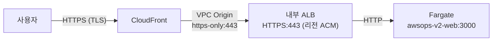
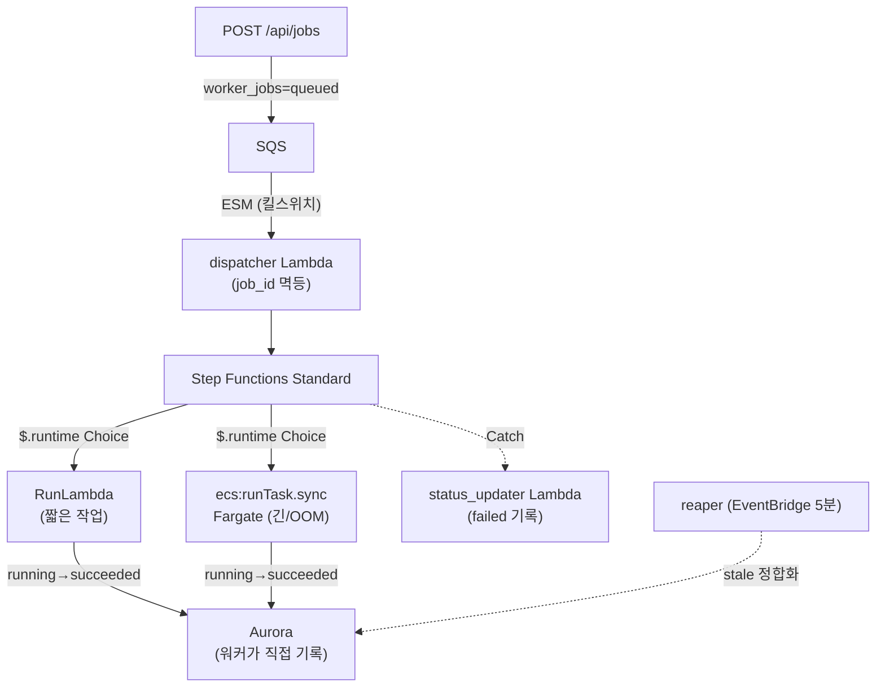
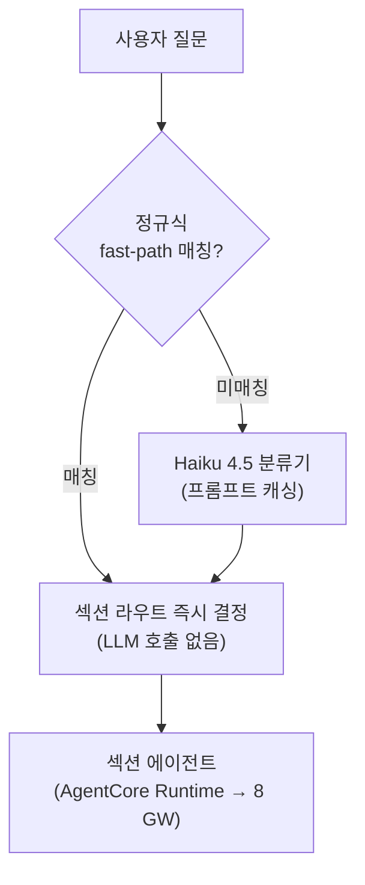
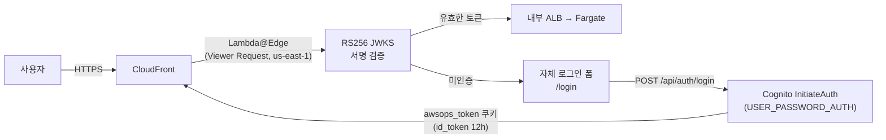

# 아키텍처 심화 FAQ

AWSops의 내부 동작 원리에 대한 심화 기술 FAQ입니다. SRE·아키텍트 관점에서 엣지 경로, 비동기 워커 백본, 데이터 계층, AI 라우팅, 인증, 운영상의 학습을 다룹니다.

:::info 읽기 전용 운영 대시보드
AWSops는 **읽기 전용(read-only) 운영 대시보드 + AI 진단** 도구입니다. **AWS 리소스 변경과 자율 실행(autonomy)은 영구 동결**되어 있습니다. 외부 관측성 데이터 읽기와 거버넌스된 외부 기록/티켓/메시지 쓰기(데이터 레코드)는 허용되지만, AWS 리소스 자체를 바꾸지는 않습니다.
:::

## 엣지(CloudFront → VPC Origin → 내부 ALB → Fargate)는 어떻게 구성되나요?

AWSops는 **공개 ALB가 없습니다.** 모든 트래픽은 CloudFront에서 출발해 VPC Origin을 통해 사설 서브넷의 내부 ALB로만 들어갑니다.

### 경로 상세

| 구간 | 프로토콜 | 비고 |
|------|----------|------|
| 사용자 → CloudFront | HTTPS (TLS) | 퍼블릭 엣지 |
| CloudFront → VPC Origin | `https-only` 443 | VPC 내부로 진입, 공개 노출 없음 |
| VPC Origin → 내부 ALB | HTTPS 443 | 리전 ACM 인증서 |
| 내부 ALB → Fargate | HTTP | 사설 네트워크 내부 |

### 504 → 200 학습 (TLS end-to-end + SG)

초기 구성에서 엣지가 **504**를 반환하는 두 가지 함정이 있었습니다:

1. **TLS end-to-end 불일치** — CloudFront → ALB 구간이 TLS로 끝까지 연결되어야 합니다. VPC Origin은 `https-only`로 두고, **origin domain을 공개 FQDN으로** 지정해 SNI가 ALB의 리전 ACM 인증서와 매칭되도록 해야 합니다.
2. **보안 그룹(SG) 소스** — ALB SG는 VPC CIDR이 아니라 **CloudFront 관리형 SG `CloudFront-VPCOrigins-Service-SG`** 에서 443을 허용해야 합니다. VPC-CIDR-only로 두면 504가 발생합니다.

:::tip X-Custom-Secret / managed-prefix-list 없음
현재 엣지는 헤더 비밀값(`X-Custom-Secret`)이나 managed-prefix-list 기반 차단을 쓰지 않습니다. 접근 제어는 **VPC Origin + CloudFront 관리형 SG** 조합으로만 이루어집니다.
:::

### VPC Origin 프로토콜은 in-place 변경 불가

VPC Origin의 프로토콜(`https-only` 등)은 **in-place로 변경되지 않습니다.** Terraform에서 바꾸려면 `create_before_destroy` 라이프사이클 + `-replace`로 새 오리진을 만들고 교체해야 합니다. 그대로 in-place 변경을 시도하면 적용이 hang됩니다.

## 비동기 워커 백본은 어떻게 동작하나요? (OOM-안전)

웹은 **thin-BFF**입니다. 무겁거나 긴, 또는 OOM 위험이 있는 작업은 인라인으로 실행하지 않고 **워커 큐로 enqueue**합니다. 진단 리포트 생성, DOCX/PDF 내보내기, 인벤토리 sync 같은 작업이 여기에 해당합니다.

### 단계별 동작

1. **enqueue** — web `POST /api/jobs`가 `worker_jobs`에 `queued`로 행을 쓰고 SQS에 메시지를 넣습니다.
2. **ESM(킬스위치)** — Event Source Mapping이 SQS → dispatcher Lambda를 연결합니다. ESM은 비활성화로 즉시 처리를 멈출 수 있는 **킬스위치** 역할을 합니다.
3. **dispatcher (멱등)** — `job_id`를 기준으로 멱등합니다. Step Functions 실행 이름을 `job_id`로 설정하므로 중복 enqueue가 같은 실행으로 수렴합니다.
4. **Step Functions `$.runtime` Choice** — 입력의 `runtime` 값으로 분기합니다:
   - `lambda` → **RunLambda** (짧은 작업)
   - `fargate` → **`ecs:runTask.sync`** (긴 작업 또는 OOM 위험 작업)
5. **워커가 상태를 직접 기록** — 워커가 `running`을 claim하고 완료 시 `succeeded`를 **Aurora에 직접** 씁니다.
6. **실패 처리** — Catch 시 **status_updater Lambda**가 `failed`로 기록합니다. (Step Functions는 VPC 내부 Aurora에 직접 쓸 수 없어 별도 Lambda가 필요합니다.)
7. **reaper** — EventBridge 5분 주기로 stale(예: 워커가 죽어 `running`에 멈춘) 잡을 정합화하는 느린 backstop입니다.

### 왜 OOM-안전한가?

무겁고 메모리 사용량이 큰 작업(대용량 리포트 렌더링, chromium PDF 생성 등)을 web 프로세스가 아니라 **격리된 Fargate 태스크**에서 돌립니다. 워커가 OOM으로 죽어도 web 서비스는 영향을 받지 않으며, `ecs:runTask.sync`의 TimeoutSeconds가 runaway 태스크를 종료시켜 Catch가 `failed`를 기록합니다.

:::tip Fargate 워커는 CMD를 써야 합니다 (ENTRYPOINT 금지)
Fargate 워커 Dockerfile은 반드시 **`CMD`** 를 사용해야 합니다. Step Functions의 `containerOverrides.command`는 CMD를 **대체**하지만 exec-form **ENTRYPOINT에는 append**됩니다. ENTRYPOINT를 쓰면 argv가 중복되어 argparse가 실패합니다.
:::

## 데이터 계층은 무엇인가요? (Aurora Serverless v2)

앱 상태는 EC2의 로컬 `data/*.json` 파일이 아니라 **Aurora Serverless v2(PostgreSQL 17)** 에 저장됩니다. 웹은 **node-pg**(`web/lib/db.ts`의 공유 풀 `getPool`)로 접근합니다.

| 항목 | 값 |
|------|-----|
| 엔진 | Aurora Serverless v2, **PostgreSQL 17** (정확 마이너 핀, 예: `17.9`) |
| 용량 | **0.5 – 4 ACU** (`aurora_min_acu` / `aurora_max_acu`) |
| 암호화 | KMS CMK |
| 시크릿 | RDS 관리형 master secret |
| 마이그레이션 | `schema_migrations` 테이블 + ULID 기반 마이그레이션 파일 |

### Aurora에 저장되는 것

- `worker_jobs` — 비동기 잡 상태
- 챗 스레드 — 대화 영속(Claude-app 스타일 사이드바)
- AI 진단 리포트 — 제목·태그·소프트삭제(`deleted_at`) 포함
- 데이터소스 스키마 캐시 — 커넥터 스키마

:::info node-pg 한 가지 패턴, v1의 Steampipe pg Pool 아님
AWSops는 (v1의) Steampipe pg Pool(포트 9193, node-cache, cache-warmer, batchQuery 등)을 쓰지 않습니다. 라이브 AWS 조회는 아래의 AgentCore MCP 도구가, 영속 상태는 Aurora가 담당합니다.
:::

## 라이브 AWS 조회는 어떻게 하나요? (AgentCore vs Steampipe)

AWSops의 라이브 AWS 데이터는 **AgentCore MCP Lambda 도구**가 담당합니다. 약 **120개의 읽기 전용 도구**가 **8개 섹션 게이트웨이**(network / container / data / security / cost / monitoring / iac / ops)에 걸쳐 배포됩니다.

| 구분 | 역할 |
|------|------|
| **AgentCore MCP 도구 (라이브)** | 실시간 AWS API 조회 — 챗·진단·페이지의 라이브 데이터 소스 |
| **Steampipe (flag-gated)** | `steampipe_enabled`(기본 OFF) 인벤토리 sync **전용**. 라이브 쿼리 엔진이 아니며, 로컬 9193 서비스도 아님 |

:::info 게이트웨이 수는 8개입니다 (ADR-004)
외부 관측성(Observability)은 별도의 **Integrations 축**(ADR-039)이며 9번째 게이트웨이가 아닙니다. ADR-004에 따라 게이트웨이 수는 **8**로 유지됩니다.
:::

## AI 라우팅은 어떻게 동작하나요? (ADR-038 하이브리드)

AI 라우팅은 **ADR-038 하이브리드** 방식으로 LIVE입니다. v1의 Sonnet 단일 분류기 11/18-route 레지스트리를 대체합니다.

### 3가지 핵심 메커니즘

1. **정규식 fast-path** — 명확한 키워드 패턴은 LLM 호출 없이 즉시 라우팅 → 지연 절감.
2. **Haiku 4.5 분류기** — fast-path로 못 잡은 질문만 가벼운 Haiku 모델이 분류.
3. **프롬프트 캐싱** — 분류 프롬프트를 캐시(약 59% 히트)해 토큰·지연을 줄임.

### AI 어시스턴트 동작

- **스트리밍 + 도메인 라우팅 + 마크다운 렌더링**
- 대화는 **Aurora에 영속** — Claude-app 스타일 사이드바, `/assistant` 전체 페이지와 리사이즈 가능한 드로어가 **하나의 히스토리**를 공유.

:::tip 분류기 타임아웃 학습
글로벌 cross-region 추론 프로파일에서 분류기 타임아웃을 **1초로 두면 안 됩니다** — cold/지연 시 실패합니다. 충분한 여유(예: 3.5초)를 둬야 합니다.
:::

## 인증 흐름은 어떻게 되나요? (RS256 + 인앱 로그인)

인증은 **Cognito + Lambda@Edge**로, 엣지에서 **RS256 JWKS 서명을 완전 검증**합니다(v1의 만료-only 검증과 다름). 경로는 루트(`/`)이며 `/awsops` basePath가 **없습니다.**

### 단계별 상세

**1. Lambda@Edge (us-east-1, python3.12, Viewer Request)**
- 모든 요청에서 `awsops_token` 쿠키의 JWT를 **RS256 JWKS로 서명 검증** + `iss`/`aud`/`token_use` 확인.
- 미인증이면 자체 **`/login`** 폼으로 redirect.

**2. 인앱 로그인 (ADR-042)**
- 로그인 = **자체 `/login` 폼**. BFF `POST /api/auth/login`이 **무서명 공개 `InitiateAuth(USER_PASSWORD_AUTH)`** 를 호출(SDK 미사용) → `awsops_token` 쿠키 발급(id_token 12시간).
- **Hosted UI PKCE 플로우(`/_callback`)는 다크 폴백**으로만 보존.
- signout은 쿠키 삭제 → `/login`(Hosted UI `/logout` 왕복 없음).

**3. 관리자(admin) 게이트 (서버 사이드, fail-closed)**
- admin = **Cognito `admins` 그룹** 또는 **SSM admin-email allowlist**(`web/lib/admin.ts`). 둘 중 하나라도 해당하면 admin.
- 판정은 서버 사이드에서, **fail-closed**(불확실하면 거부)로 수행.

## 운영상 알아야 할 Terraform/인프라 학습은?

SRE 관점에서 반복적으로 발목을 잡았던 두 가지입니다.

### Aurora 메이저 업그레이드 (15 → 17.x)

순서가 중요합니다:

1. `variables.tf`에 **정확한 마이너 버전**(예: `17.9`) + `allow_major_version_upgrade = true` + `apply_immediately = true`를 설정하고 **먼저 apply**(업그레이드 수행).
2. **그 다음** cluster와 instance **둘 다**에 `lifecycle { ignore_changes = [engine_version] }`를 추가 → 향후 마이너 자동 업그레이드(17.x → 17.y)를 Terraform 드리프트로 떠오르지 않게 흡수.

:::tip "17"만 핀하면 안 됩니다
마이너 없이 메이저만(`"17"`) 핀하면 `aws_rds_cluster`에서 오작동합니다. 항상 검증된 정확 마이너를 쓰세요.
:::

### 보안 그룹(SG) description은 불변

SG의 `description`은 **불변**으로 취급해야 합니다. 변경하면 SG가 replace되는데, ALB가 그 SG에 의존하므로 적용이 hang됩니다. ingress 규칙은 **in-place로** 변경하되 description은 그대로 두세요.

:::info 기타 반복 학습
- **ECS `secrets` valueFrom**(Aurora secret)은 **실행 역할(execution role)** 권한이 필요합니다(task role 아님). 아니면 `ResourceInitializationError`.
- **`HOSTNAME=0.0.0.0`을 런타임 env**로 명시해야 합니다(task def `environment`). 이미지 ENV만으로는 ECS가 HOSTNAME을 ENI IP로 덮어써 healthCheck가 UNHEALTHY가 됩니다.
- **arm64 필수** — web/agent/worker 이미지 모두 `buildx --platform linux/arm64`.
- 컨테이너 + 타깃그룹 health 경로는 앱(`/api/health`)과 일치해야 합니다. 불일치 시 circuit breaker가 루프합니다.
:::
