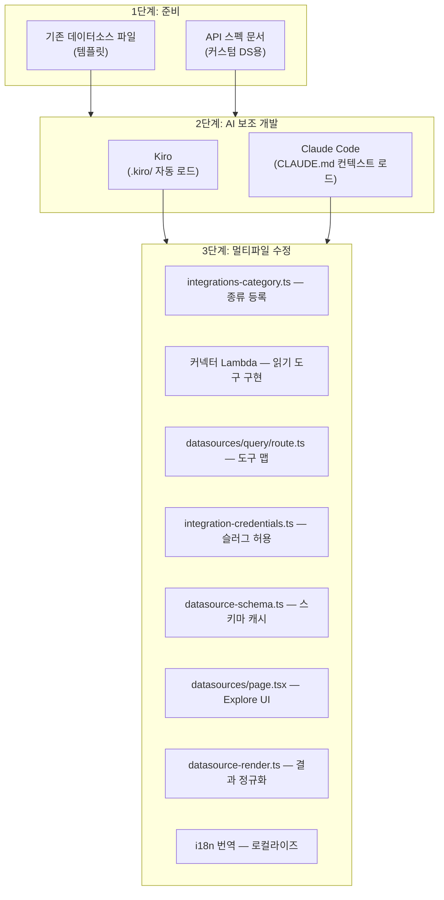

# 데이터소스 개발 FAQ

외부 관측성 데이터소스(커넥터) 확장에 대한 질문과 답변입니다.

## 데이터소스 플랫폼은 어떤 구조인가요?

AWSops의 데이터소스는 **읽기 전용 커넥터 플랫폼**입니다. AWS 리소스 조회(AgentCore MCP 도구)와는 별개의 축으로, 외부 관측성 백엔드를 연결합니다.

구성 요소:

- **커넥터 Lambda** — 각 데이터소스 종류(kind)별 읽기 전용 도구를 제공하는 MCP 스타일 Lambda. SSRF·인증·읽기 전용 강제를 커넥터가 소유합니다.
- **스키마 캐시(Aurora)** — 인트로스펙션한 스키마를 Aurora 테이블(`datasource_schemas`)에 영속 저장. UI와 챗 에이전트가 이 캐시를 읽어 컴팩트한 스키마 블록을 주입합니다(라이브 인트로스펙션 아님).
- **Explore 페이지** — `web/app/datasources/page.tsx`. 쿼리 실행 + 자연어→쿼리(NL→query) 챗 주입을 한 화면에서 제공합니다.
- **자격증명** — Secrets Manager 단일 시크릿(슬러그 키 맵)에 저장. 커넥터 Lambda가 `map[INTEGRATION_SLUG]`를 읽습니다.

현재 쿼리 가능한 종류:

| 종류 | 쿼리 언어 | 용도 |
|------|-----------|------|
| Prometheus | PromQL | 메트릭 모니터링 |
| Mimir | PromQL | 장기 메트릭 |
| Loki | LogQL | 로그 집계 |
| Tempo | TraceQL | 분산 트레이싱 |
| ClickHouse | SQL | 분석 DB |

:::info 읽기 전용 자세(ADR-041)
데이터소스는 **데이터 read**(+ 거버넌스된 외부 record/ticket/message write)만 다룹니다. AWS 리소스 변경·자율 동작은 영구 동결(do-not-enable)입니다. `web/app/api/datasources/query/route.ts`의 도구 맵에는 **읽기 도구만** 존재하며(mutate 도구 도달 불가), 테스트가 이 불변식을 검증합니다.
:::

## 새로운 데이터소스 타입(예: Elasticsearch, InfluxDB)을 추가하려면?

새 종류는 여러 파일에 걸친 **일관된 멀티파일 패턴**으로 추가합니다. AI 코딩 도구(Kiro 또는 Claude Code)에 기존 종류를 템플릿으로 읽혀 새 종류를 생성하는 워크플로를 권장합니다.



### 수정 대상 파일

| # | 파일 | 추가할 것 | 템플릿 참조 |
|---|------|-----------|-------------|
| 1 | `web/lib/integrations-category.ts` | `DATASOURCE_KINDS` 배열에 종류 문자열 추가 | 기존 `'prometheus' \| 'mimir' \| ...` |
| 2 | 커넥터 Lambda(`scripts/v2/workers/*` MCP 소스) | 읽기 전용 도구(`<kind>_query` 등) 구현 + 헬스체크. **SSRF 가드 필수**(아래 참조) | 기존 prometheus 커넥터 모방 |
| 3 | `web/app/api/datasources/query/route.ts` | `TOOL` 맵에 `{ instant, range?, arg }` 항목 추가(읽기 도구만) | prometheus/clickhouse 항목 복사 |
| 4 | `web/lib/integration-credentials.ts` | `KNOWN_CONNECTOR_SLUGS`에 슬러그 추가(임의 키 주입 차단) | 기존 슬러그 배열 |
| 5 | `web/lib/datasource-schema.ts` | 스키마 인트로스펙션 → Aurora `datasource_schemas` upsert(`upsertSchema`) | `getSchema`/`upsertSchema` 패턴 |
| 6 | `web/app/datasources/page.tsx` | 타입 아이콘/라벨/플레이스홀더 + 예시 쿼리 항목 추가 | 기존 Record 항목 복사 |
| 7 | `web/lib/datasource-render.ts` | 응답을 `QueryResult`(`columns`, `rows`, `metadata`)로 정규화 | `normalizeResult` 패턴 |
| 8 | `web/lib/i18n/translations/{en,ko}.json` | 새 UI 문자열 i18n 키 추가 | 기존 `datasources.*` 키 |

:::info 핵심 패턴
모든 쿼리 함수/커넥터는 결과를 `QueryResult` 인터페이스(`columns`, `rows`, `metadata`)로 정규화해 반환해야 합니다. 이것이 Explore UI와 AI 분석이 공유하는 표준 형식입니다.
:::

## 커넥터 입력은 어떻게 보호해야 하나요? (재사용-핵심)

AWSops는 in-VPC(mgmt-vpc, `169.254.169.254` 메타데이터·내부 ALB 인접)에서 동작하므로, 관리자가 등록한 egress 엔드포인트가 가장 큰 SSRF 위험입니다. **새 커넥터 입력은 반드시 SSRF 가드 + 크기 바운드**를 적용하세요.

### 크기 바운드 — 파싱 전 `readJsonBounded`

요청 본문은 **파싱하기 전에** `web/lib/http-body.ts`의 `readJsonBounded`로 읽어 크기를 제한합니다. App Router에는 기본 본문 상한이 없어 그대로 `request.json()`을 호출하면 DoS에 노출됩니다.

```ts
import { readJsonBounded, BodyTooLargeError } from '@/lib/http-body';

let body: { slug?: unknown; query?: unknown };
try { body = (await readJsonBounded(request)) as typeof body; }
catch (e) { if (e instanceof BodyTooLargeError) return json({ error: 'body too large' }, 413); throw e; }
```

캐시되는 스키마도 바운드됩니다(`datasource-schema.ts`의 `MAX_SCHEMA_BYTES`).

### SSRF 가드 — `web/lib/ssrf-guard.ts`

엔드포인트 등록·요청 시 `assertDatasourceEndpointAllowed()`(또는 외부 egress용 `assertEgressEndpointAllowed()`)로 검증합니다. 차단 규칙:

- **메타데이터/IMDS 무조건 차단** — `169.254.169.254`(IPv4) + `fd00:ec2::254`(IPv6 IMDS).
- **루프백/링크로컬/멀티캐스트/언스펙파이드 차단** — `::1`, `fe80::/10` 등.
- **6to4·IPv4-mapped IPv6 우회 차단** — `2002:a9fe:a9fe::` 같은 인코딩된 메타데이터 타깃을 IPv4로 디코드해 검사.
- **https 강제 / 스킴 제한** — egress 티어는 https only.
- **private opt-in** — RFC1918/ULA(사내 in-cluster 데이터소스)는 데이터소스 티어에서 허용되지만, 외부 egress 티어는 계정별 `allowPrivateDatasource` opt-in이 있어야 사설 주소 허용.
- **redirect: 'manual'** — 리다이렉트를 따라가 우회하지 못하도록 수동 처리. DNS 해석을 요청 전에 수행.

:::caution 커넥터가 보안을 소유합니다
SSRF·인증·읽기 전용 강제의 source of truth는 **커넥터 Lambda**입니다. BFF 라우트(`query/route.ts`)는 도구를 해석·전달·정규화만 합니다. 새 커넥터에서 SSRF 가드를 빠뜨리면 라우트 레벨 검증만으로는 막을 수 없습니다.
:::

## 스키마 캐시와 NL→쿼리는 어떻게 동작하나요?

Explore 페이지(`/datasources`)는 두 경로를 씁니다:

- **쿼리 실행** — `POST /api/datasources/query` → 커넥터 Lambda 읽기 도구 호출 → `QueryResult`로 정규화.
- **자연어→쿼리** — `POST /api/datasources/generate`. 모니터링 에이전트에 **쿼리 전용 프롬프트** + 커넥터의 캐시된 스키마 블록을 주입해 올바른 언어(PromQL/LogQL/SQL 등)로 쿼리를 생성합니다. 에이전트는 라이브 인트로스펙션이 아니라 Aurora 스키마 캐시를 읽습니다(`getSchema`/`listConfiguredSchemas`).

새 종류를 추가할 때 `datasource-schema.ts`에 인트로스펙션→`upsertSchema`를 구현해야 NL→쿼리가 정확해집니다.

## AI 코딩 도구로 추가하기

### Kiro로 추가

[Kiro](https://kiro.dev)는 `.kiro/` 디렉터리를 자동으로 읽어 프로젝트 컨텍스트를 확보합니다:

- `.kiro/AGENT.md` — 아키텍처·규칙
- `.kiro/steering/project-structure.md` — 디렉터리 구조, 데이터소스 파일 위치
- `.kiro/steering/coding-standards.md` — 코딩 컨벤션

**잘 알려진 데이터소스**(Elasticsearch, InfluxDB, Graphite 등)는 간단한 프롬프트로 충분합니다:

```
Elasticsearch를 새 데이터소스 종류로 추가해줘.
기존 종류 패턴을 따라 커넥터 Lambda + query/route.ts TOOL 맵 +
스키마 캐시 + Explore UI + i18n을 모두 수정해줘.
SSRF 가드(assertDatasourceEndpointAllowed)와 readJsonBounded를 반드시 적용해.
```

### Claude Code로 추가

Claude Code는 디렉터리별 `CLAUDE.md`로 프로젝트를 이해합니다:

- 루트 `CLAUDE.md` — 전체 아키텍처·필수 규칙(읽기 전용 자세, 보안 교훈 포함)
- `web/**` — 라이브러리 모듈(`datasources.ts`, `datasource-schema.ts`, `ssrf-guard.ts` 등)과 API 라우트/페이지 상세

**예시 프롬프트:**

```
InfluxDB(InfluxQL)를 새 데이터소스 종류로 추가해줘.
기존 종류 패턴을 따라 모든 관련 파일을 수정해.
기본 포트 8086, 헬스 엔드포인트 /ping.
커넥터 입력은 readJsonBounded로 바운드하고 SSRF 가드를 적용해(읽기 전용 도구만).
```

## 사내/커스텀 데이터소스는 어떻게 추가하나요?

AI 도구가 API를 모르는 **사내 시스템**이나 **틈새 도구**는 프롬프트와 함께 **API 스펙 문서**를 제공해야 합니다.

### 제공할 정보

| 항목 | 설명 | 예시 |
|------|------|------|
| **헬스 엔드포인트** | 연결 테스트 경로 | `GET /api/health` |
| **쿼리 API** | 데이터 조회 형식 | `POST /api/v1/query` |
| **요청 본문** | 쿼리 파라미터 구조 | `{"query": "...", "from": "...", "to": "..."}` |
| **응답 형식** | 반환 데이터 구조 | `{"data": [{"timestamp": ..., "value": ...}]}` |
| **인증 방식** | 지원 인증 타입 | Bearer token, API key, Basic auth |

### 예시 프롬프트 (API 스펙 포함)

```
"CustomMetrics"를 새 데이터소스 종류로 추가해줘.
기존 종류 패턴을 따라 모든 관련 파일을 수정해.

API 문서:
- 헬스체크: GET /api/health → 200 OK
- 쿼리: POST /api/v1/query
  Body: {"query": "metric_name", "from": "2024-01-01T00:00:00Z", "to": "2024-01-02T00:00:00Z", "step": "5m"}
  Response: {"status": "ok", "data": [{"timestamp": 1704067200, "value": 42.5, "labels": {"host": "web-1"}}]}
- 인증: Authorization 헤더에 Bearer token
- 기본 포트: 9090
- 읽기 전용(쓰기/변경 도구 노출 금지), SSRF 가드 + readJsonBounded 적용
```

:::tip OpenAPI 스펙 파일 활용
OpenAPI(Swagger) YAML/JSON 파일이 있으면 더 정확한 코드를 생성할 수 있습니다. Kiro는 스펙 파일을 프로젝트에 두면 자동 참조하고, Claude Code는 프롬프트에 파일 경로를 포함하면 됩니다.
:::

:::caution 커넥터는 큐레이션 전용 (ADR-040/041)
외부 커넥터는 **거버넌스된 큐레이션 커넥터**만 허용됩니다 — 임의 형태의 BYO-MCP는 제외입니다. 새 종류는 SSRF 가드·Secrets Manager 자격증명·읽기 전용 도구·DLP/리댁션·`KNOWN_CONNECTOR_SLUGS` 허용목록 안에서만 추가하세요. 자세한 거버넌스는 `docs/decisions/ADR-040-governed-external-knowledge-comms-writes.md`, `ADR-041-read-only-means-resource-not-data.md` 참조.
:::

## 추가 후 검증 체크리스트

새 데이터소스 종류 추가 후 다음을 확인하세요:

- [ ] TypeScript/프로덕션 빌드 성공 (`npm run build`) — `*.test.ts` 타입 잡음은 비차단
- [ ] Explore 페이지 타입 드롭다운에 새 종류 노출
- [ ] 연결 테스트 성공(헬스 엔드포인트 응답)
- [ ] 쿼리 실행이 `QueryResult` 형식으로 정규화되어 반환
- [ ] NL→쿼리가 올바른 언어로 유효한 쿼리 생성(스키마 캐시 주입 확인)
- [ ] 커넥터 입력에 `readJsonBounded` + SSRF 가드 적용(메타데이터/IMDS/루프백 차단 테스트)
- [ ] `KNOWN_CONNECTOR_SLUGS`에 슬러그 등록(임의 키 거부)
- [ ] 한국어/영어 i18n 문자열 정상 표시
