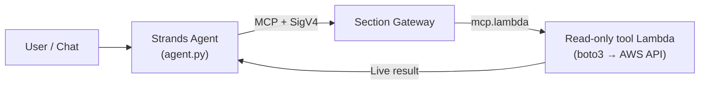
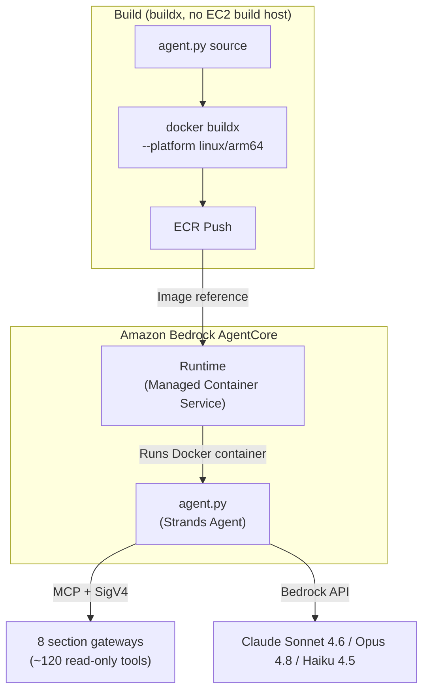
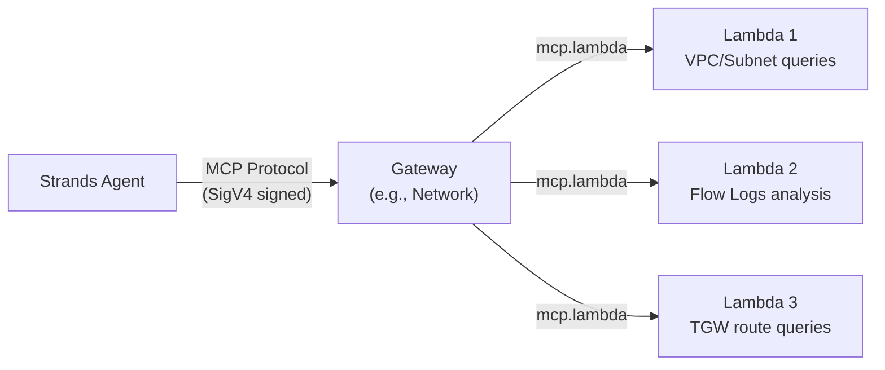
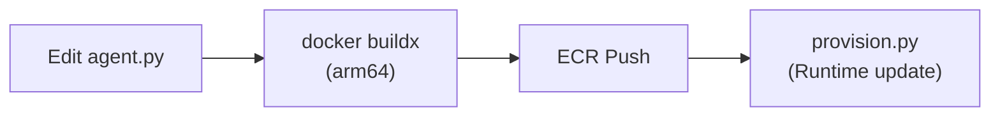
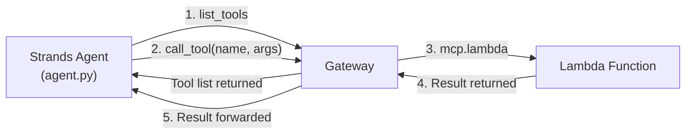
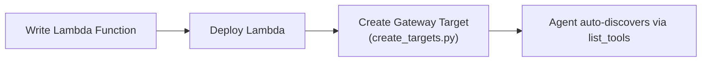
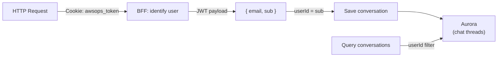

# AgentCore & Memory Technical FAQ

In-depth questions and answers about the AI engine internals: AgentCore Runtime, Gateway, the live AWS query path, and Memory Store.

## Why is AgentCore the primary path for live AWS queries?

In AWSops, **live AWS data is queried through AgentCore MCP Lambda tools**. This replaces the legacy app's approach of querying directly via embedded Steampipe.



### Key points

| Item | Detail |
|------|--------|
| **Live queries** | AgentCore MCP Lambda tools (~120, read-only) call AWS APIs directly via boto3 |
| **Steampipe's role** | **Not** the live query engine. It is only a flag-gated **inventory sync** (`steampipe_enabled`, default OFF) — no local 9193 service, no pg Pool |
| **Gating** | All of AgentCore is gated by the `agentcore_enabled` Terraform flag (default OFF → `plan` = No changes, $0) |
| **Read-only** | All tools are read-only (ADR-041 / 2026-06-11 reversal: AWS-resource mutation + autonomy are permanently frozen) |

:::info Steampipe is no longer the live engine
Live AWS state is always answered by AgentCore tools. When enabled, Steampipe merely warms up on Fargate to sync inventory into Aurora — an auxiliary path, OFF by default.
:::

## What is AgentCore Runtime? How does it relate to Strands Agent?

AgentCore Runtime and Strands Agent operate at different layers.



### AgentCore Runtime

- AWS-managed **serverless container execution environment**
- Specify a Docker image (ECR) and it automatically runs/scales containers
- Handles Cold Start management, network configuration, IAM Roles
- Invoked via `InvokeAgentRuntime`

### Strands Agent Framework

- **Python-based AI agent framework** (`agent/agent.py`)
- Provides tools to the LLM (Bedrock) and feeds tool results back in a loop
- Connects to gateways via MCP protocol to use tools

### Relationship summary

| Item | AgentCore Runtime | Strands Agent |
|------|------------------|---------------|
| Role | Container execution environment | AI agent logic |
| Level | Infrastructure | Application |
| Managed by | AWS | Developer |
| Code location | AWS service | `agent/agent.py` |
| Configuration | Terraform / idempotent provisioner | Python code |

## How are Gateway and Lambda related? How many gateways are there?

Gateway is the **MCP protocol router**, and Lambda is the **read-only backend that executes actual AWS APIs**.



### There are 8 section gateways (ADR-004)

`network · container · data · security · cost · monitoring · iac · ops` — **8 total**.

| Item | Detail |
|------|--------|
| **Gateway count** | **Fixed at 8** per ADR-004 |
| **Tool count** | About **120**, all read-only — evolves as the fleet grows (not a fixed number) |
| **External observability** | **Not** a 9th gateway — split out as the separate **Integrations axis** (ADR-039) |
| **Protocol** | MCP (Model Context Protocol) standard |

- The Agent calls `list_tools` to discover available tools
- When the Agent selects a tool, the Gateway invokes the corresponding Lambda
- Gateway Targets are created with the `mcp.lambda` protocol and `credentialProviderConfigurations`

### Why Lambda?

| Reason | Description |
|--------|-------------|
| **Isolation** | Each tool runs independently; one failure doesn't affect others |
| **Permission separation** | Least-privilege IAM Role per Lambda |
| **Scaling** | Auto-scales on concurrent invocations |
| **Cost** | Pay only on invocation, no idle cost |

:::caution Gateway Target creation
The CLI `--inline-payload` option has JSON parsing issues — use **Python/boto3** instead. Also, if a just-created gateway is not yet `READY`, the first Target creation may throw `ValidationException`; since the provisioner is idempotent, re-running resolves it.
:::

## Why do I get a "cross-account blocked" error in a single-account setup?

The AWSops live environment is **single-account** (`180294183052`). Yet selecting the **host account itself** as the target in chat used to make a tool try to self-assume a cross-account role that doesn't exist on the host, causing `AccessDenied` — which the agent then **mis-reported** as "cross-account blocked."

### What went wrong

- `agent.py` forced `target_account_id = <host account>`
- The tool tried to self-assume `arn:...:role/AWSopsReadOnlyRole`
- That role exists **only in onboarded *target* accounts**, never on the host → `AccessDenied`
- The agent misread the cause → "cross-account blocked" message

### The fix (defense-in-depth)

| Location | Behavior |
|----------|----------|
| `cross_account.get_role_arn()` | Returns **`None`** when target == host → use the Lambda execution role directly (no AssumeRole) |
| `agent.py effective_account_id()` | **Blanks** the host account like `__all__` → no prefix is applied for same-account access |
| Host resolution | `AWSOPS_HOST_ACCOUNT_ID` env → STS `GetCallerIdentity` fallback (cached for the warm container) |

The legitimate path for assuming a *different* account is unchanged.

:::tip When you pick "my account" in a single-account setup
Selecting the host account now uses the execution role directly without a self-assume, so it works normally. Only selecting a *different* (onboarded) account takes the STS AssumeRole path.
:::

## Where is AgentCore configuration stored?

**SSM Parameter Store is the source of truth.** The idempotent provisioner (`scripts/v2/agentcore/provision.py`) writes the resource identifiers it creates into SSM, and the web thin-BFF reads them at runtime.

### SSM paths (`/ops/awsops-v2/agentcore/...`)

| Parameter | Value |
|-----------|-------|
| `/ops/awsops-v2/agentcore/runtime_arn` | AgentCore Runtime ARN |
| `/ops/awsops-v2/agentcore/interpreter_id` | Code Interpreter ID |
| `/ops/awsops-v2/agentcore/memory_id` | Memory Store ID |

### Why SSM? (avoids the valueFrom race)

- The provisioner creates resources **after apply** → records identifiers in SSM
- The web BFF reads from SSM at runtime (cached)
- No ECS task-def `secrets` `valueFrom` → avoids the **race condition** between provision time and task start time

:::info SSM reserved prefix
SSM paths starting with `aws...` are rejected as reserved, so AWSops uses the `/ops/${project}/...` form.
:::

## Why is a Docker arm64 build required? (There is no EC2 build host)

AgentCore Runtime runs on **AWS Graviton (ARM64)** processors.

```bash
# Correct build command — cross-build for arm64 with buildx
docker buildx build --platform linux/arm64 -t awsops-agent .

# ECR push
docker tag awsops-agent:latest $ECR_URI:latest
docker push $ECR_URI:latest
```

### What happens with an x86 (amd64) build?

The container won't start or fails with `exec format error`. Runtime status transitions to `FAILED`.

### There is no dedicated EC2 build instance

Unlike the legacy app, AWSops has **no separate t4g build host.** The web/agent/worker images are all built with `docker buildx --platform linux/arm64`. Apple Silicon (M1/M2/M3) is native ARM64, but amd64 environments such as Intel Macs produce the same arm64 image simply by specifying `--platform linux/arm64`.

## How do I redeploy after modifying agent.py?

`make agentcore` builds/pushes the arm64 image and runs the idempotent provisioner.



### Procedure

```bash
make agentcore          # build/push arm64 agent image + idempotent provisioner
make agentcore --smoke  # additionally validate with an invocation
```

The provisioner is idempotent, so it is safe to re-run (e.g., when the first Target creation failed because the gateway was not yet ready).

:::tip Gateway routing is injected via env
`agent.py` does not hardcode gateway URLs — they are injected via the `GATEWAYS_JSON` environment variable. So a gateway-routing change does not immediately require a Docker rebuild.
:::

## What is MCP protocol? How does tool discovery work?

### MCP (Model Context Protocol)

MCP is a protocol for AI agents to **invoke external tools in a standardized way**. In AWSops, the Strands Agent accesses the read-only gateway tools via MCP.



### SigV4 signed communication

Gateway connections require AWS SigV4 signing (`agent/streamable_http_sigv4.py`). It uses an MCP StreamableHTTP transport signed with the agent's credentials.

### Tool discovery

When the Agent connects to a Gateway, it retrieves the full tool list via **pagination**, then provides it to the LLM. The LLM (Bedrock) examines the user's question and **decides which tools to call on its own**, so developers don't need to write tool-selection logic.

## How do I add a new tool (Lambda) to a Gateway?

### Overall flow



### Step 1: Write the Lambda function

Create a Python file in `agent/lambda/` following the MCP handler pattern:

```python
# agent/lambda/my_new_mcp.py
import json
import boto3

def lambda_handler(event, context):
    params = event if isinstance(event, dict) else json.loads(event)
    t = params.get("tool_name", "")
    args = params.get("arguments", params)

    if t == "my_new_tool":
        client = boto3.client('ec2')
        result = client.describe_instances(**args)  # read-only
        return {"statusCode": 200, "body": json.dumps(result, default=str)}

    return {"statusCode": 400, "body": "Unknown tool"}
```

### Step 2: Create the Gateway Target

Add the tool schema in `agent/lambda/create_targets.py` and create the Target via boto3:

```python
client.create_gateway_target(
    gatewayIdentifier=gw_id,
    targetConfiguration={
        'mcp': {'lambda': {
            'lambdaArn': arn,
            'toolSchema': {'inlinePayload': tools}  # {name, description, inputSchema}
        }}
    },
    credentialProviderConfigurations=[
        {'credentialProviderType': 'GATEWAY_IAM_ROLE'}  # Required
    ]
)
```

### Step 3: Auto-discovery

Once the new tool is added, the Agent discovers it automatically via `list_tools`. A Docker rebuild is only needed if `agent.py` itself was modified.

:::tip Cross-account support
`create_targets.py` injects a `target_account_id` parameter into all tools. Use `cross_account.py`'s `get_client()` in Lambda to access resources in a *different* account via STS AssumeRole (when the target is the host, it uses the execution role directly with no self-assume).
:::

## What is the structure of Lambda tool functions?

All tool Lambdas follow the same MCP handler pattern:

```python
# Common pattern (e.g., agent/lambda/aws_cost_mcp.py)
def lambda_handler(event, context):
    # 1. Event parsing + tool routing
    params = event if isinstance(event, dict) else json.loads(event)
    t = params.get("tool_name", "")
    args = params.get("arguments", params)

    # 2. Cross-account support (role_arn=None when target==host)
    target_account_id = args.pop('target_account_id', None)
    role_arn = get_role_arn(target_account_id) if target_account_id else None

    # 3. Per-tool branching
    if t == "get_cost_and_usage":
        ce = get_client('ce', 'us-east-1', role_arn)
        resp = ce.get_cost_and_usage(...)
        return ok(resp)
    else:
        return err("Unknown tool")
```

### Shared module: `cross_account.py`

An STS AssumeRole helper for cross-account access. It **caches credentials for 50 minutes** to optimize repeated calls, and returns `None` when the target equals the host account to prevent a self-assume.

### Rules

- All Lambdas are **read-only** (with a few exceptions such as reachability path creation)
- VPC Lambdas (Istio, Steampipe) use `pg8000` instead of `psycopg2`
- Tool schema format: `{name, description, inputSchema: {type, properties, required}}`

## Why can't I use hyphens in Code Interpreter or Memory names?

This is due to **naming constraints** in the AgentCore API — names allow **underscores only**.

### Affected resources

| Resource | Incorrect | Correct |
|----------|-----------|---------|
| Code Interpreter | `awsops-code-interpreter` | `awsops_code_interpreter` |
| Memory Store | `awsops-memory` | `awsops_memory` |

### Symptoms

Creating with hyphenated names raises `ValidationException`, or creation succeeds but invocation fails, possibly with an unclear error message.

### Additional Memory Store constraints

- `eventExpiryDuration`: Maximum **365 days**
- Expired events are automatically deleted

The `-XXXXX` suffix AWS appends is auto-generated; the naming constraint applies only to the user-specified portion (`awsops_code_interpreter`, `awsops_memory`).

## Where is AI conversation history stored, and how is it separated by user?

Conversation history persists in **Aurora** (PostgreSQL 17), not in legacy local JSON files.



### Behavior

| Item | Detail |
|------|--------|
| **Store** | Aurora Serverless v2 (PG 17), node-pg pool (`web/lib/db.ts`) |
| **User identity** | Cognito JWT `sub` |
| **UI** | Claude-app-style sidebar — the `/assistant` full page and a resizable drawer share one history |
| **Rendering** | Streaming + markdown |

### Authentication flow

1. **Lambda@Edge** validates the JWT at CloudFront with RS256 JWKS signature verification
2. Validated requests reach the ECS Fargate web app
3. The BFF uses `sub` from the JWT payload as the user identifier
4. Unauthenticated requests are rejected by the BFF with 401 (fail-closed) — the identifier is always the verified Cognito `sub`

## How do I monitor AgentCore Runtime status?

The web BFF queries Runtime / Gateway / Code Interpreter status. It reads identifiers from SSM, then fetches status via the AgentCore API.

### Runtime status

| Status | Meaning | Action |
|--------|---------|--------|
| **READY** | Running normally | - |
| **CREATING** | Initial creation in progress | Wait a few minutes |
| **UPDATING** | Updating (Docker image change, etc.) | Wait a few minutes |
| **FAILED** | Error — container failed to start | Check Docker image (arm64) / IAM Role / network |

### Assistant page

The AI assistant is available at `/assistant` (full page) and in a resizable drawer you can open anywhere; both share the same Aurora conversation history.

:::tip Routing is hybrid (ADR-038)
Questions are routed to the appropriate section agent via a regex fast-path + Haiku 4.5 classifier + prompt caching (LIVE, ~59% cache hit). This is not the legacy fixed multi-route Sonnet registry.
:::
