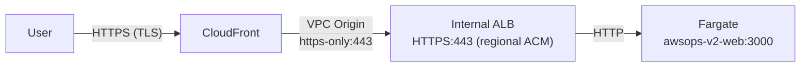
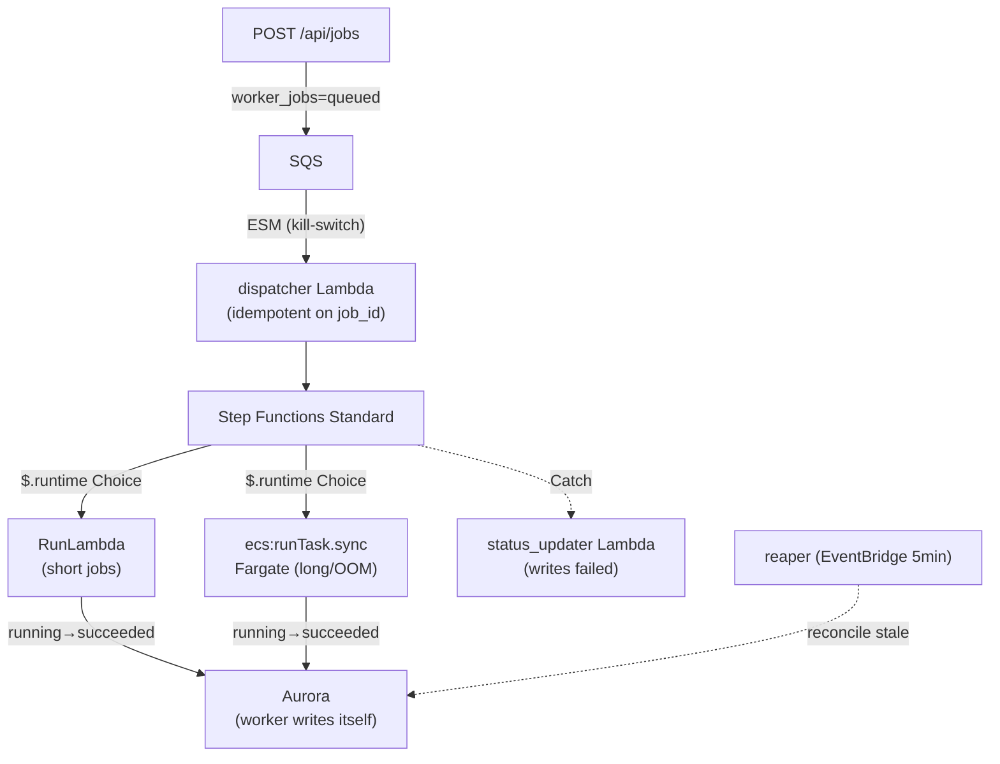
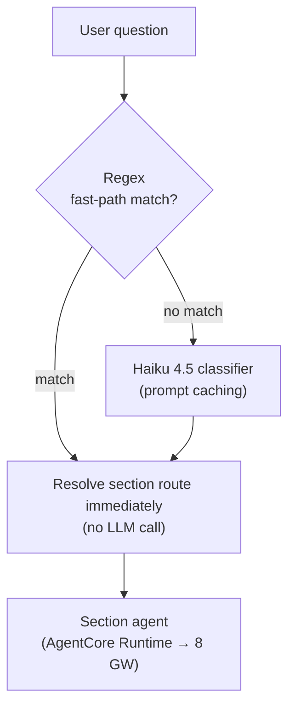
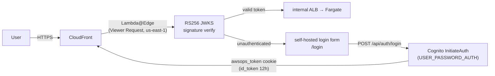

# Architecture Deep-Dive FAQ

An in-depth technical FAQ about how AWSops works internally. Written for SREs and architects, covering the edge path, the async worker backbone, the data layer, AI routing, auth, and operational learnings.

:::info Read-only ops dashboard
AWSops is a **read-only operations dashboard + AI diagnosis** tool. **AWS-resource mutation and autonomy are permanently frozen.** External observability reads and governed external record/ticket/message writes (data records) are allowed, but none of them change AWS resources themselves.
:::

## How is the edge (CloudFront → VPC Origin → internal ALB → Fargate) wired?

AWSops has **no public ALB.** All traffic starts at CloudFront and reaches the internal ALB in private subnets only through a VPC Origin.

### Path details

| Segment | Protocol | Notes |
|---------|----------|-------|
| User → CloudFront | HTTPS (TLS) | Public edge |
| CloudFront → VPC Origin | `https-only` 443 | Enters the VPC, no public exposure |
| VPC Origin → internal ALB | HTTPS 443 | Regional ACM certificate |
| Internal ALB → Fargate | HTTP | Inside the private network |

### The 504 → 200 learning (TLS end-to-end + SG)

Two pitfalls in the initial setup made the edge return **504**:

1. **TLS end-to-end mismatch** — the CloudFront → ALB hop must be TLS all the way. Keep the VPC Origin `https-only` and set the **origin domain to the public FQDN** so SNI matches the ALB's regional ACM certificate.
2. **Security-group source** — the ALB SG must allow 443 from the **CloudFront managed SG `CloudFront-VPCOrigins-Service-SG`**, not from the VPC CIDR. A VPC-CIDR-only rule yields 504.

:::tip No X-Custom-Secret / managed-prefix-list
The edge uses neither a header secret (`X-Custom-Secret`) nor a managed-prefix-list block. Access control is purely the **VPC Origin + CloudFront managed SG** combination.
:::

### VPC Origin protocol is not in-place changeable

The VPC Origin protocol (e.g. `https-only`) **cannot be changed in place.** To change it in Terraform, use a `create_before_destroy` lifecycle + `-replace` to build a new origin and swap it. Attempting an in-place change hangs the apply.

## How does the async worker backbone work? (OOM-safe)

The web tier is a **thin-BFF.** Heavy, long-running, or OOM-risk work is never run inline — it is **enqueued** to the worker queue. Diagnosis report generation, DOCX/PDF export, and inventory sync all go this route.

### Step by step

1. **enqueue** — web `POST /api/jobs` writes a `worker_jobs` row as `queued` and puts a message on SQS.
2. **ESM (kill-switch)** — an Event Source Mapping wires SQS → dispatcher Lambda. The ESM doubles as a **kill-switch**: disable it to stop processing instantly.
3. **dispatcher (idempotent)** — idempotent on `job_id`. The Step Functions execution name is set to `job_id`, so duplicate enqueues converge on the same execution.
4. **Step Functions `$.runtime` Choice** — branches on the `runtime` value:
   - `lambda` → **RunLambda** (short jobs)
   - `fargate` → **`ecs:runTask.sync`** (long-running or OOM-risk jobs)
5. **The worker writes its own status** — the worker claims `running` and, on completion, writes `succeeded` **directly to Aurora**.
6. **Failure handling** — on Catch, the **status_updater Lambda** writes `failed`. (Step Functions cannot write to the VPC-internal Aurora directly, so a separate Lambda is required.)
7. **reaper** — runs every 5 minutes via EventBridge as the slow backstop, reconciling stale jobs (e.g. a job stuck in `running` because the worker died).

### Why is it OOM-safe?

Heavy, memory-hungry work (large report rendering, chromium PDF generation, etc.) runs in an **isolated Fargate task**, not in the web process. If a worker dies with OOM the web service is unaffected, and `ecs:runTask.sync`'s TimeoutSeconds kills a runaway task so the Catch records `failed`.

:::tip Fargate workers must use CMD (not ENTRYPOINT)
A Fargate worker Dockerfile must use **`CMD`**. Step Functions' `containerOverrides.command` **replaces** CMD but is **appended** to an exec-form **ENTRYPOINT**. With ENTRYPOINT the argv doubles and argparse dies.
:::

## What is the data layer? (Aurora Serverless v2)

App state lives in **Aurora Serverless v2 (PostgreSQL 17)**, not local `data/*.json` files on EC2. The web accesses it via **node-pg** (the shared pool `getPool` in `web/lib/db.ts`).

| Item | Value |
|------|-------|
| Engine | Aurora Serverless v2, **PostgreSQL 17** (exact minor pin, e.g. `17.9`) |
| Capacity | **0.5 – 4 ACU** (`aurora_min_acu` / `aurora_max_acu`) |
| Encryption | KMS CMK |
| Secret | RDS-managed master secret |
| Migrations | `schema_migrations` table + ULID-named migration files |

### What lives in Aurora

- `worker_jobs` — async job state
- Chat threads — persisted conversations (Claude-app-style sidebar)
- AI diagnosis reports — including title, tags, soft-delete (`deleted_at`)
- Datasource schema cache — connector schemas

:::info One node-pg pattern, not the v1 Steampipe pg Pool
AWSops does not use the v1 Steampipe pg Pool (port 9193, node-cache, cache-warmer, batchQuery, etc.). Live AWS queries go through the AgentCore MCP tools below; durable state lives in Aurora.
:::

## How are live AWS queries served? (AgentCore vs Steampipe)

Live AWS data is served by **AgentCore MCP Lambda tools** — roughly **120 read-only tools** spread across **8 section gateways** (network / container / data / security / cost / monitoring / iac / ops).

| Component | Role |
|-----------|------|
| **AgentCore MCP tools (live)** | Real-time AWS API queries — the live data source for chat, diagnosis, and pages |
| **Steampipe (flag-gated)** | The `steampipe_enabled` (default OFF) inventory **sync only**. Not a live query engine, not a local 9193 service |

:::info The gateway count is 8 (ADR-004)
External observability is the separate **Integrations axis** (ADR-039), not a 9th gateway. Per ADR-004, the gateway count stays at **8**.
:::

## How does AI routing work? (ADR-038 hybrid)

AI routing is the **ADR-038 hybrid** scheme, and it is LIVE. It replaces the v1 single-Sonnet 11/18-route registry.

### Three core mechanisms

1. **Regex fast-path** — clear keyword patterns route instantly with no LLM call → latency saved.
2. **Haiku 4.5 classifier** — only questions the fast-path misses go to the lightweight Haiku model.
3. **Prompt caching** — the classifier prompt is cached (~59% hit rate), cutting tokens and latency.

### AI assistant behavior

- **Streaming + domain routing + markdown rendering.**
- Conversations **persist in Aurora** — a Claude-app-style sidebar; the `/assistant` full page and the resizable drawer share **one history**.

:::tip Classifier timeout learning
On global cross-region inference profiles, **do not set the classifier timeout to 1 second** — it fails when cold/slow. Give it generous headroom (e.g. 3.5 seconds).
:::

## What is the auth flow? (RS256 + in-app login)

Auth is **Cognito + Lambda@Edge**, with **full RS256 JWKS signature verification at the edge** (unlike v1's expiry-only check). Routes are at the root (`/`) — there is **no `/awsops` basePath**.

### Step by step

**1. Lambda@Edge (us-east-1, python3.12, Viewer Request)**
- On every request, verifies the `awsops_token` JWT with **RS256 JWKS** + checks `iss`/`aud`/`token_use`.
- Unauthenticated requests are redirected to the self-hosted **`/login`** form.

**2. In-app login (ADR-042)**
- Login = a **self-hosted `/login` form**. The BFF `POST /api/auth/login` calls the **unsigned public `InitiateAuth(USER_PASSWORD_AUTH)`** (no SDK) → mints the `awsops_token` cookie (id_token, 12 hours).
- The **Hosted UI PKCE flow (`/_callback`) is retained as a dark fallback only.**
- Signout clears the cookie → `/login` (no Hosted UI `/logout` round-trip).

**3. Admin gate (server-side, fail-closed)**
- admin = the **Cognito `admins` group** OR the **SSM admin-email allowlist** (`web/lib/admin.ts`). Either match grants admin.
- The decision is made server-side and is **fail-closed** (deny when uncertain).

## What operational Terraform/infra learnings should I know?

Two things that repeatedly tripped us up, from an SRE perspective.

### Aurora major upgrade (15 → 17.x)

Order matters:

1. Set the **exact minor version** (e.g. `17.9`) in `variables.tf` plus `allow_major_version_upgrade = true` and `apply_immediately = true`, and **apply first** (perform the upgrade).
2. **Then** add `lifecycle { ignore_changes = [engine_version] }` to **both** the cluster and the instance → so future minor auto-upgrades (17.x → 17.y) never surface as Terraform drift.

:::tip Don't pin just "17"
Pinning the major only (`"17"`) without a minor misbehaves on `aws_rds_cluster`. Always use a verified exact minor.
:::

### Security-group description is immutable

Treat a SG's `description` as **immutable.** Changing it forces a SG replace, and because the ALB depends on that SG the apply hangs. Make ingress-rule changes **in place** and keep the description verbatim.

:::info Other recurring learnings
- **ECS `secrets` valueFrom** (Aurora secret) needs **execution-role** permissions (not the task role), else `ResourceInitializationError`.
- Set **`HOSTNAME=0.0.0.0` as a runtime env** (task def `environment`). An image ENV alone is not enough — ECS overwrites HOSTNAME with the ENI IP and the healthCheck goes UNHEALTHY.
- **arm64 required** — web/agent/worker images all build with `buildx --platform linux/arm64`.
- The container + target-group health path must match the app (`/api/health`), or the circuit breaker loops.
:::
