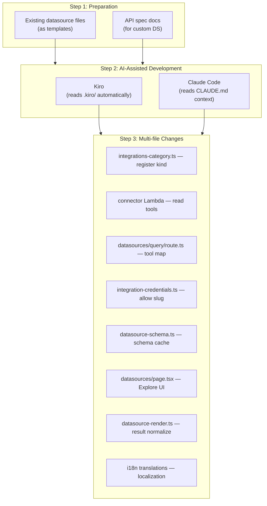

# Datasource Development FAQ

Questions and answers about extending AWSops with new external observability datasources (connectors).

## What is the datasource platform structure?

AWSops datasources are a **read-only connector platform**. It is a separate axis from AWS-resource queries (AgentCore MCP tools) and connects external observability backends.

Components:

- **Connector Lambda** — an MCP-style Lambda exposing read-only tools per datasource kind. SSRF, auth, and read-only enforcement are owned by the connector.
- **Schema cache (Aurora)** — introspected schemas are persisted to an Aurora table (`datasource_schemas`). The UI and the chat agent read this cache to inject a compact schema block (not live introspection).
- **Explore page** — `web/app/datasources/page.tsx`. Provides query execution + natural-language→query (NL→query) chat injection on one screen.
- **Credentials** — stored in a single Secrets Manager secret (a slug-keyed map). The connector Lambda reads `map[INTEGRATION_SLUG]`.

Currently queryable kinds:

| Kind | Query Language | Purpose |
|------|---------------|---------|
| Prometheus | PromQL | Metrics monitoring |
| Mimir | PromQL | Long-term metrics |
| Loki | LogQL | Log aggregation |
| Tempo | TraceQL | Distributed tracing |
| ClickHouse | SQL | Analytics DB |

:::info Read-only posture (ADR-041)
Datasources cover **data reads** (plus governed external record/ticket/message writes) only. AWS-resource mutation and autonomy are permanently frozen (do-not-enable). The tool map in `web/app/api/datasources/query/route.ts` holds **read tools only** (no mutate tool is reachable), and a test asserts this invariant.
:::

## How do I add a new datasource type (e.g., Elasticsearch, InfluxDB)?

A new kind is added with a **consistent multi-file pattern** spanning several files. The recommended workflow is to have an AI coding tool (Kiro or Claude Code) read the existing kinds as templates and generate the new one.



### Files to Modify

| # | File | What to Add | Template Reference |
|---|------|-------------|-------------------|
| 1 | `web/lib/integrations-category.ts` | Add the kind string to the `DATASOURCE_KINDS` array | Existing: `'prometheus' \| 'mimir' \| ...` |
| 2 | Connector Lambda (`scripts/v2/workers/*` MCP source) | Implement read-only tools (`<kind>_query`, etc.) + health check. **SSRF guard required** (see below) | Mirror the existing prometheus connector |
| 3 | `web/app/api/datasources/query/route.ts` | Add a `{ instant, range?, arg }` entry to the `TOOL` map (read tools only) | Copy the prometheus/clickhouse entries |
| 4 | `web/lib/integration-credentials.ts` | Add the slug to `KNOWN_CONNECTOR_SLUGS` (blocks arbitrary key injection) | Existing slug array |
| 5 | `web/lib/datasource-schema.ts` | Introspect schema → upsert into Aurora `datasource_schemas` (`upsertSchema`) | `getSchema` / `upsertSchema` pattern |
| 6 | `web/app/datasources/page.tsx` | Add type icon/label/placeholder + example query entries | Copy existing Record entries |
| 7 | `web/lib/datasource-render.ts` | Normalize the response to `QueryResult` (`columns`, `rows`, `metadata`) | `normalizeResult` pattern |
| 8 | `web/lib/i18n/translations/{en,ko}.json` | Add i18n keys for new UI strings | Existing `datasources.*` keys |

:::info Key Pattern
Every query function/connector must normalize its result to the `QueryResult` interface (`columns`, `rows`, `metadata`). This is the standard format shared by the Explore UI and AI analysis.
:::

## How must connector input be secured? (reuse-critical)

AWSops runs in-VPC (mgmt-vpc, adjacent to the `169.254.169.254` metadata endpoint and the internal ALB), so an admin-registered egress endpoint is the biggest SSRF risk. **New connector input MUST be SSRF-guarded and size-bounded.**

### Size bound — `readJsonBounded` before parse

Read the request body with `readJsonBounded` from `web/lib/http-body.ts` **before parsing**, to cap its size. App Router has no default body limit, so calling `request.json()` directly exposes you to DoS.

```ts
import { readJsonBounded, BodyTooLargeError } from '@/lib/http-body';

let body: { slug?: unknown; query?: unknown };
try { body = (await readJsonBounded(request)) as typeof body; }
catch (e) { if (e instanceof BodyTooLargeError) return json({ error: 'body too large' }, 413); throw e; }
```

Cached schemas are bounded too (`MAX_SCHEMA_BYTES` in `datasource-schema.ts`).

### SSRF guard — `web/lib/ssrf-guard.ts`

Validate endpoints on registration/request with `assertDatasourceEndpointAllowed()` (or `assertEgressEndpointAllowed()` for external egress). Blocking rules:

- **Metadata/IMDS unconditionally blocked** — `169.254.169.254` (IPv4) + `fd00:ec2::254` (IPv6 IMDS).
- **Loopback/link-local/multicast/unspecified blocked** — `::1`, `fe80::/10`, etc.
- **6to4 / IPv4-mapped IPv6 evasion blocked** — an encoded metadata target like `2002:a9fe:a9fe::` is decoded to IPv4 and re-checked.
- **https enforced / scheme restricted** — the egress tier is https-only.
- **private opt-in** — RFC1918/ULA (in-cluster datasources) are allowed in the datasource tier, but the external egress tier requires the per-account `allowPrivateDatasource` opt-in to permit private addresses.
- **redirect: 'manual'** — redirects are handled manually so they can't be followed to evade the guard; DNS is resolved before the request.

:::caution The connector owns security
The source of truth for SSRF, auth, and read-only enforcement is the **connector Lambda**. The BFF route (`query/route.ts`) only resolves, forwards, and normalizes the tool. If a new connector omits its SSRF guard, route-level validation alone cannot cover the gap.
:::

## How do the schema cache and NL→query work?

The Explore page (`/datasources`) uses two paths:

- **Query execution** — `POST /api/datasources/query` → invokes the connector Lambda read tool → normalizes to `QueryResult`.
- **Natural-language→query** — `POST /api/datasources/generate`. It injects a **query-only prompt** plus the connector's cached schema block into the monitoring agent so it generates a query in the correct language (PromQL/LogQL/SQL, etc.). The agent reads the Aurora schema cache (`getSchema` / `listConfiguredSchemas`), not a live introspection.

When adding a new kind, implement introspection → `upsertSchema` in `datasource-schema.ts` so NL→query stays accurate.

## Adding with AI coding tools

### Adding with Kiro

[Kiro](https://kiro.dev) automatically reads the `.kiro/` directory for project context:

- `.kiro/AGENT.md` — architecture and rules
- `.kiro/steering/project-structure.md` — directory structure, datasource file locations
- `.kiro/steering/coding-standards.md` — coding conventions

For **well-known datasources** (Elasticsearch, InfluxDB, Graphite, etc.), a simple prompt is enough:

```
Add Elasticsearch as a new datasource kind.
Follow the existing kind pattern across the connector Lambda + the query/route.ts TOOL map +
schema cache + Explore UI + i18n.
Always apply the SSRF guard (assertDatasourceEndpointAllowed) and readJsonBounded.
```

### Adding with Claude Code

Claude Code understands the project through per-directory `CLAUDE.md` files:

- Root `CLAUDE.md` — overall architecture and critical rules (read-only posture, security lessons)
- `web/**` — library modules (`datasources.ts`, `datasource-schema.ts`, `ssrf-guard.ts`, etc.) and API route/page details

**Example prompt:**

```
Add InfluxDB (InfluxQL) as a new datasource kind.
Follow the existing kind pattern across all related files.
Default port 8086, health endpoint /ping.
Bound connector input with readJsonBounded and apply the SSRF guard (read tools only).
```

## How do I add an internal/custom datasource?

For **internal systems** or **niche tools** whose APIs AI tools don't know, you must **provide API spec documentation** alongside your prompt.

### Information to Provide

| Item | Description | Example |
|------|-------------|---------|
| **Health endpoint** | Path for connection testing | `GET /api/health` |
| **Query API** | Data retrieval format | `POST /api/v1/query` |
| **Request body** | Query parameter structure | `{"query": "...", "from": "...", "to": "..."}` |
| **Response format** | Return data structure | `{"data": [{"timestamp": ..., "value": ...}]}` |
| **Authentication** | Supported auth type | Bearer token, API key, Basic auth |

### Example Prompt (with API spec)

```
Add "CustomMetrics" as a new datasource kind.
Follow the existing kind pattern across all related files.

API documentation:
- Health check: GET /api/health → 200 OK
- Query: POST /api/v1/query
  Body: {"query": "metric_name", "from": "2024-01-01T00:00:00Z", "to": "2024-01-02T00:00:00Z", "step": "5m"}
  Response: {"status": "ok", "data": [{"timestamp": 1704067200, "value": 42.5, "labels": {"host": "web-1"}}]}
- Auth: Bearer token in the Authorization header
- Default port: 9090
- Read-only (expose no write/mutate tools), apply the SSRF guard + readJsonBounded
```

:::tip Using OpenAPI Spec Files
If you have an OpenAPI (Swagger) YAML/JSON file, even more accurate code can be generated. In Kiro, placing the spec file in the project allows automatic referencing; in Claude Code, include the file path in your prompt.
:::

:::caution Curated connectors only (ADR-040/041)
External connectors are allowed only as **governed curated connectors** — arbitrary-form BYO-MCP is excluded. Add new kinds only within the SSRF guard, Secrets Manager credentials, read-only tools, DLP/redaction, and `KNOWN_CONNECTOR_SLUGS` allowlist. For the governance detail, see `docs/decisions/ADR-040-governed-external-knowledge-comms-writes.md` and `ADR-041-read-only-means-resource-not-data.md`.
:::

## Verification Checklist

After adding a new datasource kind, verify the following:

- [ ] TypeScript/production build succeeds (`npm run build`) — `*.test.ts` type noise is non-blocking
- [ ] The new kind appears in the type dropdown on the Explore page
- [ ] Connection test succeeds (health endpoint responds)
- [ ] Query execution returns results normalized to `QueryResult` format
- [ ] NL→query produces valid queries in the correct language (schema-cache injection confirmed)
- [ ] Connector input applies `readJsonBounded` + the SSRF guard (test metadata/IMDS/loopback blocking)
- [ ] The slug is registered in `KNOWN_CONNECTOR_SLUGS` (arbitrary keys rejected)
- [ ] Both Korean and English i18n strings display correctly
