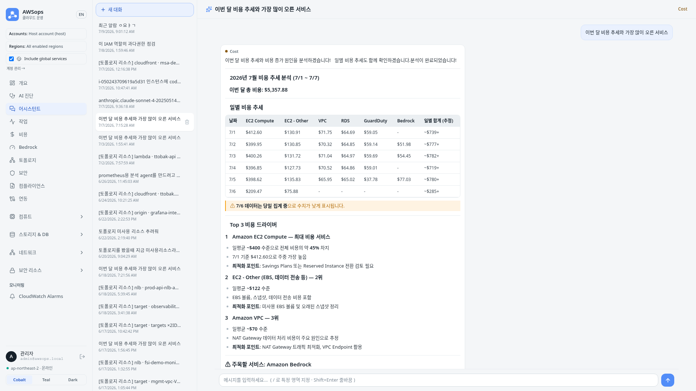
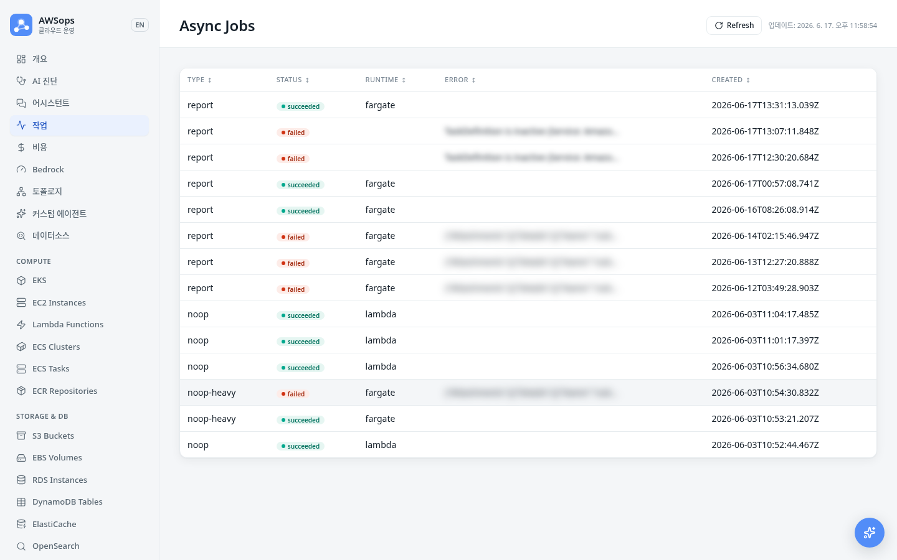

<!-- Slide 1: Section Cover -->

@type: cover
@transition: fade

# Architecture Deep Dive
## AWSops 기술 아키텍처

Terraform 기반 MSA · 비공개 엣지 · 읽기 전용 운영 태세

:::notes
{timing: 1min}
두 번째 파트, 아키텍처 딥다이브입니다.
AWSops가 어떻게 만들어졌는지 레이어별로 자세히 보겠습니다.
핵심은 세 가지입니다. 첫째, Terraform 기반 MSA로 재구축했다는 점. 둘째, 공개 진입점이 없는 비공개 엣지 구조라는 점. 셋째, 읽기 전용 운영 태세 위에 모든 것이 설계되었다는 점입니다.
{cue: transition}
전체 그림부터 보겠습니다.
:::

---

<!-- Slide 2: Overall Architecture -->

@type: content
@transition: slide

# Overall Architecture — 4-Layer Private Edge

:::html

  

    Browser
    awsops-v2.example.com
  

  
↓ TLS

  

    CloudFront
    VPC Origin · https-only:443 · SNI = public FQDN
  

  
↓ HTTPS:443 (regional ACM)

  

    Internal ALB
    SG: 443 ONLY from <code style="color:#a855f7;">CloudFront-VPCOrigins-Service-SG</code>
  

  
↓ HTTP

  

    ECS Fargate
    <code style="color:#00ff88;">awsops-v2-web:3000</code> (thin-BFF, arm64)
  

  

    
No Public ALB

    
진입점은 CloudFront 한 곳

  

  

    
Aurora

    
영속 상태

  

  

    
AgentCore MCP

    
라이브 AWS 읽기

  

:::

:::notes
{timing: 3min}
전체 구조는 4개 레이어의 비공개 엣지입니다.
브라우저는 전용 도메인으로 들어오고, CloudFront가 TLS로 받습니다. 여기서 VPC Origin을 https-only 443으로 설정해 내부 ALB까지 TLS가 끊기지 않게 합니다. origin 도메인을 public FQDN으로 지정해 SNI가 맞아야 합니다.
{cue: pause}
핵심은 공개 ALB가 없다는 점입니다. 내부 ALB의 보안 그룹은 CloudFront 관리형 SG에서 오는 443만 허용합니다. VPC CIDR만 열면 504가 납니다. ALB는 HTTP로 Fargate의 web 컨테이너 3000번 포트로 전달합니다.
영속 상태는 Aurora에 두고, 라이브 AWS 조회는 AgentCore MCP 도구가, 무거운 작업은 비동기 워커가 처리합니다.
{cue: transition}
이 인프라를 어떻게 코드로 관리하는지 보겠습니다.
:::

---

<!-- Slide 3: Terraform IaC -->

@type: content
@transition: slide

# Terraform IaC — Single Root + Feature Flags

::: left

### Foundation

- **단일 루트** `terraform/v2/foundation/`
- **Partial S3 backend** — `awsops-v2-tfstate`, `use_lockfile` (DynamoDB 없음)
- TF ≥ **1.15**, provider **~>6.0**, **arm64**
- **Saved-tfplan 규율** — 공유 인프라는 `apply tfplan` (no `-auto-approve`)

### Feature Flags (~17개, 전부 default-off = $0)

- `agentcore_enabled` · `workers_enabled` · `steampipe_enabled`
- `hybrid_routing_enabled` · `diagnosis_schedule_enabled` · `diagnosis_notify_enabled`
- `incident_lifecycle_enabled` · `k8sgpt_enabled` · `rca_writeback_enabled`
- `eks_auto_register_enabled` · `ai_cost_tracking_enabled` · `multi_route_synthesis_enabled`
- `remediation_enabled` — **ADR-005 FROZEN**, do-not-enable

**LIVE 오늘**: workers · steampipe · agentcore · integrations · ai_cost_tracking · diagnosis_schedule · diagnosis_notify · eks_auto_register · hybrid_routing

:::

::: right

### Key `.tf` Files

| 파일 | 역할 |
|------|------|
| `network.tf` | VPC 신규/재사용 |
| `edge.tf` | CloudFront + VPC Origin + ALB |
| `auth.tf` | Cognito + Lambda@Edge |
| `data.tf` | Aurora + schema |
| `workload.tf` | ECS web service |
| `ecr.tf` | dual-tier ECR |
| `ai.tf` | AgentCore + SSM |
| `workers.tf` | SQS + SFN + Lambda |
| `eks.tf` | Access Entry + AdminView |
| `steampipe.tf` | 인벤토리 sync (`steampipe_enabled`) |
| `notify.tf` | 진단 알림 SNS (`diagnosis_notify_enabled`) |
| `incidents.tf` | 인시던트 webhook (`incident_lifecycle_enabled`) |
| `k8sgpt.tf` | K8sGPT 예산/리소스 (`k8sgpt_enabled`) |
| `writeback.tf` | RCA write-back (`rca_writeback_enabled`) |
| `remediation.tf` | 리메디에이션 substrate (**FROZEN**) |
| `secret-rotation.tf` | 자기치유 재배포 (ADR-015) |

:::

:::notes
{timing: 3min}
인프라는 전부 Terraform입니다.
단일 루트 `terraform/v2/foundation/` 아래 모든 리소스를 정의하고, 상태는 partial S3 backend로 관리합니다. `use_lockfile`을 써서 DynamoDB 락 테이블 없이도 동시성 안전을 확보했습니다. Terraform 1.15 이상, provider 6 계열, 이미지는 모두 arm64입니다.
{cue: pause}
큰 모듈은 전부 feature flag로 게이트합니다. 지금은 약 17개까지 늘어났습니다 — agentcore, workers, steampipe, hybrid_routing뿐 아니라 diagnosis_schedule, diagnosis_notify, incident_lifecycle, k8sgpt, rca_writeback, eks_auto_register, ai_cost_tracking, multi_route_synthesis, 그리고 동결(do-not-enable) 상태인 remediation까지. 전부 기본값이 false라서 plan을 돌리면 No changes, 비용은 0입니다.
{cue: pause}
다만 라이브 환경은 이미 여러 개를 켜 놓은 상태입니다. workers, steampipe, agentcore, integrations, ai_cost_tracking, diagnosis_schedule, diagnosis_notify, eks_auto_register, hybrid_routing가 terraform.tfvars에서 true입니다. remediation과 integrations_write는 계속 off이자 동결 상태입니다.
공유 인프라는 절대 auto-approve를 쓰지 않고, 저장된 tfplan을 apply하는 규율을 지킵니다. CloudFront나 SG 같은 긴 apply는 컨트롤러가 직접 실행합니다.
오른쪽이 파일별 역할입니다. 네트워크, 엣지, 인증, 데이터, 워크로드, ECR, AI, 워커, EKS에 더해 steampipe, notify, incidents, k8sgpt, writeback, remediation, secret-rotation까지 각 서브시스템이 별도 파일과 게이트로 분리되어 있습니다.
{cue: transition}
이제 컴퓨트와 웹 레이어입니다.
:::

---

<!-- Slide 4: Compute & Web -->

@type: content
@transition: slide

# Compute & Web — Thin-BFF on Fargate

::: left

### Next.js 14 Standalone (arm64)

- **루트 경로 서빙** — basePath 없음, fetch는 `/api/*`
- **Thin-BFF 원칙** — 무겁고·길고·OOM 위험 작업은 직접 실행 금지
- 무거운 작업은 **`POST /api/jobs`로 enqueue**

### Routes

- `/api/health` — 공개 헬스체크
- `/api/stream` — SSE 스트리밍
- `/api/db` — Aurora ping
- `/api/jobs` (+`/[id]`) — 비동기 작업

:::

::: right

:::html

  

    
⚠ HOSTNAME=0.0.0.0

    
런타임 env로 명시. 이미지 ENV로는 부족 — ECS가 ENI IP로 덮어써 healthCheck UNHEALTHY.

  

  

    
✓ Health Path Match

    
컨테이너 + target group 헬스 경로 = <code style="color:#00d4ff;">/api/health</code>. 불일치 시 circuit breaker 루프.

  

:::

:::

:::notes
{timing: 3min}
웹 레이어는 Next.js 14 standalone 빌드이고 arm64입니다.
전용 도메인을 쓰므로 basePath 없이 루트 경로에서 서빙하고, fetch는 그냥 `/api/*`를 호출합니다.
{cue: pause}
가장 중요한 설계 원칙은 thin-BFF입니다. 무겁거나, 오래 걸리거나, OOM 위험이 있는 작업은 절대 인라인으로 돌리지 않습니다. 대신 `POST /api/jobs`로 워커 큐에 넣습니다. 라우트는 공개 헬스체크, SSE 스트림, Aurora ping, 비동기 작업 정도로 얇게 유지합니다.
오른쪽은 실전에서 꼭 챙겨야 하는 두 가지입니다. 첫째, HOSTNAME을 0.0.0.0으로 런타임 env에 명시해야 합니다. 이미지 ENV만으로는 ECS가 ENI IP로 덮어써서 헬스체크가 UNHEALTHY가 됩니다. 둘째, 컨테이너와 타깃 그룹의 헬스 경로가 앱의 `/api/health`와 정확히 일치해야 circuit breaker 루프를 피합니다.
{cue: transition}
영속 상태를 담는 데이터 레이어로 갑니다.
:::

---

<!-- Slide 5: Data Layer -->

@type: content
@transition: slide

# Data Layer — Aurora Serverless v2

::: left

### Aurora (PostgreSQL 17.9)

- **0.5–4 ACU**, KMS CMK, RDS-관리 master secret
- 앱 접근 = **node-pg** (`web/lib/db.ts`)
- ADR-030 스키마 (v9 baseline) + `worker_jobs` · chat threads · diagnosis
- 새 테이블 = **ULID 마이그레이션** (`migrations/<ULID>_*.sql`)

:::

::: right

### Steampipe = 인벤토리 sync ONLY

:::html

  
warm Fargate → Aurora → /inventory/[type]

  

    flag-gated (<code style="color:#00ff88;">steampipe_enabled</code>) 
    약 <b style="color:#00ff88;">22종</b> 리소스 타입 동기화 
    fan-out sync · registry-driven nav
  

  

    NOT a live query engine — pg Pool / 라이브 조회 아님
  

:::

:::

:::notes
{timing: 3min}
영속 상태는 Aurora Serverless v2가 담당합니다.
PostgreSQL 17.9, 0.5에서 4 ACU로 오토스케일하고, KMS CMK로 암호화하며 master secret은 RDS가 관리합니다. 앱은 node-pg 공유 풀로 접근합니다. 스키마는 ADR-030 기반 v9 baseline에 worker_jobs, chat 스레드, 진단 리포트 테이블이 더해진 형태이고, 새 테이블은 schema.sql에 덧붙이지 않고 ULID 마이그레이션 파일로 추가하는 규칙입니다.
{cue: pause}
여기서 꼭 짚어야 할 점이 있습니다. Steampipe는 라이브 쿼리 엔진이 아닙니다. flag로 켜는 인벤토리 sync일 뿐입니다. warm Fargate가 약 22종 리소스 타입을 Aurora로 동기화하고, 이걸 generic `/inventory/[type]` 페이지가 보여줍니다. 라이브 AWS 조회는 어디까지나 AgentCore MCP 도구가 합니다. 예전의 임베디드 pg Pool 방식이 아니라는 점을 강조합니다.
{cue: transition}
이제 핵심인 AI 엔진입니다.
:::

---

<!-- Slide 6: AI Engine -->

@type: content
@transition: slide

# AI Engine — Bedrock AgentCore

:::html

  

    
Models + Runtime

    

      Claude <b>Opus 4.8</b> / <b>Sonnet 5</b> / <b>Haiku 4.5</b> 
      AgentCore Runtime (Strands, <code style="color:#f59e0b;">agent/agent.py</code>) 
      + Memory + Code Interpreter
    

  

  

    
Config Source of Truth

    

      <b>SSM</b> = source of truth 
      <code style="color:#00d4ff;">/ops/awsops-v2/agentcore/*</code> 
      provision.py 기록 → BFF 런타임 read
    

  

  
9 Section Gateways &nbsp;·&nbsp; ~160 read-only tools (27 slices)

  

    network
    container
    data
    security
    cost
    monitoring
    iac
    ops
    external-obs
  

  
external-obs = <b style="color:#00d4ff;">9번째 게이트웨이</b>(2026-06-24 승격, ADR-004) — Prometheus·ClickHouse 커넥터 호스팅, 챗 키 <code style="color:#00d4ff;">observability</code>로 별칭. 27슬라이스 중 <b style="color:#00ff88;">2개(iam-mcp+flow-monitor, 15도구)만 LIVE</b> — 나머지는 <code>ai.tf</code>에 정의되었으나 flag-off

:::

:::html

:::

:::notes
{timing: 4min}
AI 엔진은 Bedrock AgentCore입니다.
모델은 Opus 4.8, Sonnet 5, Haiku 4.5를 상황에 맞게 쓰고, AgentCore Runtime이 Strands 기반 `agent/agent.py`를 실행합니다. Memory와 Code Interpreter도 함께 붙어 있습니다.
{cue: pause}
설정의 source of truth는 SSM입니다. provision.py가 runtime ARN, interpreter ID, memory ID를 `/ops/awsops-v2/agentcore/` 경로에 기록하고, 웹 BFF가 런타임에 읽습니다. valueFrom 레이스를 피하려는 의도적 설계입니다.
도구는 9개 섹션 게이트웨이로 묶입니다. network, container, data, security, cost, monitoring, iac, ops, 그리고 external-obs입니다. ADR-004가 2026년 6월 24일에 개정되면서 external-obs에 Prometheus·ClickHouse 커넥터가 붙었고, 그때부터 9번째 라우팅 가능한 게이트웨이로 승격됐습니다. 예전 버전에서 "9번째 게이트웨이가 아니다"라고 했던 건 그 커넥터가 붙기 전 부트스트랩 상태를 말한 거였고, 지금은 정반대입니다. 전체 카탈로그는 27개 슬라이스, 약 160개 읽기 전용 도구인데, 실제로 배포되어 LIVE인 건 iam-mcp와 flow-monitor 딱 2개 슬라이스, 15개 도구뿐입니다. 나머지는 ai.tf에 정의는 되어 있지만 flag가 꺼져 있어서 아직 뜨지 않습니다.
{cue: transition}
그럼 이 9개 게이트웨이 중 어디로 보낼지는 어떻게 정할까요?
:::

---

<!-- Slide 7: Hybrid Routing & Streaming Chat -->

@type: content
@transition: slide

# Hybrid Routing & Streaming Chat — ADR-003

::: left

### Routing Pipeline

1. **Regex fast-path** — 명백한 질의는 즉시 라우팅
2. **Haiku 4.5 classifier** — 애매하면 분류
3. **Prompt caching** — 약 **59%** 캐시 히트
4. → 섹션 라우팅 → SSE 스트리밍 + 도구 표시

### Gate Result

- **69.2% → 96.9%** (+27.7pp)
- **LIVE** 2026-06-10

:::

::: right

### Chat UX

:::html

  

    🪟 resizable / maximizable drawer 
    📄 <code style="color:#00d4ff;">/assistant</code> full page 
    📝 react-markdown 렌더링 
    💾 Aurora-backed thread 영속 
    📚 Claude-app 스타일 사이드바
  

:::

:::html

:::

:::

:::notes
{timing: 3min}
9개 게이트웨이 중 어디로 보낼지는 ADR-003 하이브리드 라우팅이 정합니다.
파이프라인은 3단계입니다. 먼저 regex fast-path가 명백한 질의를 즉시 라우팅합니다. 애매하면 Haiku 4.5 분류기가 판단합니다. 그리고 prompt caching으로 약 59% 캐시 히트를 내서 비용과 지연을 줄입니다. 결정된 섹션으로 라우팅한 뒤 SSE로 응답을 스트리밍하면서 어떤 도구를 호출하는지도 함께 보여줍니다.
{cue: pause}
게이트 정확도는 69.2%에서 96.9%로 27.7 포인트 올랐고, 2026년 6월 10일에 라이브입니다.
오른쪽은 챗 UX입니다. 크기 조절과 최대화가 되는 드로어, `/assistant` 풀페이지, react-markdown 렌더링, 그리고 Aurora에 저장되는 스레드 영속까지. 사이드바는 Claude 앱 스타일이라 익숙합니다.
{cue: transition}
이 챗 위에 얹힌 대표 기능이 AI 진단입니다.
:::

---

<!-- Slide 8: AI Diagnosis -->

@type: content
@transition: slide

# AI Diagnosis — Flagship, Read-Only

:::html

  

    
Light / Mid Tier

    
9

    
섹션 · 8 base + intended-vs-actual drift

  

  

    
Deep Tier

    
15

    
섹션 · 8 base + 6 deep-only + drift, Sonnet 기본 / Opus 선택 (cost-gate)

  

  Well-Architected 매핑
  SSE 진행률
  auto-title + tags
  soft-delete
  DOCX / PDF / Markdown export

  Strictly Read-Only
  진단·권고만 — auto-remediation 없음. 생성은 비동기 워커 (python-docx + chromium)

:::

:::notes
{timing: 4min}
AWSops의 대표 기능은 AI 종합진단입니다.
진단은 워커가 생성하는 종합 리포트입니다. light·mid 티어는 9섹션인데, 8개 기본 섹션에 intended-vs-actual drift 섹션이 하나 더 붙습니다. deep 티어는 15섹션으로, 같은 8개 기본 섹션에 6개 deep-only 섹션과 drift 섹션이 더해집니다. deep은 기본 Sonnet으로 돌고, cost-gate를 거쳐 Opus를 선택할 수도 있습니다. 모든 섹션은 Well-Architected 6대 기둥에 매핑됩니다.
{cue: pause}
생성 중에는 SSE로 진행률이 흐르고, 끝나면 워커 LLM이 자동으로 제목을 붙이고 태그를 제안합니다. 제목 수정, 태그 수동 추가, soft-delete도 됩니다. 내보내기는 DOCX, PDF, Markdown 세 가지를 지원하는데, 워커가 python-docx와 chromium으로 생성합니다.
가장 중요한 건 이 모든 게 철저히 읽기 전용이라는 점입니다. 진단하고 권고할 뿐 자동으로 고치지 않습니다. auto-remediation은 없습니다. 그래서 안심하고 운영 환경에 붙일 수 있습니다.
{cue: question}
Well-Architected Review를 수동으로 며칠씩 만들어 보신 분 계시죠? 이게 그 작업을 대신합니다.
{cue: transition}
이 무거운 생성 작업을 안전하게 받쳐주는 워커 티어를 보겠습니다.
:::

---

<!-- Slide 9: Async Worker Tier -->

@type: content
@transition: slide

# Async Worker Tier — OOM-Safe Backbone

:::html

  

    web POST /api/jobs
     → <code style="color:#00d4ff;">worker_jobs</code> (queued) + SQS
  

  
↓ ESM (kill-switch)

  

    dispatcher Lambda
     — 멱등 (idempotent on job_id)
  

  
↓ Step Functions Standard · Choice on <code style="color:#a855f7;">$.runtime</code>

  

    

      RunLambda 짧은 작업
    

    

      ecs:runTask.sync (Fargate) 긴 작업 / OOM
    

  

  
↓

  

    worker가 직접 <b style="color:#00ff88;">running/succeeded</b> 기록 · Catch 시 <b style="color:#f59e0b;">status_updater</b>가 failed · <b style="color:#00d4ff;">reaper</b>(EventBridge 5분)가 stale 정합화
  

:::

::: left

### 잡 종류 (2026-06-18 이후 증가)

- **schedule_dispatcher** — 시간별 EventBridge → `report_schedules` 스캔 → 진단 잡 enqueue (`diagnosis_schedule_enabled`, LIVE)
- **diagnosis_digest** (notify.tf) — 리포트별 이메일 대신 배치 SNS 다이제스트 (`diagnosis_notify_enabled`, LIVE, ADR-013)
- **compliance** (Powerpipe) — CIS 벤치마크 Fargate 잡 (`steampipe_enabled`)

:::

::: right

:::html

:::

:::

:::notes
{timing: 3min}
무거운 작업은 모두 비동기 워커 티어가 받습니다.
흐름은 이렇습니다. 웹이 `POST /api/jobs`로 들어오면 worker_jobs 테이블에 queued 상태로 기록하고 SQS에 넣습니다. ESM이 킬스위치 역할을 하면서 dispatcher Lambda를 호출하는데, dispatcher는 job_id 기준으로 멱등하게 동작합니다.
{cue: pause}
그다음 Step Functions Standard가 `$.runtime` 값을 보고 분기합니다. 짧은 작업은 RunLambda로, 길거나 OOM 위험이 있는 작업은 ecs:runTask.sync로 Fargate 워커에 넘깁니다. 진단 리포트나 DOCX·PDF 생성 같은 무거운 작업이 여기로 갑니다.
워커는 스스로 running과 succeeded를 Aurora에 기록합니다. 실패해서 Catch로 빠지면 status_updater Lambda가 failed로 표시하는데, 이건 SFN이 VPC 안 Aurora에 직접 쓸 수 없기 때문입니다. 마지막으로 reaper가 5분마다 stale 작업을 정합화합니다. 그래서 OOM에 안전한 백본입니다. 참고로 Fargate 워커는 ENTRYPOINT가 아니라 CMD를 써야 SFN command override가 정상 동작합니다.
{cue: pause}
이 백본에 얹히는 잡 종류도 계속 늘었습니다. schedule_dispatcher는 시간별로 report_schedules를 스캔해서 예약된 진단 잡을 큐에 넣고, diagnosis_digest는 리포트가 끝날 때마다 개별 이메일을 보내던 걸 배치 SNS 다이제스트로 바꿨습니다. 그리고 Powerpipe 기반 compliance 잡이 CIS 벤치마크를 이 워커 티어 위에서 돌립니다. 셋 다 flag-gated지만 라이브 환경에서는 이미 켜져 있습니다.
{cue: transition}
관측성과 토폴로지로 넘어갑니다.
:::

---

<!-- Slide 10: Datasources & Topology -->

@type: content
@transition: slide

# Datasources & Topology

::: left

### Datasource Platform (read-only)

- 커넥터: **ClickHouse · Prometheus · Loki · Tempo · Mimir**
- connector Lambda + **Aurora schema cache**
- chat injection — AI가 데이터소스 교차 조회
- **`/datasources` Explore** 페이지 + NL→query

:::

::: right

### Topology

:::html

  

    CF→
    LB→
    TG→
    DB
  

  

    flow + infra 리소스 그래프 
    <code style="color:#a855f7;">/topology/resource/[id]</code> 상세 패널
  

:::

:::

:::notes
{timing: 3min}
관측성 데이터는 읽기 전용 데이터소스 플랫폼으로 통합합니다.
ClickHouse, Prometheus, Loki, Tempo, Mimir 커넥터를 지원합니다. 각 커넥터는 Lambda로 구현되고, 스키마는 Aurora에 캐시합니다. 이 데이터를 챗에 주입하면 AI가 여러 데이터소스를 교차 조회할 수 있습니다. `/datasources` Explore 페이지에서는 자연어를 쿼리로 변환해 직접 탐색할 수도 있습니다. 모두 읽기 전용입니다.
{cue: pause}
토폴로지는 리소스 간 관계를 그래프로 보여줍니다. flow 그래프와 infra 리소스 그래프 두 가지가 있고, CloudFront에서 로드밸런서, 타깃 그룹, DB로 이어지는 경로를 시각화합니다. `/topology/resource/[id]`로 들어가면 개별 리소스의 상세 패널을 볼 수 있습니다.
{cue: transition}
컨테이너 운영자를 위한 EKS 통합을 보겠습니다.
:::

---

<!-- Slide 11: EKS -->

@type: content
@transition: slide

# EKS — Read-Only In-Cluster

::: left

### 3 Auth Modes (Aurora `eks_registrations.auth`)

- **task-role presigned STS** — `configure.mjs` **멀티선택** → `eks.tf` Access Entry + **AmazonEKSAdminViewPolicy**(클러스터 스코프, View 아님 — View는 cluster-scoped list 403)
- **sa-token** / **assume-role** — 클러스터별 Aurora 등록, terraform 온보딩 불필요
- **Auto-Register (LIVE)** — EventBridge(CloudTrail) → Lambda → `eks_registrations` (`eks_auto_register_enabled`)

### Read-Only Query

- nodes / pods / deployments / services (+ explorer kinds)
- **BFF-direct** (워커 거치지 않음)
- core discovery(`ListClusters`/`DescribeCluster`)는 **ungated·always-on**(`workload.tf`) — `/api/eks`·`/api/overview`·`/api/cost`는 온보딩 flag와 무관하게 항상 동작

:::

::: right

:::html

  
EKS Page

  

    ✓ access badges 
    ✓ CLI guide 
    ✓ 클러스터별 워크로드 뷰
  

  

    AdminView policy = 읽기 전용 RBAC(*/*/get,list,watch) — 변경 권한 없음. secrets/configmaps는 BFF allow-list에서 제외
  

:::

:::

:::notes
{timing: 3min}
EKS도 읽기 전용으로 통합되는데, 인증 경로가 3가지로 늘었습니다. 원래 경로는 configure.mjs 멀티선택으로 시작해서 eks.tf가 웹 task role에 Access Entry를 부여하고 AmazonEKSAdminViewPolicy를 클러스터 스코프로 붙이는 방식입니다. View가 아니라 AdminView인 이유는, View 정책엔 클러스터 스코프 리소스가 없어서 노드 목록 조회가 403이 나기 때문입니다. AdminView는 */*/get,list,watch라 시크릿까지 읽을 수 있지만, BFF가 노출하는 kind는 화이트리스트로 제한되어 있어서 시크릿·컨피그맵은 절대 통과하지 않습니다.
{cue: pause}
여기에 sa-token과 assume-role 두 가지 경로가 Aurora의 eks_registrations.auth에 더해졌습니다. 클러스터별로 등록하면 되고 terraform 온보딩이 필요 없습니다. 그리고 지금 라이브인 auto-register 경로가 있는데, EventBridge가 CloudTrail의 AssociateAccessPolicy나 DeleteAccessEntry 이벤트를 잡아서 Lambda를 거쳐 eks_registrations에 자동으로 기록합니다. 버튼을 누를 필요가 없습니다.
조회는 nodes, pods, deployments, services 같은 핵심 리소스를 BFF가 직접 처리합니다. 워커를 거치지 않습니다. 그리고 한 가지 더, ListClusters·DescribeCluster 같은 핵심 discovery 권한은 이제 게이트가 아니라 workload.tf에 상시로 붙어 있습니다. 그래서 온보딩 플래그가 꺼져 있어도 /api/eks, /api/overview, /api/cost는 항상 정상 동작합니다.
EKS 페이지에는 접근 권한 배지와 CLI 가이드, 클러스터별 워크로드 뷰가 있습니다.
{cue: transition}
계정을 하나 더 늘리면 어떻게 되는지, 멀티 계정 구조를 보겠습니다.
:::

---

<!-- Slide 12: Multi-Account -->

@type: content
@transition: slide

# Multi-Account — STS AssumeRole Fan-Out (ADR-011)

::: left

### Registry + Assume

- Aurora **accounts** 레지스트리 — 호스트 계정은 lazy seed
- 대상 계정 `AWSopsReadOnlyRole`을 host task role이 **STS AssumeRole**
- **ExternalId** — 1st-party(trust policy가 task-role ARN 핀) = **선택**, 3rd-party/와일드카드 = **필수**(confused-deputy 방어)
- 글로벌 셀렉터: 단일 계정 스코프 / `__all__` = 전 계정 fan-out

:::

::: right

### Safety

- **host self-assume 가드** — target == host면 `get_role_arn()`이 `None` 반환 → host 실행 role 직접 사용(v1 전용 role을 host에서 self-assume → AccessDenied 오진 방지)
- **read-only 한정** — 대상 계정 변경 작업 없음(ADR-005 동결과 정합)
- `/accounts` admin UI + CFN으로 대상 계정에 read-only role 배포(코드 변경 없음)

:::

:::notes
{timing: 3min}
[요약]
• Aurora accounts 레지스트리 + STS AssumeRole로 여러 AWS 계정을 read-only 페더레이션
• ExternalId는 1st-party(task-role ARN 핀)면 선택, 3rd-party면 필수
• host self-assume 가드로 "cross-account 차단" 오진을 방지

AWSops는 단일 호스트 계정에서 돌지만, 여러 AWS 계정을 통합 대시보드로 보여줄 수 있습니다. ADR-011이 이걸 STS AssumeRole 기반 read-only 페더레이션으로 정의합니다. Aurora에 accounts 레지스트리를 두고, 호스트 계정은 처음 접근할 때 lazy seed로 등록됩니다. 대상 계정에는 AWSopsReadOnlyRole을 미리 배포해 두고, host task role이 그 role을 assume합니다.
{cue: pause}
ExternalId는 상황에 따라 다릅니다. 대상 계정의 trust policy가 AWSops task-role ARN을 정확히 핀해 두면 1st-party로 보고 ExternalId를 생략할 수 있습니다. 반대로 3rd-party거나 와일드카드 principal이면 ExternalId가 필수입니다 — confused-deputy 공격을 막기 위해서입니다. 이 구분은 코드가 강제하는 게 아니라 trust policy로 운영적으로 강제됩니다.
전역 계정 셀렉터로 한 계정만 볼 수도 있고, __all__을 선택하면 전 계정을 fan-out으로 조회해서 비용이나 Bedrock 사용량 같은 걸 집계합니다.
{cue: pause}
한 가지 함정이 있었는데, 호스트 계정을 선택했을 때 에이전트가 host를 마치 다른 계정인 것처럼 착각해서 host에는 없는 v1 전용 role을 self-assume하려다 AccessDenied가 나고, 이걸 "cross-account 차단"으로 오진했던 적이 있습니다. 지금은 target이 host와 같으면 get_role_arn()이 None을 반환해서 host 실행 role을 그대로 씁니다.
{cue: transition}
이 모든 접근 경로를 지탱하는 인증과 보안 레이어를 보겠습니다.
:::

---

<!-- Slide 13: Auth & Security -->

@type: content
@transition: slide

# Auth & Security

::: left

### Cognito + Lambda@Edge

- **us-east-1**, py3.12, viewer-request
- **RS256 JWKS** 서명 검증 (iss/aud/token_use)
- OAuth `state` + **PKCE public client**

### Login (ADR-002)

- **Primary** = 자체 `/login` 폼
- BFF `POST /api/auth/login` → 무서명 공개 `InitiateAuth(USER_PASSWORD_AUTH)` → `awsops_token` (id_token 12h)
- Hosted UI PKCE = **dark fallback**, signout = 쿠키 삭제

:::

::: right

:::html

  

    
🔒 Private Edge

    
공개 ALB 없음 — 진입점은 CloudFront 하나

  

  

    
🔑 ECS Secrets

    
execution role 권한 (task role 아님)

  

  

    
👤 Admin

    
SSM + Cognito group (fail-closed)

  

:::

:::

:::notes
{timing: 3min}
인증은 Cognito와 Lambda@Edge가 함께 처리합니다.
Lambda@Edge는 us-east-1에서 viewer-request로 동작하며 RS256 JWKS로 토큰 서명을 검증합니다. iss, aud, token_use를 모두 확인하고, OAuth state와 PKCE public client를 씁니다. 시크릿이 없는 공개 클라이언트입니다.
{cue: pause}
로그인의 기본 경로는 ADR-002에 따라 자체 `/login` 폼입니다. BFF의 `POST /api/auth/login`이 무서명 공개 InitiateAuth를 USER_PASSWORD_AUTH 방식으로 호출해 awsops_token을 발급합니다. id_token은 12시간 유효합니다. 미인증 요청은 엣지가 `/login`으로 보냅니다. Hosted UI PKCE 플로우는 다크 폴백으로 남겨두고, signout은 쿠키만 삭제합니다.
오른쪽 세 가지가 보안 기둥입니다. 공개 ALB가 없는 비공개 엣지, ECS 시크릿은 task role이 아니라 execution role 권한이어야 한다는 점, 그리고 admin 모델은 SSM과 Cognito group 기반으로 fail-closed입니다.
{cue: transition}
이걸 실제로 배포하는 흐름을 보겠습니다.
:::

---

<!-- Slide 14: Deployment -->

@type: content
@transition: slide

# Deployment — Makefile Flow

:::html

  

    <code style="color:#00d4ff;font-weight:bold;">make configure</code>
     — TUI → terraform.tfvars + backend.hcl
  

  
↓

  

    <code style="color:#f59e0b;font-weight:bold;">terraform init / plan -out tfplan</code>
     → 컨트롤러가 <code style="color:#f59e0b;">apply tfplan</code> (공유 인프라)
  

  
↓

  

    <code style="color:#00ff88;font-weight:bold;">make deploy</code>
     — migrate-first → arm64 build → ECR → ECS rolling → wait stable → smoke <code style="color:#00ff88;">/api/health</code>
  

  
↓ (flag-gated)

  

    <code style="color:#a855f7;font-weight:bold;">make agentcore</code> / <code style="color:#a855f7;font-weight:bold;">make workers</code>
     — 각 flag로 apply 후 실행
  

:::

:::notes
{timing: 3min}
배포는 Makefile로 단계가 깔끔하게 나뉩니다.
먼저 `make configure`로 대화형 TUI를 돌립니다. VPC, 도메인, 버킷, EKS를 고르면 terraform.tfvars와 backend.hcl이 생성됩니다. 그다음 terraform init과 plan으로 tfplan을 저장하고, 공유 인프라는 컨트롤러가 직접 apply tfplan으로 적용합니다. 에이전트가 공유 프로덕션 인프라를 임의로 apply하지 않도록 막혀 있습니다.
{cue: pause}
앱은 `make deploy`로 배포합니다. 중요한 건 migrate가 먼저 돌고 그다음 웹 이미지를 배포한다는 순서입니다. ULID 마이그레이션을 먼저 적용한 뒤 arm64로 빌드해서 ECR에 푸시하고, ECS 롤링 배포 후 stable을 기다린 다음 `/api/health`로 smoke 테스트를 합니다. 여기서 terraform apply는 하지 않습니다.
AgentCore와 워커는 각각의 flag로 apply한 뒤 `make agentcore`, `make workers`로 이미지와 provisioner를 실행합니다.
{cue: transition}
마지막으로 이 아키텍처가 가진 태세와 차별점을 정리하겠습니다.
:::

---

<!-- Slide 15: Posture & Differentiators -->

@type: content
@transition: fade

# Posture & Differentiators

:::html

  

    
🔒

    
동결 (do-not-enable)

    
ADR-005 (029/036/031P4 통합, 2026-06-11 reversal) AWS-리소스 <b>변경 + 자율</b> — 새 명시적 결정 전까지 동결(영구 아님)

  

  

    
📥

    
거버넌스된 External (ADR-007)

    
외부 DATA read + 기록/티켓/메시지 <b>write</b> 허용 SSRF · Secrets · DLP · human-gate 하

  

  <b style="color:#ef4444;">예외 1건 — ADR-015</b> (2026-07-01 owner-override): 호스트 자기 web 서비스의 <code style="color:#ef4444;">ecs:UpdateService force-new-deployment</code>(재시작)만, Aurora secret 회전 이벤트 트리거 한정, IAM 1 ARN, secret-id fail-closed, default-off. 나머지 ADR-005 전부는 그대로 동결.

  🧠
  In-Account Bedrock
  — 계정 안에서 추론, 외부 AI SaaS API 없음

:::

:::notes
{timing: 3min}
이 아키텍처의 태세를 정확히 정의하겠습니다.
AWSops는 읽기 전용 AWS 운영 대시보드에 AI 진단을 더한 것입니다. ADR-005(옛 029/036/031 Phase4를 통합, 2026년 6월 11일 reversal 합의)에 따라 AWS 리소스 변경과 자율 실행은 동결입니다. 다만 여기서 정확히 말씀드릴 게 있는데, 이건 "영구 금지"가 아닙니다. BASELINE 문서가 그 표현을 명시적으로 거부합니다. 정확히는 "안전조건 충족 + 새로운 명시적 결정 전까지" 동결이고, 완화하려면 새 ADR과 멀티-AI 패널, 날짜가 박힌 owner override가 필요합니다. do-not-enable, 그냥 조용히 다시 켜지 않는다는 뜻입니다.
{cue: pause}
딱 하나 예외가 있습니다. ADR-015인데, 2026년 7월 1일에 오준석님이 owner-override로 승인했습니다. 호스트 자기 web 서비스를 Aurora secret 회전 이벤트에 맞춰 force-new-deployment로 재시작하는 것, 그거 하나만 허용됩니다. IAM은 서비스 1개 ARN으로 스코프되고, secret id가 안 맞으면 fail-closed로 아예 안 돕니다. 기본값은 off입니다. 나머지 ADR-005는 전부 그대로 동결입니다.
다만 외부 데이터에 대해서는 다릅니다. ADR-007이 이걸 다루는데, 외부 관측성 데이터 읽기, 그리고 외부 기록·티켓·메시지 write는 거버넌스 하에 허용됩니다. SSRF 방어, Secrets 관리, DLP와 redaction, human-gate를 모두 거칩니다. 즉 AWS 리소스는 안 건드리지만, 외부 시스템에 리포트를 보내거나 티켓을 끊는 건 통제된 형태로 가능합니다.
그리고 핵심 차별점, AI 추론은 고객 계정 안 Bedrock에서 돌립니다. 외부 AI SaaS API가 없으므로 운영 데이터가 계정 밖으로 나가지 않습니다.
{cue: transition}
전체를 한 장으로 정리하겠습니다.
:::

---

<!-- Slide 16: Key Takeaways -->

@type: content
@transition: fade

# Key Takeaways — Architecture

- **Terraform MSA on private edge** — CloudFront VPC Origin → 내부 ALB → Fargate, 공개 ALB 없음
- **Aurora 영속 상태** — PostgreSQL 17.9 (Steampipe = flag-gated 인벤토리 sync일 뿐)
- **AgentCore 섹션 에이전트** — 9 게이트웨이 · ~160 read-only 도구(27슬라이스, LIVE는 2슬라이스·15도구)로 라이브 AWS 읽기
- **ADR-003 하이브리드 라우팅 + ADR-011 멀티 계정** — regex + Haiku 분류기 + caching, STS AssumeRole fan-out
- **OOM-safe 비동기 워커 티어** — SQS + SFN + Lambda/Fargate, 진단·스케줄·알림·컴플라이언스 처리
- **읽기 전용 동결 태세** — AWS 변경·자율 동결(ADR-005, 새 결정 전까지) + ADR-015 예외 1건, in-account Bedrock

:::notes
{timing: 2min}
아키텍처 파트를 한 장으로 정리합니다.
첫째, 비공개 엣지 위의 Terraform MSA입니다. CloudFront VPC Origin에서 내부 ALB를 거쳐 Fargate로 가고, 공개 ALB는 없습니다. 둘째, 영속 상태는 Aurora PostgreSQL 17.9입니다. Steampipe는 라이브 엔진이 아니라 flag로 켜는 인벤토리 sync일 뿐입니다.
{cue: pause}
셋째, 라이브 AWS 읽기는 AgentCore 섹션 에이전트가, 9개 게이트웨이에 약 160개 읽기 전용 도구로 처리합니다. 27개 슬라이스 중 실제 LIVE는 2개, 15개 도구뿐입니다. 넷째, 라우팅은 ADR-003 하이브리드고 ADR-011 멀티 계정 STS AssumeRole로 여러 계정을 fan-out 조회합니다. 다섯째, 무거운 작업은 OOM에 안전한 비동기 워커 티어가 받는데, 진단 리포트뿐 아니라 스케줄, 알림 다이제스트, 컴플라이언스 잡까지 늘었습니다. 여섯째, 그 위에 읽기 전용 동결 태세가 있는데 영구 금지는 아니고 ADR-015라는 좁은 예외 1건이 있습니다. 그리고 in-account Bedrock입니다.
{cue: transition}
세 번째 파트, 실제 데모와 진단 리포트로 이어가겠습니다.
:::

---

<!-- Slide 17: Thank You -->

@type: cover
@transition: fade

# AWSops
## AI-Powered AWS Operations Dashboard

감사합니다 · Questions?

:::notes
{timing: 1min}
두 번째 파트를 마칩니다.
지금까지 AWSops의 기술 아키텍처를 레이어별로 살펴봤습니다. Terraform 기반 MSA, 비공개 엣지, Aurora 영속 상태, AgentCore 섹션 에이전트, 하이브리드 라우팅, OOM에 안전한 워커 티어, 그리고 읽기 전용 동결 태세까지 모두 하나의 일관된 설계로 묶여 있습니다.
{cue: question}
질문 있으시면 편하게 주세요.
{cue: transition}
잠시 쉬고 마지막 파트, 실전 데모와 진단 리포트로 이어가겠습니다.
:::
