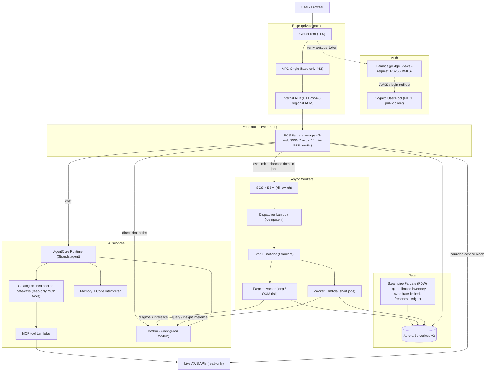
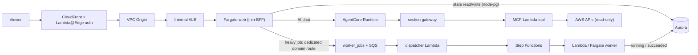

# Architecture

## System Overview

AWSops v2 is a read-only AWS/Kubernetes operations dashboard with AI diagnosis, rebuilt from the v1 single-EC2 monolith into a Terraform-based MSA. CloudFront reaches the web tier through a private origin path (VPC Origin → internal ALB → ECS Fargate). Cognito + Lambda@Edge verifies authentication at the edge; the BFF reverifies tokens and enforces session revocation and authorization. Aurora Serverless v2 holds durable state, AgentCore tools supply live domain reads, and separate worker processes execute heavy jobs. AWS-resource mutation and autonomous action are FROZEN by design (ADR-005).

## Components by Layer

| Layer | Component | Role | Key files |
|---|---|---|---|
| Edge | CloudFront (TLS) → VPC Origin `https-only:443` → internal ALB HTTPS:443 (regional ACM) | Private request path; no public ALB. ALB SG allows 443 only from `CloudFront-VPCOrigins-Service-SG` | `terraform/v2/foundation/edge.tf`, `network.tf`, `workload.tf` |
| Auth | Cognito User Pool (PKCE public client) + Lambda@Edge (`us-east-1`, python3.12, viewer-request) | RS256 JWKS/claims verification at the edge and BFF; BFF revocation, ownership and admin checks; self-hosted `/login` issues `awsops_token`, with Hosted UI PKCE retained as fallback | `auth.tf`, `edge-lambda/cognito_edge.py.tftpl`, `web/app/login/` |
| Presentation (web BFF) | Next.js 14 thin-BFF on ECS Fargate `awsops-v2-web:3000` (standalone arm64, root path — no basePath) | Serves UI, Aurora data, bounded service-specific SDK reads, read-only Kubernetes queries and AI chat. Heavy work uses ownership-checked domain routes; generic `POST /api/jobs` accepts only noop job types. See [web reference](reference/04-web-bff.md) and [API index](api-reference.md). | `web/`, `workload.tf`, `scripts/v2/deploy.mjs` |
| Data | Aurora Serverless v2 (engine/scaling configuration in `variables.tf`, KMS CMK, managed master secret); web node-pg uses IAM DB authentication. Flag-gated Steampipe inventory sync (`steampipe_enabled`) is **quota-limited** (ADR-021): env-tunable Steampipe plugin rate limiter, denial-safe SDK collectors, content-preserving `partial` runs (an SDK sub-call failure skips both prune phases; an unreachable-account partial still prunes reachable accounts while preserving that account's last-good rows), and a durable per-type freshness ledger (`last_success_at` via run_token CAS, `unknown_attribute_count` disclosure) | Durable app state (`data/schema.sql` + `schema_migrations`, ULID migrations) — replaces v1 `data/*.json`, not live Steampipe | `data.tf`, `data/schema.sql`, `web/lib/db.ts`, `steampipe.tf`, `scripts/v2/steampipe/sync_lambda.py` |
| AI | AgentCore Runtime, section gateways, Lambda MCP tools, Memory and Code Interpreter; models/catalog are configuration-driven | Live read-only domain tools. The registered BFF-local `aws-data` and collector routes are hard-disabled by `steampipeAvailable()` and fall back to normal routing. SSM is the runtime configuration source. | `ai.tf`, `scripts/v2/agentcore/`, `agent/`, `web/lib/aws-data.ts`, `web/lib/collectors/` |
| Async Workers | SQS + ESM (kill-switch) → dispatcher Lambda (idempotent on job_id) → Step Functions Standard `$.runtime` Choice → worker Lambda (short) or `ecs:runTask.sync` Fargate (long/OOM); status_updater + reaper (5 min) | Ledger-first `worker_jobs`; worker process failures are isolated from the web heap, while backend dependencies remain shared. Worker infrastructure is gated on `workers_enabled` | `workers.tf`, `scripts/v2/workers/` |
| Observability | monitoring gateway (CloudWatch/CloudTrail + Loki/Tempo/Mimir), external-obs gateway (Prometheus/ClickHouse connectors), SNS diagnosis notification, incident webhook ingest, K8sGPT diagnosis (each path has its own gate and configuration) | External-metric and alert/diagnosis surfaces on top of the read-only posture | `notify.tf`, `incidents.tf`, `k8sgpt.tf` |
| Security | ADR-005 freeze (remediation substrate do-not-enable), ADR-015 secret-rotation self-healing (single scoped exception), security findings + CIS compliance pages, EKS Access Entry + AdminView policy (read-only) | Read-only enforcement, governed exceptions, compliance history | `remediation.tf`, `secret-rotation.tf`, `eks.tf`, `web/app/security/`, `web/app/compliance/` |

## Architecture Diagram

## Data Flow

## Infrastructure

The application foundation root is `terraform/v2/foundation/`; `terraform/v2/bootstrap/` is separate bootstrap infrastructure. The partial S3 backend takes its bucket/key and native lock configuration from local `backend.hcl`. Version constraints are defined in `backend.tf`; `providers.tf` selects regions. Large features are count/flag-gated and default off; the foundation still creates resources and incurs cost.

| File | Owns |
|---|---|
| `network.tf` | VPC new-or-reuse (`create_network` flag), subnets, NAT/IGW |
| `edge.tf` | CloudFront + VPC Origin + edge ACM certificate and DNS |
| `auth.tf` + `edge-lambda/` | Cognito User Pool/client/domain + Lambda@Edge (RS256, templated Python) |
| `data.tf` + `data/schema.sql` + `migrations/` | Aurora Serverless v2 + baseline schema + ULID migrations |
| `workload.tf` | ECS web cluster/service/task definition, internal ALB, regional ACM, HTTPS listener and target group |
| `ecr.tf` | Dual-tier ECR (dev-private + prod-public) |
| `ai.tf` | AgentCore ECR + IAM + agent Lambda slices + SSM (membership and gates defined by `local.agent_lambdas`) |
| `workers.tf` | SQS + ESM + dispatcher/worker/status_updater/reaper Lambda + Step Functions + Fargate worker (`workers_enabled`) |
| `eks.tf` | `for_each onboard_eks_clusters` Access Entry + AdminView policy + endpoint/CA outputs |
| `steampipe.tf` | Warm Steampipe Fargate (FDW) + sync Lambda → Aurora inventory (`steampipe_enabled`) — plugin rate limiter (env-tunable) + freshness ledger; data flow: [diagrams/inventory-freshness-dataflow.html](diagrams/inventory-freshness-dataflow.html) |
| `notify.tf` | Diagnosis-completion SNS topic + subscription IAM + admin-only web-task test Publish, single-topic-scoped (`diagnosis_notify_enabled`) |
| `incidents.tf` | Incident-lifecycle webhook/status (`incident_lifecycle_enabled`, ADR-006) |
| `k8sgpt.tf` | K8sGPT diagnosis layer Bedrock budget/resources (`k8sgpt_enabled`) |
| `writeback.tf` | RCA result write-back path (`rca_writeback_enabled`) |
| `remediation.tf` | Remediation substrate — **ADR-005 FROZEN, do-not-enable** |
| `secret-rotation.tf` | ADR-015 self-healing: EventBridge (secret RotationSucceeded) → Lambda → `ecs:UpdateService force-new-deployment` on own web service (`secret_rotation_redeploy_enabled`) |
| `variables.tf` / `outputs.tf` / `providers.tf` / `backend.tf` | Inputs, outputs, providers, partial S3 backend |

## Key Design Decisions

Current decision baseline: [decisions/BASELINE.md](decisions/BASELINE.md) (north star + invariants + FROZEN/GATED register + index of the consolidated ADRs).

| ADR | Decision | Why |
|---|---|---|
| [ADR-001](decisions/001-v2-foundation.md) | v2 Foundation — Terraform + thin-BFF + async workers (CDK→Terraform) | v1's single-host build+run coupling caused web latency spikes and non-durable `data/*.json` state |
| [ADR-002](decisions/002-auth-and-login.md) | Auth — Cognito + Lambda@Edge RS256 + in-app `/login` | Edge verification plus BFF authorization/revocation, with explicitly defined public and machine-ingress routes |
| [ADR-003](decisions/003-ai-agent-routing.md) | AI routing — regex fast-path + Haiku classifier + cross-domain auto-synthesis | Deterministic speed for clear queries, LLM classification for ambiguous/multi-domain ones |
| [ADR-004](decisions/004-agentcore-gateways-runtime.md) | AgentCore — catalog-defined section gateways + shared Runtime + Memory + Code Interpreter | Per-domain read-only MCP tools, idempotently provisioned, config delivered via SSM |
| [ADR-005](decisions/005-aws-mutation-autonomy-frozen.md) | AWS-resource mutation + autonomy = FROZEN (do-not-enable) | Read-only by design; unfreezing requires a new ADR + multi-AI panel + dated owner-override |
| [ADR-007](decisions/007-external-data-integration-governance.md) | External data integration governance (keystone) | "Read-only" scopes AWS resources; external DATA read+write is allowed only under governance |
| [ADR-009](decisions/009-async-worker-backbone.md) | Async worker backbone — SQS + Step Functions + Lambda/Fargate | Separate worker processes limit failure coupling; ledger-first + idempotent dispatch |
| [ADR-016](decisions/016-v1-decommission.md) | v1 legacy decommission | v2 fully replaces v1; staged human-directed teardown, not autonomous action |

## Operations

Operational runbooks live in [runbooks/](runbooks/):

| Runbook | Topic |
|---|---|
| [deploy-new-version.md](runbooks/deploy-new-version.md) | Deploy a new version |
| [start-services.md](runbooks/start-services.md) | Start services |
| [add-new-page.md](runbooks/add-new-page.md) | Add a new dashboard page |
| [cognito-auth-issues.md](runbooks/cognito-auth-issues.md) | Cognito authentication issues |
| [alert-pipeline-troubleshoot.md](runbooks/alert-pipeline-troubleshoot.md) | Alert pipeline troubleshooting |
| [cache-warmer-issues.md](runbooks/cache-warmer-issues.md) | Cache warmer troubleshooting |
| [multi-account-setup.md](runbooks/multi-account-setup.md) | Multi-account setup |
| [onboard-target-account.md](runbooks/onboard-target-account.md) | Onboard a target account |
| [istio-agent-eks-access.md](runbooks/istio-agent-eks-access.md) | Grant istio-read MCP access to an EKS cluster |
| [k8sgpt-operator-install.md](runbooks/k8sgpt-operator-install.md) | K8sGPT operator install (out-of-band) |
| [v1-decommission.md](runbooks/v1-decommission.md) | v1 legacy decommission |
| [v1-to-v2-aurora-backfill.md](runbooks/v1-to-v2-aurora-backfill.md) | v1 → v2 Aurora history backfill |
