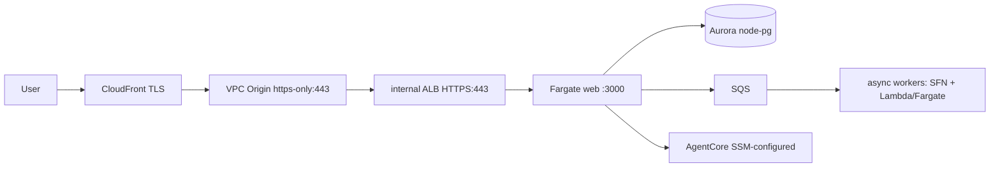

# AWSops — System Overview & Component Reference / 시스템 개요 · 컴포넌트 레퍼런스

> Branch `feat/v2-architecture-design`. Current decisions live in
> [`../decisions/BASELINE.md`](../decisions/BASELINE.md) (single current-truth). ADRs hold detail.

**EN** — AWSops is a **read-only AWS / Kubernetes operations dashboard + AI diagnosis**, organized
around the **AWS Well-Architected 6 pillars** (Operational Excellence, Security, Reliability,
Performance Efficiency, Cost Optimization, Sustainability). It is a **Terraform-based MSA**: every
viewer request travels a **private edge** (CloudFront → VPC Origin `https-only:443` → internal ALB
HTTPS:443 → Fargate web — no internet-facing load balancer on the path), Cognito + Lambda@Edge auth
terminates at the edge, **Aurora Serverless v2** holds durable state, AgentCore **section agents**
answer per-domain questions over **live AWS data**, and an **OOM-safe async worker tier** lifts
heavy work off the request path. **AWS-resource mutation and autonomous action are FROZEN**
(read-only by design — see [ADR-005](../decisions/005-aws-mutation-autonomy-frozen.md) and BASELINE §2).

**KO** — AWSops는 **읽기 전용 AWS / Kubernetes 운영 대시보드 + AI 진단**으로, **AWS Well-Architected
6기둥**(운영 우수성·보안·안정성·성능 효율·비용 최적화·지속 가능성)을 축으로 구성된다. **Terraform 기반
MSA**다: 모든 요청은 **비공개 엣지**(CloudFront → VPC Origin `https-only:443` → 내부 ALB HTTPS:443 →
Fargate web — 경로상 인터넷 노출 LB 없음)를 거치고, Cognito + Lambda@Edge 인증이 엣지에서 종료되며,
**Aurora Serverless v2**가 영속 상태를 보관하고, AgentCore **섹션 에이전트**가 도메인별 질의에
**라이브 AWS 데이터**로 답하며, **OOM-안전 비동기 워커 티어**가 무거운 작업을 요청 경로에서 떼어낸다.
**AWS 리소스 변경·자율 조치는 FROZEN**(설계상 read-only — [ADR-005](../decisions/005-aws-mutation-autonomy-frozen.md),
BASELINE §2 참조).

**Source-of-truth model / 단일 출처 모델** — These reference docs are the **single current source**
per component (current design, decisions, key files, status, gotchas). The current cross-cutting
decision baseline is [`../decisions/BASELINE.md`](../decisions/BASELINE.md); ADRs under
[`../decisions/`](../decisions/) hold the detail (the *why*); per-phase execution history lives in
[`../archive/`](../archive/). 이 레퍼런스 문서들이 컴포넌트별 **현행 단일 출처**, 현행 결정 기준선은
`../decisions/BASELINE.md`, ADR은 상세 결정 출처, 실행 이력은 `../archive/`다.

## Request flow / 요청 흐름

## Components / 컴포넌트

각 컴포넌트는 한 단락으로 요약하고, 상세는 해당 레퍼런스 문서로 링크한다. The current decision
baseline for all of them is [`../decisions/BASELINE.md`](../decisions/BASELINE.md).

**Edge & Networking — [`01-edge-network.md`](01-edge-network.md).** CloudFront(TLS) → **VPC Origin
`https-only:443`** → **internal ALB HTTPS:443** (regional ACM) → HTTP → Fargate web. No public ALB;
the ALB SG allows 443 from the CloudFront managed SG. VPC is newly created or reused via the
`create_network` flag. CloudFront(TLS) → VPC Origin → 내부 ALB → Fargate, 인터넷 노출 LB 없음.

**Auth & Identity — [`02-auth.md`](02-auth.md).** Cognito User Pool + **Lambda@Edge** (viewer-request,
RS256 JWKS verification). Login is the self-hosted in-app `/login` form (the BFF calls the public
`InitiateAuth(USER_PASSWORD_AUTH)` → `awsops_token`); the Hosted UI PKCE flow is retained as a dark
fallback. 인앱 `/login` 폼 1차 + Hosted UI PKCE 다크 폴백, RS256 JWKS 검증.

**Data / Aurora — [`03-data-aurora.md`](03-data-aurora.md).** **Aurora Serverless v2** (PG 17.9,
0.5–4 ACU, KMS CMK, RDS-managed master secret), accessed via **node-pg** (`web/lib/db.ts`). Schema
is `data/schema.sql` + ULID migrations tracked in `schema_migrations`. App state lives in Aurora,
not `data/*.json`. node-pg로 접근하는 Aurora 영속 상태.

**Web thin-BFF — [`04-web-bff.md`](04-web-bff.md).** **Next.js 14 thin-BFF** (`web/`, standalone
**arm64**, served at the **root path** — no basePath). Heavy/long/OOM-risk work is enqueued via
`POST /api/jobs` rather than run inline. The BFF backs the dashboard pages and per-domain API
routes. 무거운 작업은 워커 큐로 enqueue하는 thin-BFF.

**AgentCore Agents — [`05-agentcore.md`](05-agentcore.md).** Strands agent on **AgentCore Runtime**
fronted by domain gateways exposing **read-only MCP tools**, plus Memory + Code Interpreter, all
provisioned by an idempotent boto3 provisioner with config delivered through SSM. **9 gateways are
provisioned; `agent.py` routes across the 8 section gateways** (external observability is the
ADR-039 Integrations axis, not a routed section). 9개 프로비저닝 / 8 섹션 에이전트 라우트.

**Async Worker Backbone — [`06-workers.md`](06-workers.md).** `POST /api/jobs` → `worker_jobs` +
SQS → ESM (kill-switch) → idempotent dispatcher Lambda → **Step Functions** `$.runtime` Choice →
RunLambda (short) **or** `ecs:runTask.sync` Fargate (long/OOM). A reaper reconciles stale jobs.
OOM-안전 비동기 워커 티어.

**EKS Onboarding — [`07-eks.md`](07-eks.md).** `configure.mjs` multi-select → `eks.tf` grants the
web task role an **EKS Access Entry + AWS-managed view policy** (cluster-scoped, host-account only),
exposing endpoint/CA so the dashboard can run **read-only** Kubernetes queries. EKS Access Entry +
view 정책(읽기 전용).

| Component | Reference | Key files |
|---|---|---|
| Edge & Networking | [01-edge-network.md](01-edge-network.md) | `terraform/v2/foundation/edge.tf` (+ `network.tf`, `workload.tf`) |
| Auth & Identity | [02-auth.md](02-auth.md) | `terraform/v2/foundation/auth.tf` (+ `edge-lambda/cognito_edge.py.tftpl`), `web/app/login/`, `web/app/api/auth/login/` |
| Data / Aurora | [03-data-aurora.md](03-data-aurora.md) | `terraform/v2/foundation/data.tf` (+ `data/schema.sql`), `web/lib/db.ts` |
| Web thin-BFF | [04-web-bff.md](04-web-bff.md) | `web/` (Next.js 14 BFF; `terraform/v2/foundation/workload.tf`, `scripts/v2/deploy.mjs`) |
| AgentCore Agents | [05-agentcore.md](05-agentcore.md) | `scripts/v2/agentcore/` (`catalog.py`, `provision.py`; `terraform/v2/foundation/ai.tf`) |
| Async Worker Backbone | [06-workers.md](06-workers.md) | `terraform/v2/foundation/workers.tf` (+ `scripts/v2/workers/`) |
| EKS Onboarding | [07-eks.md](07-eks.md) | `terraform/v2/foundation/eks.tf` (+ `scripts/v2/configure.mjs`) |

## Status / 상태

Foundation phases P1a–P2 are **GREEN**. Read-only agent fleet, chat UI, and dashboard data pages
have largely shipped beyond their original P1x snapshots; per-component status and current scope
live in each reference doc, and the cross-cutting decision baseline (including the FROZEN/GATED
register) is in [`../decisions/BASELINE.md`](../decisions/BASELINE.md). 단계별·컴포넌트별 현황은 각
레퍼런스 문서, 동결/게이트 등 현행 결정 기준선은 `../decisions/BASELINE.md`.

## Execution history / 실행 이력

Per-phase execution history (plans, verification logs, design notes) lives under
[`../archive/`](../archive/) — see its README. 각 단계의 실행 이력은 `../archive/`를 참조한다.
