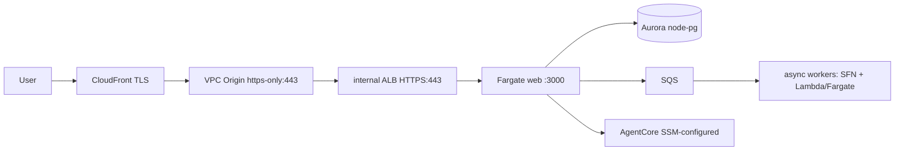

# AWSops v2 — Component Reference Index / 컴포넌트 레퍼런스 인덱스

> Branch `feat/v2-architecture-design`.

**EN** — AWSops v2 rebuilds the v1 single-EC2 monolith as a **Terraform-based MSA**. Every viewer
request travels a **private edge** (CloudFront → VPC Origin `https-only:443` → internal ALB
HTTPS:443 → Fargate web — no internet-facing load balancer anywhere on the path), with Cognito
Lambda@Edge auth terminating at the edge. **Aurora Serverless v2** holds durable application state
(schema per `data/schema.sql`, baseline v9), AgentCore **section agents** answer per-domain AI
questions over live AWS data, and an **OOM-safe async worker tier** (SQS → Step Functions →
Lambda/Fargate) lifts heavy, long-running, or memory-hungry work off the request path so the web
container stays thin and fast to roll.

**KO** — AWSops v2는 v1 단일 EC2 모놀리식을 **Terraform 기반 MSA**로 재구축한다. 모든 요청은
**비공개 엣지**(CloudFront → VPC Origin `https-only:443` → 내부 ALB HTTPS:443 → Fargate web —
경로상 인터넷 노출 LB 없음)를 거치고, Cognito Lambda@Edge 인증은 엣지에서 종료된다. **Aurora
Serverless v2**가 앱 상태(스키마는 `data/schema.sql`, 베이스라인 v9)를 보관하고, AgentCore **섹션
에이전트**가 도메인별 AI 질의에 라이브 AWS 데이터로 답하며, **OOM-안전 비동기 워커 티어**(SQS →
Step Functions → Lambda/Fargate)가 무겁고 오래 걸리거나 메모리가 큰 작업을 요청 경로에서 떼어내
web 컨테이너를 얇고 빠르게 유지한다.

**Source-of-truth model / 단일 출처 모델** — These 7 reference docs are the **single current
source** per component (current design, decisions, key files, status, gotchas). ADRs under
[`../../decisions/`](../../decisions/) remain the **immutable decision source** (the *why*).
Per-phase execution history lives in [`../archive/`](../archive/). 이 7개 레퍼런스 문서가
컴포넌트별 **현행 단일 출처**, ADR은 **불변 결정 출처**, 실행 이력은 `../archive/`다.

## Request flow / 요청 흐름

## Components / 컴포넌트

| Component | Reference | Governing ADRs | Key files | Status |
|---|---|---|---|---|
| Edge & Networking | [Edge & Networking](01-edge-network.md) | ADR-030, ADR-028 | `terraform/v2/foundation/edge.tf` (+ `network.tf`, `workload.tf`) | P1a ✅ GREEN |
| Auth & Identity | [Auth & Identity](02-auth.md) | ADR-020 | `terraform/v2/foundation/auth.tf` (+ `edge-lambda/cognito_edge.py.tftpl`) | P1b + P1d ✅ |
| Data / Aurora | [Data / Aurora](03-data-aurora.md) | ADR-030 | `terraform/v2/foundation/data.tf` (+ `data/schema.sql`) | P1c ✅ |
| Web thin-BFF | [Web thin-BFF](04-web-bff.md) | ADR-030, ADR-024 | `web/` (Next.js 14 BFF; `terraform/v2/foundation/workload.tf`, `scripts/v2/deploy.mjs`) | P1d ✅ GREEN |
| AgentCore Agents | [AgentCore Agents](05-agentcore.md) | ADR-031, ADR-004, ADR-002, ADR-025 | `scripts/v2/agentcore/` (`catalog.py`, `provision.py`; `terraform/v2/foundation/ai.tf`) | P1f ✅ |
| Async Worker Backbone | [Async Worker Backbone](06-workers.md) | ADR-029, ADR-030 | `terraform/v2/foundation/workers.tf` (+ `scripts/v2/workers/`) | P2 ✅ (W9 GREEN) |
| EKS Onboarding | [EKS Onboarding](07-eks.md) | ADR-008 (no dedicated ADR) | `terraform/v2/foundation/eks.tf` (+ `scripts/v2/configure.mjs`) | P1e ✅ |

## Phase status / 단계 상태

- **P1a** ✅ — S3 backend + foundation + private edge (CloudFront VPC Origin → internal ALB → Fargate)
- **P1b** ✅ — Cognito + Lambda@Edge auth
- **P1c** ✅ — Aurora Serverless v2 (schema per `terraform/v2/foundation/data/schema.sql`, baseline v9)
- **P1d** ✅ — web thin-BFF + dual-tier ECR + `make deploy` + RS256 auth hardening
- **P1e** ✅ — EKS onboarding (Access Entry + View policy)
- **P1f** ✅ — AgentCore idempotent provisioner (9 gateways + Memory + Interpreter + Runtime)
- **P2** ✅ (W9 GREEN) — async worker backbone (SQS + Step Functions + Lambda/Fargate, `worker_jobs`)
- **P3** 🔜 — 9+1 agents (full Lambda fleet, section = routing) + right-docking chat UI + OpenCost read-only out-of-band install bundle (AWS-resource mutation FROZEN, ADR-005)
- **P4** 🔜 — incident / ChatOps lifecycle + DevOps Agent federation

## Execution history / 실행 이력

Per-phase execution history (plans, verification logs, design notes) for each phase lives under
[`../archive/`](../archive/) — see its README. 각 단계의 실행 이력(계획·검증 로그·설계 노트)은
`../archive/`에 보관되며, 해당 디렉토리의 README를 참조한다.
