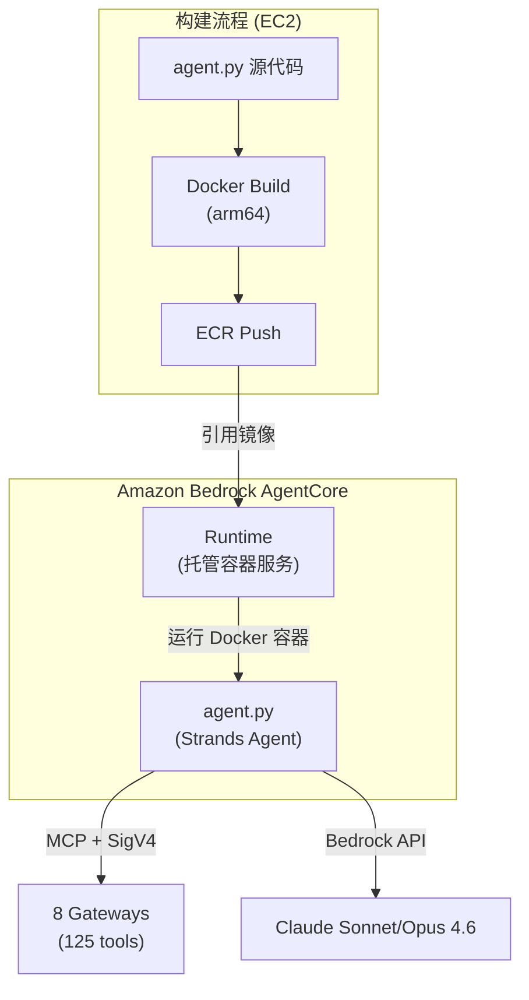
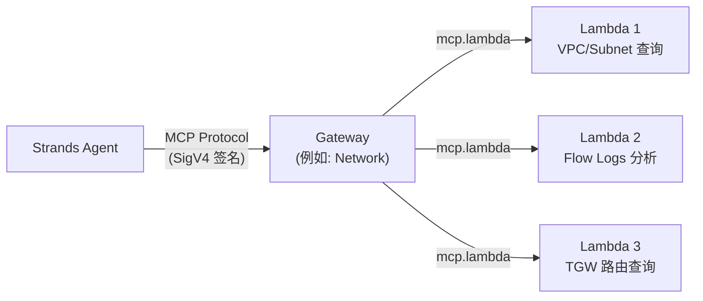
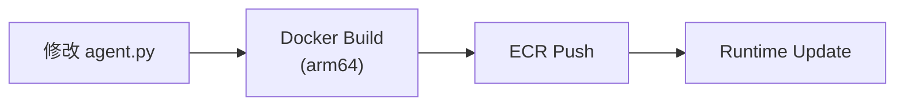
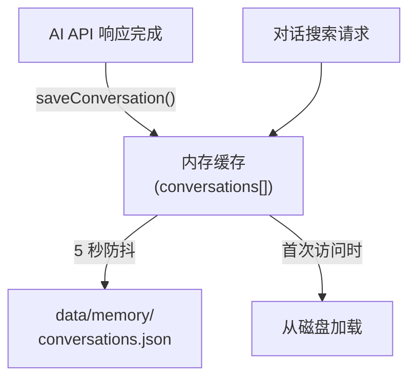
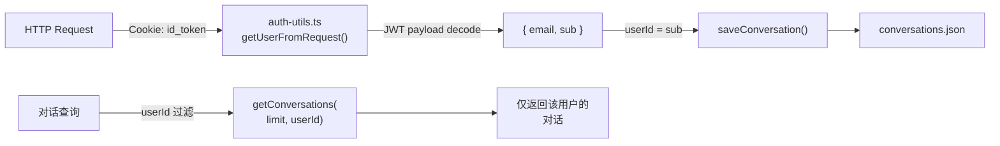
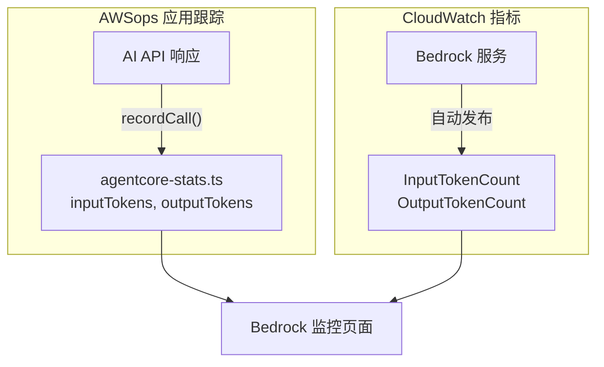
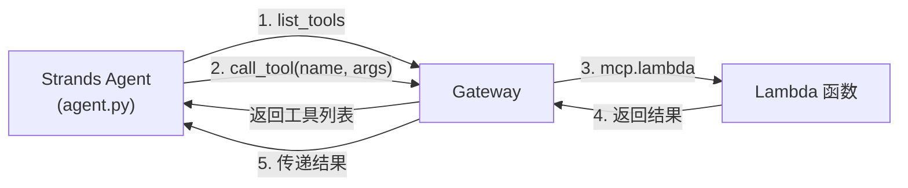
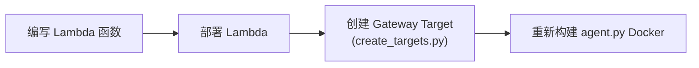
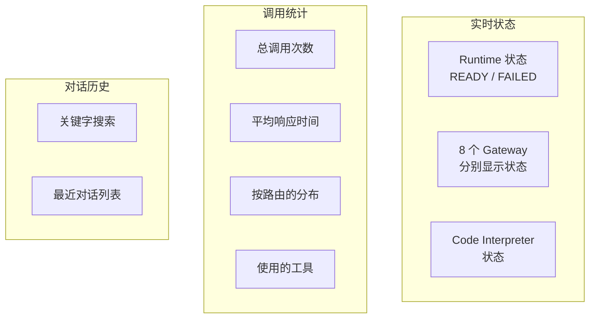

# AgentCore & Memory 技术 FAQ

关于 AgentCore Runtime、Gateway、Memory Store、统计跟踪等 AI 引擎内部工作原理的深入问题与解答。

<details>
<summary>AgentCore Runtime 是什么？它与 Strands Agent 的关系是？</summary>

AgentCore Runtime 与 Strands Agent 在不同的层级上运行。



### AgentCore Runtime

- 由 AWS 管理的**无服务器容器执行环境**
- 指定 Docker 镜像（ECR）后自动运行/扩缩容容器
- 处理 Cold Start 管理、网络配置、IAM Role 等
- 通过 `InvokeAgentRuntimeCommand` 调用

### Strands Agent Framework

- **基于 Python 的 AI 智能体框架**（agent.py）
- 向 LLM（Bedrock）提供工具，并将工具调用结果再传回 LLM 的循环
- 通过 MCP 协议连接 Gateway，使用 125 个工具

### 关系梳理

| 项目 | AgentCore Runtime | Strands Agent |
|------|------------------|---------------|
| 角色 | 容器执行环境 | AI 智能体逻辑 |
| 层级 | 基础设施 | 应用程序 |
| 管理主体 | AWS | 开发者 |
| 代码位置 | AWS 服务 | `agent/agent.py` |
| 配置方式 | CDK/CLI | Python 代码 |

</details>

<details>
<summary>Gateway 与 Lambda 是什么关系？</summary>

Gateway 是 **MCP 协议路由器**，Lambda 是**实际执行 AWS API 的后端**。



### Gateway（8 个）

- Agent 通过 `list_tools` 查询可用工具列表
- Agent 选择工具后，Gateway 调用对应的 Lambda
- 使用 **MCP（Model Context Protocol）**标准
- 创建 Gateway Target 时需指定 `mcp.lambda` 协议和 `credentialProviderConfigurations`

### Lambda（19 个）

- 每个 Lambda 包含执行特定 AWS API 的函数
- 例如：Network Lambda 调用 `describe_vpcs`、`describe_flow_logs` 等 AWS SDK
- 源代码位于 `agent/lambda/*.py`
- 使用 `agent/lambda/create_targets.py` 批量创建 Gateway Target

### 为什么使用 Lambda？

| 原因 | 说明 |
|------|------|
| **隔离** | 每个工具独立运行，一个失败不影响其他工具 |
| **权限分离** | 可为每个 Lambda 授予最小权限 IAM Role |
| **扩缩容** | 并发调用时自动扩缩容 |
| **成本** | 仅在调用时计费，无空闲成本 |

:::caution 创建 Gateway Target 时的注意事项
CLI 的 `--inline-payload` 选项存在 JSON 解析问题。必须使用 **Python/boto3** 创建。
:::

</details>

<details>
<summary>为什么必须使用 Docker arm64 构建？</summary>

AgentCore Runtime 运行在 **AWS Graviton（ARM64）**处理器上。

```bash
# 正确的构建命令
docker buildx build --platform linux/arm64 --load -t awsops-agent .

# ECR 推送
docker tag awsops-agent:latest $ECR_URI:latest
docker push $ECR_URI:latest
```

### 如果用 x86（amd64）构建会怎样？

容器无法启动或出现 `exec format error`。Runtime 状态会转为 `FAILED`。

### 在 Apple Silicon Mac 上开发时

Apple Silicon（M1/M2/M3）是原生 ARM64，因此即使不加 `--platform` 也会构建为 arm64。但在 **Intel Mac** 上必须显式指定 `--platform linux/arm64`。

### EC2 构建环境

AWSops 使用 `t4g.2xlarge`（Graviton）实例，因此在 EC2 上构建即为原生 arm64 构建。

</details>

<details>
<summary>修改 agent.py 后如何重新部署？</summary>

修改 agent.py 后的部署分为 3 个步骤。



### Step 1: Docker 构建并推送到 ECR

```bash
cd agent
docker buildx build --platform linux/arm64 --load -t awsops-agent .
docker tag awsops-agent:latest $ECR_URI:latest
docker push $ECR_URI:latest
```

### Step 2: 更新 Runtime

```bash
aws bedrock-agentcore update-agent-runtime \
  --agent-runtime-id $RUNTIME_ID \
  --role-arn $ROLE_ARN \
  --network-configuration "$NETWORK_CONFIG"
```

:::warning 必需参数
`update-agent-runtime` 必须**同时**传入 `--role-arn` 和 `--network-configuration`。省略可能导致现有配置被重置。
:::

### Step 3: 确认

```bash
aws bedrock-agentcore get-agent-runtime \
  --agent-runtime-id $RUNTIME_ID \
  --query 'status'
# 状态变为 "READY" 即部署完成
```

### Gateway URL 变更时

`agent.py` 的 `GATEWAYS` 字典中包含各账户的 Gateway URL。部署到新账户时，需要更新该 URL 后重新构建 Docker。

</details>

<details>
<summary>Memory Store 是如何工作的？</summary>

AWSops 的 Memory Store 使用**内存缓存 + 防抖磁盘刷写**模式。



### 存储结构

```typescript
// src/lib/agentcore-memory.ts
interface ConversationRecord {
  id: string;           // 唯一 ID
  userId: string;       // Cognito sub (用户标识)
  timestamp: string;    // ISO 8601
  route: string;        // 路由 (network, cost 等)
  gateway: string;      // 网关名称
  question: string;     // 用户提问
  summary: string;      // AI 响应摘要
  usedTools: string[];  // 使用的工具列表
  responseTimeMs: number; // 响应时间
  via: string;          // 处理路径
}
```

### 工作方式

| 项目 | 说明 |
|------|------|
| **最大保留** | 100 条（超出时从最旧的开始删除） |
| **缓存** | 内存 — 最小化磁盘读取 |
| **刷写** | 5 秒防抖 — 频繁保存时仅最后一次写入磁盘 |
| **文件位置** | `data/memory/conversations.json` |
| **搜索** | 按提问、摘要、路由、工具名进行关键字搜索 |

### 为什么用文件而不是数据库？

- 无需额外基础设施（EC2 内文件系统）
- 对于 100 条级别的数据，使用 DB 过于重量级
- 内存缓存已足够满足查询性能
- JSON 文件便于备份/迁移

### 与 AgentCore Memory Store 的区别

`data/config.json` 中的 `memoryId` 指的是 **AgentCore 服务的 Memory Store**。它是 agent.py 内部 Strands Agent 使用的长期记忆，而 `agentcore-memory.ts` 是用于在 **AWSops 仪表板 UI** 中显示对话历史的独立存储。

</details>

<details>
<summary>对话历史按用户隔离的原理是什么？</summary>

从 Cognito JWT 中提取用户 ID，并为每条对话打上标签。



### 认证流程

1. **Lambda@Edge** 在 CloudFront 上验证 JWT（签名、过期检查）
2. 通过验证的请求到达 EC2
3. `auth-utils.ts` 的 `getUserFromRequest()` 仅对 JWT payload 进行**解码**（无需重新验证签名）
4. 使用 `sub`（Cognito User Pool 唯一 ID）作为用户标识符

### 保存时

```typescript
// src/app/api/ai/route.ts
const user = getUserFromRequest(request);
await saveConversation({
  id: crypto.randomUUID(),
  userId: user?.sub || 'anonymous',
  // ... 其余字段
});
```

### 查询时

```typescript
// 按用户过滤
const conversations = await getConversations(20, user?.sub);
// → 仅返回 userId 匹配的对话
```

### 未配置认证的环境

在未配置 Cognito 的环境中，`userId` 会保存为 `'anonymous'`，所有用户的对话将合并在一起。

</details>

<details>
<summary>AgentCore 调用统计是如何跟踪的？</summary>

`agentcore-stats.ts` 在内存中汇总所有 AI 调用，并持久化保存到磁盘。

### 跟踪项目

```typescript
// src/lib/agentcore-stats.ts
interface AgentCoreCallRecord {
  timestamp: string;
  route: string;        // 路由 (network, cost 等)
  gateway: string;      // 网关
  responseTimeMs: number;
  usedTools: string[];  // 使用的工具
  success: boolean;
  via: string;          // 处理路径
  inputTokens?: number;  // 输入 token
  outputTokens?: number; // 输出 token
  model?: string;        // 使用的模型
}
```

### 汇总统计

| 统计项 | 说明 |
|------|------|
| `totalCalls` | 总调用次数 |
| `successCalls` / `failedCalls` | 成功/失败次数 |
| `avgResponseTimeMs` | **移动平均**响应时间 |
| `callsByGateway` | 按网关统计的调用次数 |
| `callsByRoute` | 按路由统计的调用次数 |
| `uniqueToolsUsed` | 使用过的唯一工具列表（最多 200 个） |
| `tokensByModel` | 按模型统计的输入/输出 token 及调用次数 |
| `recentCalls` | 最近 50 条详细记录 |

### 性能优化

与 Memory Store 相同的**内存缓存 + 5 秒防抖 flush** 模式：

```
recordCall() → 内存更新 → 等待 5 秒 → 写入磁盘
recordCall() → 内存更新 → 重置定时器 → 等待 5 秒 → 写入磁盘
```

连续调用时仅最后一次写入磁盘，从而将 I/O 负载降到最低。

### 在 UI 中查看

可在 AgentCore 仪表板页面（`/awsops/agentcore`）查看实时统计。

</details>

<details>
<summary>如何监控 token 使用量和费用？</summary>

AWSops 从 **2 个数据源**跟踪 token 使用量。



### 1. AWSops 应用内部跟踪

AI API（`/api/ai`）解析 Bedrock 响应中的 `usage` 字段并传给 `recordCall()`：

```typescript
recordCall({
  inputTokens: usage.inputTokens,
  outputTokens: usage.outputTokens,
  model: 'sonnet-4.6',
  // ...
});
```

按模型汇总并保存到 `tokensByModel`。

### 2. CloudWatch 指标

Bedrock 服务自动发布的指标：
- `InputTokenCount`、`OutputTokenCount`
- `InvocationCount`、`InvocationLatency`
- 可按模型 ID、区域进行过滤

### Bedrock 监控页面

`/awsops/bedrock` 页面对两个数据源进行对比展示：

| 项目 | Account 全部 (CloudWatch) | 仅 AWSops 应用 (内部跟踪) |
|------|--------------------------|----------------------|
| 数据源 | CloudWatch `AWS/Bedrock` | `agentcore-stats.ts` |
| 范围 | 账户内所有 Bedrock 调用 | 仅 AWSops 仪表板的调用 |
| 用途 | 掌握整体费用 | 掌握仪表板的费用占比 |

:::tip 费用估算
Bedrock token 费用 = (输入 token × 输入单价) + (输出 token × 输出单价)。以 Sonnet 4.6 为例，输入 $3/MTok，输出 $15/MTok。
:::

</details>

<details>
<summary>为什么 Code Interpreter 和 Memory 名称中不能使用连字符？</summary>

这是由于 AgentCore API 的**命名规则限制**。

### 受影响的资源

| 资源 | 错误示例 | 正确示例 |
|--------|----------|----------|
| Code Interpreter | `awsops-code-interpreter` | `awsops_code_interpreter` |
| Memory Store | `awsops-memory` | `awsops_memory` |

### 症状

使用包含连字符的名称创建时：
- 出现 `ValidationException`，或虽然创建成功但调用时失败
- 错误消息可能不明确

### config.json 配置

```json
{
  "codeInterpreterName": "awsops_code_interpreter-XXXXX",
  "memoryId": "awsops_memory-XXXXX",
  "memoryName": "awsops_memory"
}
```

`codeInterpreterName` 和 `memoryId` 中的 `-XXXXX` 部分是 AWS 自动生成的 **suffix**。限制仅适用于用户指定的名称部分（`awsops_code_interpreter`、`awsops_memory`）。

### Memory Store 的其他限制

- `eventExpiryDuration`：最长 365 天
- 过期的事件会被自动删除

</details>

<details>
<summary>为什么只需修改 config.json 就能部署到其他账户？</summary>

AWSops **不将账户相关的值硬编码在代码中**，而是在运行时从 `data/config.json` 加载。

### config.json 结构

```json
{
  "costEnabled": true,
  "agentRuntimeArn": "arn:aws:bedrock-agentcore:ap-northeast-2:123456789012:runtime/RT_ID",
  "codeInterpreterName": "awsops_code_interpreter-XXXXX",
  "memoryId": "awsops_memory-XXXXX",
  "memoryName": "awsops_memory"
}
```

### 加载方式

```typescript
// src/lib/app-config.ts
export function getConfig(): AppConfig {
  // 读取 data/config.json 并返回
  // 文件不存在时使用默认值
}

// src/app/api/ai/route.ts — 使用示例
function getAgentRuntimeArn(): string {
  const config = getConfig();
  return config.agentRuntimeArn || '';
}
```

### 按账户部署流程

1. 在新账户中执行部署脚本（Step 0~7）
2. 将生成的 ARN、名称记录到 `data/config.json`
3. 无需修改代码即可直接使用

### 因账户而异的值

| 项目 | 说明 |
|------|------|
| `agentRuntimeArn` | AgentCore Runtime ARN（账户+区域+ID） |
| `codeInterpreterName` | Code Interpreter 名称（各账户唯一） |
| `memoryId` | Memory Store ID（各账户唯一） |
| `costEnabled` | Cost Explorer 是否可用（MSP 为 false） |

### agent.py 的 Gateway URL

`agent.py` 内部的 Gateway URL 也因账户而异。这部分不在 config.json 中，而是包含在 Docker 镜像内，因此**部署到新账户时需要重新构建 Docker**。

</details>

<details>
<summary>什么是 MCP 协议？工具发现是如何工作的？</summary>

### MCP (Model Context Protocol)

MCP 是 AI 智能体以**标准化方式调用**外部工具的协议。在 AWSops 中，Strands Agent 通过 MCP 访问 Gateway 的 125 个工具。



### SigV4 签名通信

连接 Gateway 需要 AWS SigV4 签名：

```python
# agent/agent.py
def create_gateway_transport(gateway_url):
    """创建 SigV4 签名的 HTTP 传输"""
    access_key, secret_key, session_token = get_aws_credentials()
    credentials = Credentials(access_key, secret_key, session_token)
    return streamablehttp_client_with_sigv4(
        url=gateway_url,
        credentials=credentials,
        service="bedrock-agentcore",
        region=GATEWAY_REGION,
    )
```

### 工具发现 (Tool Discovery)

Agent 连接到 Gateway 后，通过**分页**查询全部工具列表：

```python
# agent/agent.py
def get_all_tools(client):
    """通过分页从 MCP 客户端查询所有工具"""
    tools = []
    more = True
    token = None
    while more:
        batch = client.list_tools_sync(pagination_token=token)
        tools.extend(batch)
        if batch.pagination_token is None:
            more = False
        else:
            token = batch.pagination_token
    return tools
```

### 工具执行流程

```python
# 连接 Gateway → 查询工具 → 运行 Agent
mcp_client = MCPClient(lambda: create_gateway_transport(gateway_url))
with mcp_client:
    tools = get_all_tools(mcp_client)           # 查询工具列表
    agent = Agent(model=model, tools=tools)      # 向 LLM 提供工具
    response = agent(user_input)                 # LLM 选择/执行工具
```

LLM（Bedrock）根据用户问题**自主决定调用哪个工具**。开发者无需编写工具选择逻辑。

</details>

<details>
<summary>如何向 Gateway 添加新工具（Lambda）？</summary>

### 整体流程



### Step 1: 编写 Lambda 函数

在 `agent/lambda/` 目录中创建新的 Python 文件：

```python
# agent/lambda/my_new_mcp.py
import json
import boto3

def lambda_handler(event, context):
    params = event if isinstance(event, dict) else json.loads(event)
    t = params.get("tool_name", "")
    args = params.get("arguments", params)

    if t == "my_new_tool":
        client = boto3.client('ec2')
        result = client.describe_instances(**args)
        return {"statusCode": 200, "body": json.dumps(result, default=str)}

    return {"statusCode": 400, "body": "Unknown tool"}
```

### Step 2: 创建 Gateway Target

在 `agent/lambda/create_targets.py` 中添加工具 schema：

```python
# 工具 schema 格式
tools = [{
    "name": "my_new_tool",
    "description": "新工具说明",
    "inputSchema": {
        "type": "object",
        "properties": {
            "param1": {"type": "string", "description": "参数说明"},
        },
        "required": ["param1"]
    }
}]

# 创建 Gateway Target
create_target(
    gw_id=find_gateway('ops'),     # 目标 Gateway
    name='my-new-target',
    fn='awsops-my-new-mcp',        # Lambda 函数名称
    desc='My new tool description',
    tools=tools
)
```

核心配置：

```python
# create_targets.py 内部
client.create_gateway_target(
    gatewayIdentifier=gw_id,
    targetConfiguration={
        'mcp': {'lambda': {
            'lambdaArn': arn,
            'toolSchema': {'inlinePayload': tools}  # 工具 schema
        }}
    },
    credentialProviderConfigurations=[
        {'credentialProviderType': 'GATEWAY_IAM_ROLE'}  # 必需
    ]
)
```

### Step 3: 重新构建 Docker

添加新工具后，Agent 会通过 `list_tools` 自动发现。仅当修改了 agent.py 本身时才需要重新构建 Docker。

:::tip 跨账户支持
`create_targets.py` 会自动为所有工具注入 `target_account_id` 参数。在 Lambda 中使用 `cross_account.py` 的 `get_client()`，即可通过 STS AssumeRole 访问其他账户的资源。
:::

</details>

<details>
<summary>Lambda 工具函数是什么结构？</summary>

### Lambda 结构模式

所有 19 个 Lambda 函数都遵循相同的 MCP 处理器模式：

```python
# 通用模式 (例如: agent/lambda/aws_cost_mcp.py)
def lambda_handler(event, context):
    # 1. 事件解析 + 工具路由
    params = event if isinstance(event, dict) else json.loads(event)
    t = params.get("tool_name", "")
    args = params.get("arguments", params)

    # 2. 跨账户支持
    target_account_id = args.pop('target_account_id', None)
    role_arn = get_role_arn(target_account_id) if target_account_id else None

    # 3. 按工具分支
    if t == "get_cost_and_usage":
        ce = get_client('ce', 'us-east-1', role_arn)
        resp = ce.get_cost_and_usage(...)
        return ok(resp)
    elif t == "get_cost_forecast":
        ...
    else:
        return err("Unknown tool")
```

### 19 个 Lambda 构成

| Lambda 文件 | Gateway | 工具数 | 说明 |
|------------|---------|--------|------|
| `network_mcp.py` | Network | 15 | VPC, TGW, VPN, ENI, Firewall |
| `reachability.py` | Network | 1 | Reachability Analyzer |
| `flowmonitor.py` | Network | 1 | VPC Flow Logs |
| `aws_eks_mcp.py` | Container | 9 | EKS, CloudWatch, IAM |
| `aws_ecs_mcp.py` | Container | 3 | ECS 集群/服务/任务 |
| `aws_istio_mcp.py` | Container | 12 | Istio CRD (VPC Lambda) |
| `aws_iac_mcp.py` | IaC | 7 | CloudFormation, CDK |
| `aws_terraform_mcp.py` | IaC | 5 | Terraform Provider/Module |
| `aws_dynamodb_mcp.py` | Data | 6 | DynamoDB |
| `aws_rds_mcp.py` | Data | 6 | RDS/Aurora |
| `aws_valkey_mcp.py` | Data | 6 | ElastiCache |
| `aws_msk_mcp.py` | Data | 6 | MSK Kafka |
| `aws_iam_mcp.py` | Security | 14 | IAM |
| `aws_cloudwatch_mcp.py` | Monitoring | 11 | CloudWatch |
| `aws_cloudtrail_mcp.py` | Monitoring | 5 | CloudTrail |
| `aws_cost_mcp.py` | Cost | 9 | Cost Explorer |
| `aws_knowledge.py` | Ops | 5 | AWS 文档 |
| `aws_core_mcp.py` | Ops | 3 | CLI, 提示词 |
| VPC Lambda | Ops | 1 | Steampipe SQL |

### 共享模块：`cross_account.py`

用于跨账户访问的 STS AssumeRole 辅助模块：

```python
# 创建跨账户客户端
client = get_client('ec2', 'ap-northeast-2', role_arn)
# → STS AssumeRole → 使用临时凭证创建 boto3 客户端
# → 凭证缓存 50 分钟，优化重复调用
```

### 规则

- 所有 Lambda 均为**只读**（Reachability 路径创建除外）
- VPC Lambda（Istio、Steampipe）使用 `pg8000` 而非 `psycopg2`
- 工具 schema 格式：`{name, description, inputSchema: {type, properties, required}}`

</details>

<details>
<summary>如何监控 AgentCore Runtime 状态？</summary>

### 状态查询 API

`/api/agentcore` API 查询 Runtime、Gateway、Code Interpreter 的状态：

```typescript
// src/app/api/agentcore/route.ts
const [runtimeRaw, gatewaysRaw] = await Promise.all([
  awsCli(['bedrock-agentcore-control', 'get-agent-runtime',
          '--agent-runtime-id', getRuntimeId()]),
  awsCli(['bedrock-agentcore-control', 'list-gateways']),
]);
```

### Runtime 状态

| 状态 | 含义 | 处理措施 |
|------|------|------|
| **READY** | 正常运行 | - |
| **CREATING** | 首次创建中 | 等待数分钟 |
| **UPDATING** | 更新中（Docker 镜像变更等） | 等待数分钟 |
| **FAILED** | 错误 — 容器启动失败 | 检查 Docker 镜像/IAM Role/网络 |

### 仪表板 UI

可在 AgentCore 页面（`/awsops/agentcore`）查看的信息：



### 状态缓存

状态查询结果**缓存 5 分钟**。可通过刷新按钮立即更新：

```typescript
const cache = new NodeCache({ stdTTL: 300, checkperiod: 60 });
```

</details>
