# 架构深入解析

这是关于 AWSops 内部工作原理的深入技术 FAQ。

<details>
<summary>网络成本（networkCost）是如何计算的？</summary>

网络成本的计算方式在 **ECS** 和 **EKS** 中有所不同。

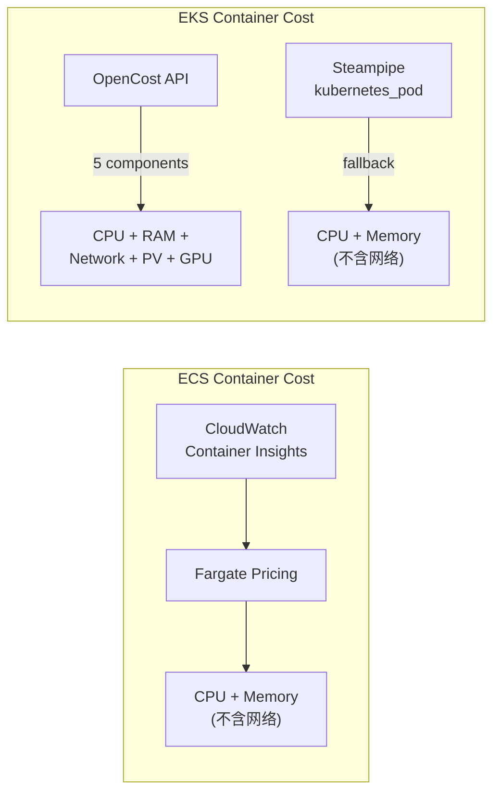

### ECS 容器：不包含网络成本

ECS 容器成本（`/api/container-cost`）仅计算 **CPU + Memory**：

```
CPU 成本 = (CPU Units / 1024) × $0.04048/小时 × 小时数
Memory 成本 = (Memory MB / 1024) × $0.004445/小时 × 小时数
总成本 = CPU 成本 + Memory 成本
```

从 CloudWatch Container Insights 收集 `CpuUtilized`、`MemoryUtilized` 指标，并应用 Fargate 价格。网络传输量（`NetworkRxBytes`/`NetworkTxBytes`）虽然会被收集，但不计入成本计算。

### EKS 容器：仅在 OpenCost 模式下包含网络成本

**OpenCost 模式**（在 `data/config.json` 中设置 `opencostEndpoint` 时）：

```typescript
// src/app/api/eks-container-cost/route.ts
const res = await fetch(
  `${opencostEndpoint}/allocation/compute?window=${window}&aggregate=namespace,pod`
);

// OpenCost 返回的 5 种成本项目
const cpuCost = (alloc.cpuCost || 0) * scale;
const memCost = (alloc.ramCost || 0) * scale;
const networkCost = (alloc.networkCost || 0) * scale;   // 网络成本
const pvCost = (alloc.pvCost || 0) * scale;              // PV(EBS) 成本
const gpuCost = (alloc.gpuCost || 0) * scale;            // GPU 成本
```

**网络成本计算原理（OpenCost 内部）**：

1. **基于 CNI 的流量追踪**：OpenCost 通过 Kubernetes CNI（Container Network Interface）追踪每个 Pod 的网络流量
2. **仅对 Cross-AZ 传输计费**：同一 AZ 内的传输免费，仅对 Cross-AZ 传输应用 AWS 数据传输费用
3. **按日成本缩放**：OpenCost 返回查询窗口（例如 1 小时）内的成本，因此需缩放到 24 小时：

```typescript
const minutes = alloc.minutes || 60;
const scale = (24 * 60) / minutes;  // 将 1 小时数据换算为 24 小时
const networkCostDaily = (alloc.networkCost || 0) * scale;
```

**Request-based 回退模式**（未安装 OpenCost 时）：

不计算网络成本。仅基于 CPU/Memory 请求量估算成本。

### UI 显示

网络成本列仅在 OpenCost 模式下显示：

```typescript
// src/app/eks-container-cost/page.tsx
...(data?.dataSource === 'opencost' ? [
  { key: 'networkCostDaily', label: 'Network' },
  { key: 'pvCostDaily', label: 'Storage' },
  { key: 'gpuCostDaily', label: 'GPU' },
] : []),
```

</details>

<details>
<summary>如何使用 OpenCost 计算 Pod 成本？</summary>

EKS Pod 成本计算有两种模式。

### 模式 1：OpenCost API（推荐）

OpenCost 基于 Prometheus 指标，按**实际使用量**计算成本。

**数据流**：

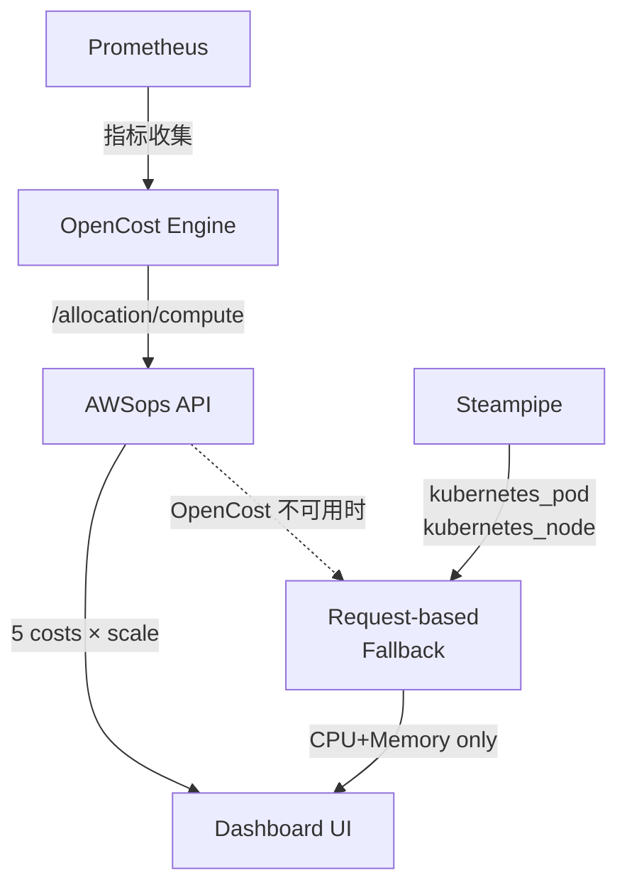

**API 调用**：
```typescript
// src/app/api/eks-container-cost/route.ts
const res = await fetch(
  `${opencostEndpoint}/allocation/compute?window=1d&aggregate=namespace,pod`
);
```

**5 种成本项目**：

| 项目 | 说明 | 计算依据 |
|------|------|----------|
| `cpuCost` | CPU 使用成本 | 实际 CPU 使用量 × AWS 价格 |
| `ramCost` | 内存使用成本 | 实际内存使用量 × AWS 价格 |
| `networkCost` | 网络传输成本 | Cross-AZ 传输量 × 数据传输价格 |
| `pvCost` | PersistentVolume 成本 | PVC → EBS 卷映射 |
| `gpuCost` | GPU 使用成本 | GPU 分配时间 × GPU 价格 |

**效率指标**：OpenCost 还提供 CPU/Memory 效率：
```typescript
cpuEfficiency: alloc.cpuEfficiency,    // 实际使用量 / 请求量
ramEfficiency: alloc.ramEfficiency,    // 实际使用量 / 请求量
```

### 模式 2：Request-based 估算（回退）

在未安装 OpenCost 的环境中，使用 Steampipe 的 `kubernetes_pod`、`kubernetes_node` 表估算成本。

**核心算法：50% CPU + 50% Memory 权重**

```typescript
// src/app/api/eks-container-cost/route.ts
// 1. 解析 Pod 的 resource requests
const cpuReq = parseCpu(container.requests?.cpu);      // "500m" → 0.5
const memReqMB = parseMemoryMB(container.requests?.memory); // "512Mi" → 512

// 2. 计算相对于节点的比例
const cpuRatio = cpuReq / node.allocCpu;     // Pod CPU / Node CPU
const memRatio = memReqMB / node.allocMemMB; // Pod Memory / Node Memory

// 3. 按 50:50 分配节点成本
const cpuCostDaily = cpuRatio * node.hourlyRate * 24 * 0.5;
const memCostDaily = memRatio * node.hourlyRate * 24 * 0.5;
const totalCostDaily = cpuCostDaily + memCostDaily;
```

**EC2 价格表**（ap-northeast-2 按需实例）：
```typescript
const EC2_PRICING: Record<string, number> = {
  'm5.large': 0.118, 'm5.xlarge': 0.236,
  'm6g.large': 0.0998, 'c5.xlarge': 0.196,
  'r5.large': 0.152, 't3.large': 0.104,
  // ... 各实例类型的每小时价格
};
const DEFAULT_HOURLY_RATE = 0.236; // 匹配失败时以 m5.xlarge 为准
```

### 两种模式对比

| 项目 | OpenCost | Request-based |
|------|----------|---------------|
| CPU | 基于实际使用量 | 基于请求量比例 |
| Memory | 基于实际使用量 | 基于请求量比例 |
| Network | 追踪 Cross-AZ 传输 | **不包含** |
| Storage | PVC → EBS 映射 | **不包含** |
| GPU | 追踪 GPU 时间 | **不包含** |
| 准确度 | 高（实测值） | 估算值（基于请求量） |
| 必需安装 | Prometheus + OpenCost | 无（仅 Steampipe） |

### 安装 OpenCost

```bash
# 执行 scripts/07-setup-opencost.sh
bash scripts/07-setup-opencost.sh

# 安装内容: Metrics Server → Prometheus → OpenCost
# 安装后在 data/config.json 中添加端点:
# { "opencostEndpoint": "http://localhost:9003" }
```

</details>

<details>
<summary>Agent 间通信结构与 FTTT 改进方法是什么？</summary>

### 整体通信流程

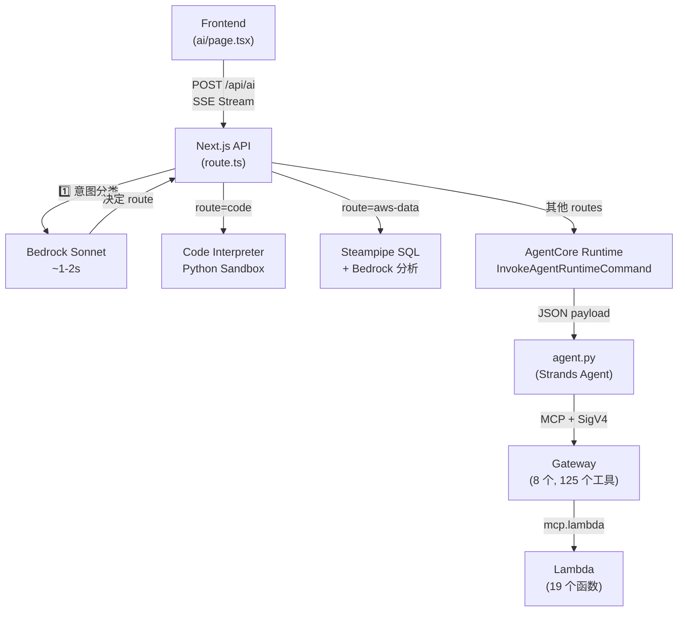

### 各阶段通信方式

**第 1 阶段：Frontend → Next.js API（SSE）**
```typescript
// Frontend: fetch with ReadableStream
const res = await fetch('/awsops/api/ai', {
  method: 'POST',
  body: JSON.stringify({ messages, stream: true }),
});

// API: 发送 SSE 事件
send('status', { step: 'classifying', message: '正在分析问题...' });
send('status', { step: 'agentcore', message: '正在执行工具...' });
send('done', { content, usedTools, route });
```

**第 2 阶段：API → AgentCore Runtime（AWS SDK）**
```typescript
// 90 秒超时, JSON payload 中包含 gateway 名称
const command = new InvokeAgentRuntimeCommand({
  agentRuntimeArn: config.agentRuntimeArn,
  payload: JSON.stringify({ messages: recentMessages, gateway }),
});
const response = await agentCoreClient.send(command);
```

**第 3 阶段：AgentCore → Gateway（MCP + SigV4）**
```python
# agent.py: 通过 SigV4 签名的 HTTP 连接 Gateway
def create_gateway_transport(gateway_url):
    return streamablehttp_client_with_sigv4(
        url=gateway_url,
        credentials=credentials,
        service="bedrock-agentcore",
        region=GATEWAY_REGION,
    )

# 通过 MCP 协议查询工具列表后执行
mcp_client = MCPClient(lambda: create_gateway_transport(url))
tools = get_all_tools(mcp_client)  # list_tools with pagination
agent = Agent(model=model, tools=tools)
response = agent(user_input)
```

**第 4 阶段：Gateway → Lambda（MCP Lambda Protocol）**
Gateway 通过 `mcp.lambda` 协议调用 Lambda。Lambda 函数执行实际的 AWS API 并返回结果。

### FTTT（Time To First Token）组成要素

FTTT 是指用户提问后**到第一个响应文本显示在屏幕上**为止的时间。

| 阶段 | 耗时 | 说明 |
|------|----------|------|
| 意图分类 | 1-2 秒 | 使用 Bedrock Sonnet 决定路由 |
| AgentCore Cold Start | 10-30 秒 | 容器首次启动（Warm 时为 0 秒） |
| 工具发现 | 1-3 秒 | `list_tools_sync()` 分页 |
| 模型推理 | 2-5 秒 | Strands Agent 的 LLM 调用 |
| 工具执行 | 2-30 秒 | Lambda 函数执行（含 API 调用） |
| **总 FTTT (Cold)** | **~15-60 秒** | |
| **总 FTTT (Warm)** | **~5-15 秒** | |

### FTTT 改进方法

**1. 消除 Cold Start（效果最大）**
```bash
# 为 AgentCore Runtime 设置最小实例数
# 始终保持 1 个以上的 Warm 容器
aws bedrock-agentcore update-agent-runtime \
  --agent-runtime-id $RUNTIME_ID \
  --min-instances 1
```

**2. 意图分类缓存**
```typescript
// 对相似的问题模式缓存分类结果
// 例: "EC2 列表" → 始终为 "aws-data" 路由
const classificationCache = new Map<string, string[]>();
```

**3. Gateway 工具列表缓存**
```python
# 在 agent.py 中将 list_tools 结果缓存到内存
# 无需在每次请求时重新查询工具列表
TOOL_CACHE: dict[str, list] = {}
TOOL_CACHE_TTL = 300  # 5 分钟
```

**4. 多路由并行执行（已实现）**
```typescript
// 分类出多个路由时同时执行
// 例: ["security", "cost"] → 同时调用两个 Gateway
const results = await Promise.all(
  routes.map(route => invokeAgentCore(messages, route))
);
```

**5. 使用 Keepalive 防止 CloudFront 超时（已实现）**
```typescript
// 每 15 秒发送 SSE 事件 → 防止 CloudFront 60 秒超时
const keepaliveInterval = setInterval(() => {
  send('status', { message: `正在执行工具... (${count * 15}s)` });
}, 15000);
```

**6. 3 种流式传输模式（已完成实现）**

AWSops 按路径提供 3 种优化的流式传输模式：

| 模式 | 适用路径 | 方式 | 延迟 |
|------|----------|------|------|
| **Real Streaming** | 多路由合成 | `ConverseStreamCommand`（Bedrock Converse API） | 按 token 即时发送 |
| **Simulated Streaming** | 单一 Gateway 响应 | `simulateStreaming()`（50 字符/15ms 分块） | 打字效果 |
| **Direct Streaming** | Bedrock Direct (aws-data) | `InvokeModelWithResponseStreamCommand` | 按 token 即时发送 |

```typescript
// 多路由合成: 通过 Converse Stream API 实时流式传输
async function synthesizeResponsesStreaming(results, send) {
  const command = new ConverseStreamCommand({
    modelId: 'anthropic.claude-sonnet-4-6-20250514-v1:0',
    messages: [{ role: 'user', content: [{ text: synthesisPrompt }] }],
  });
  const response = await bedrockClient.send(command);
  for await (const event of response.stream) {
    if (event.contentBlockDelta?.delta?.text) {
      send('chunk', { delta: event.contentBlockDelta.delta.text });
    }
  }
}

// 单一 Gateway 响应: 模拟打字效果
async function simulateStreaming(content, send) {
  const CHUNK_SIZE = 50, CHUNK_DELAY_MS = 15;
  for (let i = 0; i < content.length; i += CHUNK_SIZE) {
    send('chunk', { delta: content.slice(i, i + CHUNK_SIZE) });
    await new Promise(r => setTimeout(r, CHUNK_DELAY_MS));
  }
}
```

:::info 为什么需要 3 种模式？
- **AgentCore Gateway** 一次性返回完整响应，因此使用 simulateStreaming 提供打字效果
- **多路由合成**由 Bedrock 整合多个 Gateway 结果，因此利用 Converse API 的原生流式传输
- **Bedrock Direct** 本身就支持 token 流式传输
:::

</details>

<details>
<summary>如何通过 AlertManager 自动触发 Agent？</summary>

### 当前状态

目前在 AWSops 中 AlertManager 处于**禁用**状态：

```bash
# scripts/07-setup-opencost.sh
helm install prometheus prometheus-community/prometheus \
  --set alertmanager.enabled=false   # ← 显式禁用
```

Prometheus 仅用于 OpenCost 的指标收集。

不过，**CloudWatch 告警工具**已经存在：
- `get_active_alarms`: 查询处于 ALARM 状态的告警
- `get_alarm_history`: 告警状态变更历史
- `get_recommended_metric_alarms`: 推荐的告警设置

### 实现方法 1：AlertManager Webhook（基于 Prometheus）

**Step 1. 启用 AlertManager**

修改 `scripts/07-setup-opencost.sh`：
```bash
helm upgrade prometheus prometheus-community/prometheus \
  --set alertmanager.enabled=true
```

**Step 2. 创建 Webhook API 端点**

```typescript
// src/app/api/alert-webhook/route.ts (新建)
import { NextRequest, NextResponse } from 'next/server';

interface AlertManagerPayload {
  alerts: Array<{
    status: 'firing' | 'resolved';
    labels: Record<string, string>;
    annotations: Record<string, string>;
    startsAt: string;
    endsAt: string;
  }>;
}

export async function POST(request: NextRequest) {
  const payload: AlertManagerPayload = await request.json();

  // AlertManager 格式 → AI 消息转换
  const alertSummary = payload.alerts.map(alert => {
    const severity = alert.labels.severity || 'warning';
    const name = alert.labels.alertname;
    const description = alert.annotations.description || '';
    return `[${severity.toUpperCase()}] ${name}: ${description}`;
  }).join('\n');

  const aiMessage = {
    messages: [{
      role: 'user',
      content: `发生了以下告警。请分析原因并提出解决方案:\n\n${alertSummary}`
    }],
    stream: false,
  };

  // 调用内部 AI API
  const aiResponse = await fetch(`http://localhost:3000/awsops/api/ai`, {
    method: 'POST',
    headers: { 'Content-Type': 'application/json' },
    body: JSON.stringify(aiMessage),
  });

  const analysis = await aiResponse.json();

  // 保存分析结果或发送通知 (Slack, SNS 等)
  console.log('AI Analysis:', analysis);

  return NextResponse.json({ status: 'processed', analysis });
}
```

**Step 3. 配置 AlertManager**

```yaml
# alertmanager-config.yaml
global:
  resolve_timeout: 5m

route:
  receiver: 'awsops-ai'
  group_wait: 30s
  group_interval: 5m
  repeat_interval: 1h

receivers:
  - name: 'awsops-ai'
    webhook_configs:
      - url: 'http://<EC2-Private-IP>:3000/awsops/api/alert-webhook'
        send_resolved: true
```

**Step 4. 定义 Prometheus 告警规则**

```yaml
# prometheus-rules.yaml
groups:
  - name: kubernetes
    rules:
      - alert: PodCrashLooping
        expr: rate(kube_pod_container_status_restarts_total[15m]) > 0
        for: 5m
        labels:
          severity: critical
        annotations:
          description: "Pod {{ $labels.pod }} in {{ $labels.namespace }} is crash looping"

      - alert: HighCPUUsage
        expr: sum(rate(container_cpu_usage_seconds_total[5m])) by (pod) > 0.9
        for: 10m
        labels:
          severity: warning
        annotations:
          description: "Pod {{ $labels.pod }} CPU usage > 90% for 10 minutes"
```

### 实现方法 2：CloudWatch Alarms → SNS → Lambda（AWS 原生）

不使用 Prometheus，仅用 AWS 服务实现的方法：

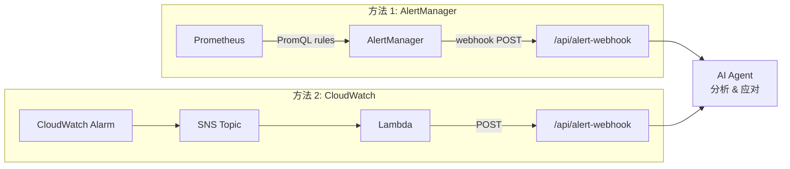

**Lambda 函数（Python）**：
```python
import json
import urllib3

def handler(event, context):
    # 解析 SNS 消息
    sns_message = json.loads(event['Records'][0]['Sns']['Message'])
    alarm_name = sns_message['AlarmName']
    reason = sns_message['NewStateReason']

    # 调用 AWSops AI API
    http = urllib3.PoolManager()
    response = http.request('POST',
        'http://<EC2-IP>:3000/awsops/api/alert-webhook',
        body=json.dumps({
            'alerts': [{
                'status': 'firing',
                'labels': {'alertname': alarm_name, 'severity': 'critical'},
                'annotations': {'description': reason},
            }]
        }),
        headers={'Content-Type': 'application/json'}
    )
    return {'statusCode': 200}
```

### 两种方法对比

| 项目 | AlertManager | CloudWatch + SNS |
|------|-------------|-----------------|
| 指标来源 | Prometheus（以 K8s 为主） | CloudWatch（整个 AWS） |
| 告警规则 | PromQL | CloudWatch Metric Math |
| 额外安装 | 启用 AlertManager | 创建 1 个 Lambda |
| 适用环境 | EKS Pod/Node 监控 | AWS 服务整体监控 |
| 成本 | 免费（开源） | Lambda/SNS 调用费用 |

:::tip 推荐配置
如果主要目的是监控 EKS 集群，请使用 **AlertManager**；如果要覆盖所有 AWS 服务，请使用 **CloudWatch + SNS**。同时使用两种方法，可以将 Kubernetes 和 AWS 两侧的告警都交由 AI Agent 分析。
:::

</details>

<details>
<summary>为什么 Steampipe pg Pool 比 CLI 快 660 倍？</summary>

### CLI 与 pg Pool 对比

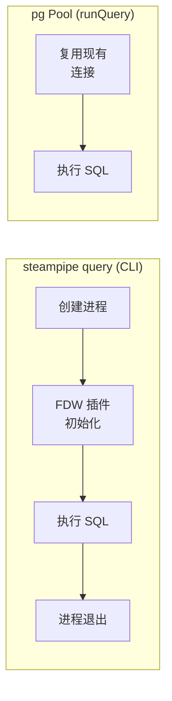

### 基准测试

| 方式 | `SELECT COUNT(*) FROM aws_ec2_instance` | 备注 |
|------|----------------------------------------|------|
| `steampipe query "SQL"` CLI | ~3,300ms | 每次创建进程 + FDW 初始化 |
| pg Pool `runQuery()` | ~5ms（缓存命中）、~200ms（缓存未命中） | 复用连接池 |
| **性能差异** | **~660 倍**（以缓存命中为准） | |

### CLI 慢的原因

1. **进程创建开销**：每次都执行 `steampipe` 二进制文件
2. **FDW 初始化**：每次都加载 Foreign Data Wrapper 插件
3. **连接建立**：每次都新建 PostgreSQL 连接
4. **结果序列化**：转换为 JSON/文本后输出到 stdout

### pg Pool 快的原因

```typescript
// src/lib/steampipe.ts
const pool = new Pool({
  host: '127.0.0.1',
  port: 9193,
  max: 10,                    // 维持 10 个连接
  idleTimeoutMillis: 30000,   // 空闲 30 秒后归还
  connectionTimeoutMillis: 15000, // 15 秒内连接失败则报错
  statement_timeout: 30000,   // 30 秒查询超时
});
```

1. **连接复用**：由 Pool 管理 10 个连接，不每次新建
2. **node-cache**：相同查询结果在内存中缓存 5 分钟（键：`sp:{accountId}:{SQL}`）
3. **Steampipe 服务模式**：通过 `steampipe service start` 保持 FDW 始终处于加载状态
4. **无二进制开销**：在 Node.js 进程内直接进行 PostgreSQL 协议通信

### 批量查询

在仪表板首页执行 20 个以上查询时使用 `batchQuery()`：

```typescript
// 每批 8 个并行执行 (池中 10 个连接里预留 2 个给其他请求)
const results = await batchQuery(queries);  // BATCH_SIZE = 8
```

</details>

<details>
<summary>如果 Steampipe 挂掉，仪表板会怎样？</summary>

Steampipe 进程中断时，pg Pool 连接会失败。各层的行为如下。

### 故障传播流程

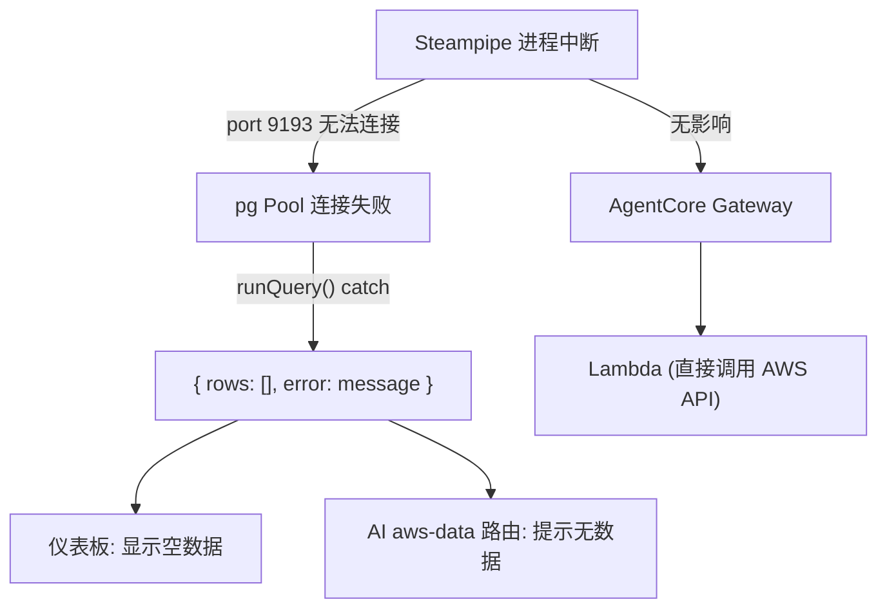

### 各层影响

| 层 | Steampipe 中断时 | 说明 |
|------|-------------------|------|
| **仪表板页面** | 显示空数据 | `runQuery()` 返回 `{ rows: [], error }`，UI 渲染空表格 |
| **AI aws-data 路由** | 提示"无法查询数据" | Steampipe SQL 执行失败 → Bedrock 说明错误情况 |
| **AI Gateway 路由** | **正常工作** | AgentCore → Lambda 直接调用 AWS API（与 Steampipe 无关） |
| **已缓存的数据** | 5 分钟内正常显示 | node-cache TTL 内缓存命中时不访问 Steampipe |
| **Cost 数据** | 回退到快照 | 使用 `data/cost/` 目录中最近的 JSON 文件替代（最长保留 180 天） |

### 错误处理方式

```typescript
// src/lib/steampipe.ts — runQuery()
try {
  const result = await pool.query(sql);
  return { rows: result.rows };
} catch (error) {
  // 绝不 throw → 向调用方返回安全的空结果
  return { rows: [], error: error.message };
}
```

所有查询都被 try/catch 包裹，因此 **Steampipe 故障不会导致 Next.js 服务器崩溃**。

### 恢复方法

```bash
# 1. 检查 Steampipe 服务状态
steampipe service status

# 2. 重启
steampipe service restart --force

# 3. 在 Next.js 中重置连接池 (管理员 API 或重启服务器)
# 调用 resetPool() 后会尝试重连最多 15 次 (间隔 1 秒)
```

### 僵尸连接自动清理

Steampipe FDW 的慢 API 调用累积后可能耗尽连接池。为防止这一点，每 2 分钟自动清理僵尸连接：

```typescript
// 自动终止运行超过 5 分钟的 SELECT 查询
// client_addr IS NOT NULL (排除 FDW 内部连接)
pg_terminate_backend(pid)
```

</details>

<details>
<summary>pg Pool 的缓存工作原理是什么？</summary>

AWSops 使用基于 **node-cache** 的内存缓存，将 Steampipe 查询结果保留 5 分钟。

### 缓存流程

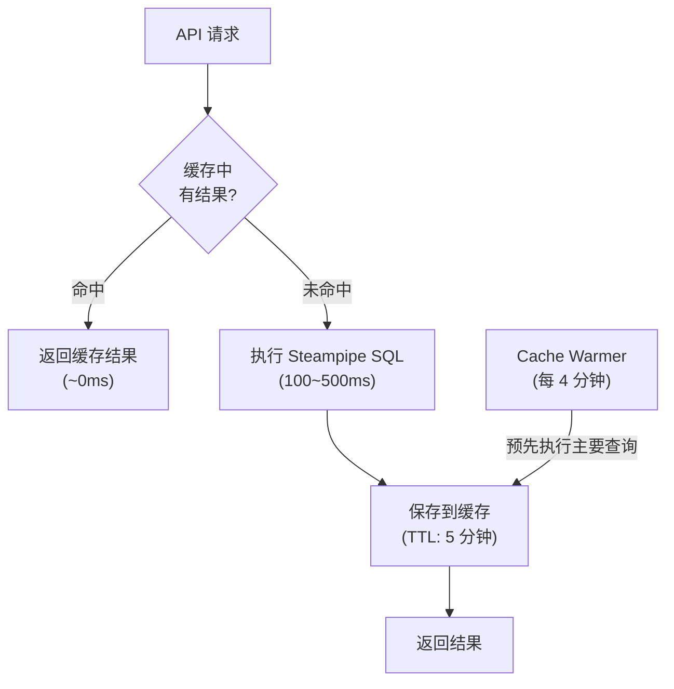

### 缓存键结构

```
sp:{accountId}:{SQL文}
```

- **多账户**：按账户分离（`sp:111111111111:SELECT...`）
- **单账户**：`sp:__all__:SELECT...`
- **Cost 可用性**：`cost:available:{accountId}`（TTL: 1 小时）

### 配置值

| 项目 | 值 | 说明 |
|------|---|------|
| 默认 TTL | 300 秒（5 分钟） | 普通查询缓存寿命 |
| Cost 可用性 TTL | 3,600 秒（1 小时） | `checkCostAvailability` 结果 |
| 检查周期 | 60 秒 | 过期键清理间隔 |
| Cache Warmer 周期 | 240 秒（4 分钟） | 在 TTL（5 分钟）过期前刷新 |

### 缓存失效

| 方式 | 触发 | 行为 |
|------|-------|------|
| **刷新按钮** | 用户在 UI 中点击 | `bustCache: true` → 忽略缓存后重新查询 |
| **clearCache()** | 管理员 API | `cache.flushAll()` 全部删除 |
| **resetPool()** | 重建连接池时 | 缓存 + 连接池同时初始化 |
| **自然过期** | TTL 到期 | 每 60 秒自动清理过期键 |

### Cache Warmer（预缓存）

服务器启动 5 秒后开始，每 4 分钟在后台执行主要仪表板查询，提前填充缓存：

```typescript
// src/lib/cache-warmer.ts
// 预热对象: EC2, S3, RDS, Lambda, VPC, IAM, ECS, DynamoDB 等约 22 个查询
// 排除 CloudWatch 监控查询 (FDW 慢 API 会引发僵尸连接)
```

- 多账户：最多按顺序预热 3 个账户
- 通过 `isWarming` 标志防止重复执行

</details>

<details>
<summary>执行 batchQuery 时会产生 AWS API 费用吗？</summary>

### 核心答案

**缓存命中时费用为零，仅在缓存未命中时才会产生 AWS API 调用**。

### 费用产生结构

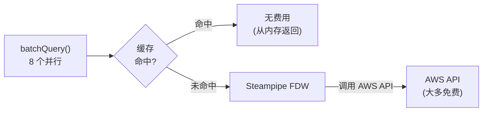

### AWS API 调用费用

Steampipe FDW 在缓存未命中时调用**实际的 AWS API**。大多数 `Describe`/`List` API 是免费的：

| API 类型 | 费用 | 示例 |
|----------|------|------|
| EC2 Describe* | 免费 | `DescribeInstances`, `DescribeVpcs` |
| S3 List* | $0.005/1,000 次 | `ListBuckets` |
| IAM List/Get* | 免费 | `ListUsers`, `ListRoles` |
| CloudWatch GetMetricData | $0.01/1,000 次 | 指标查询 |
| Cost Explorer GetCostAndUsage | $0.01/次 | 成本数据 |
| CloudTrail LookupEvents | 免费（最近 90 天） | 事件查询 |

### 实际费用场景

**仪表板首页加载（约 22 个查询）**：

| 情况 | API 调用 | 预计费用 |
|------|----------|----------|
| 缓存命中（5 分钟内再次访问） | 0 次 | $0 |
| 缓存未命中（首次加载） | ~22 次 Describe/List | ~$0（大多为免费 API） |
| Cache Warmer 1 小时（15 次） | ~330 次 | ~$0 |

**产生费用的主要 API**：

| API | 单价 | 月度预估（每 4 分钟预热） |
|-----|------|----------------------|
| Cost Explorer | $0.01/次 | ~$3.24（6 次/小时 × 24 小时 × 30 天 × $0.01） |
| CloudWatch GetMetricData | $0.01/1,000 次 | 低于 ~$0.01 |
| S3 ListBuckets | $0.005/1,000 次 | 低于 ~$0.01 |

### 成本优化设计

1. **5 分钟缓存**：再次访问同一页面时 API 调用为零
2. **Cache Warmer**：在用户请求前预先缓存 → 大部分请求为缓存命中
3. **Cost 可用性 1 小时缓存**：`checkCostAvailability()` 每小时仅 probe 1 次
4. **批大小 8**：池中 10 个连接仅使用 8 个，2 个预留给实时请求
5. **排除 CloudWatch 查询预热**：慢 FDW API 会引发僵尸连接 → 仅在用户请求时执行

:::info Cost Explorer 成本节省
Cost Explorer API 是费用最高的 API。`checkCostAvailability()` 使用专用的 10 秒超时快速判定，在 MSP 环境中通过 `costEnabled: false` 设置直接阻止 API 调用。
:::

</details>

<details>
<summary>AI 意图分类（Intent Classification）是如何工作的？</summary>

### Route Registry 模式

AWSops 的 AI 路由以 **Route Registry** 作为单一数据源。

```typescript
// src/app/api/ai/route.ts
const ROUTE_REGISTRY: Record<string, RouteConfig> = {
  code:      { handler: 'code', display: 'Code Interpreter', tools: [...], examples: [...] },
  network:   { gateway: 'network', display: 'Network Gateway (17 tools)', tools: [...] },
  container: { gateway: 'container', display: 'Container Gateway (24 tools)', tools: [...] },
  iac:       { gateway: 'iac', tools: [...] },
  data:      { gateway: 'data', tools: [...] },
  security:  { gateway: 'security', tools: [...] },
  monitoring:{ gateway: 'monitoring', tools: [...] },
  cost:      { gateway: 'cost', tools: [...] },
  'aws-data':{ handler: 'sql', display: 'Steampipe + Bedrock', tools: [...] },
  general:   { gateway: 'ops', tools: [...] },
};
```

### 分类流程

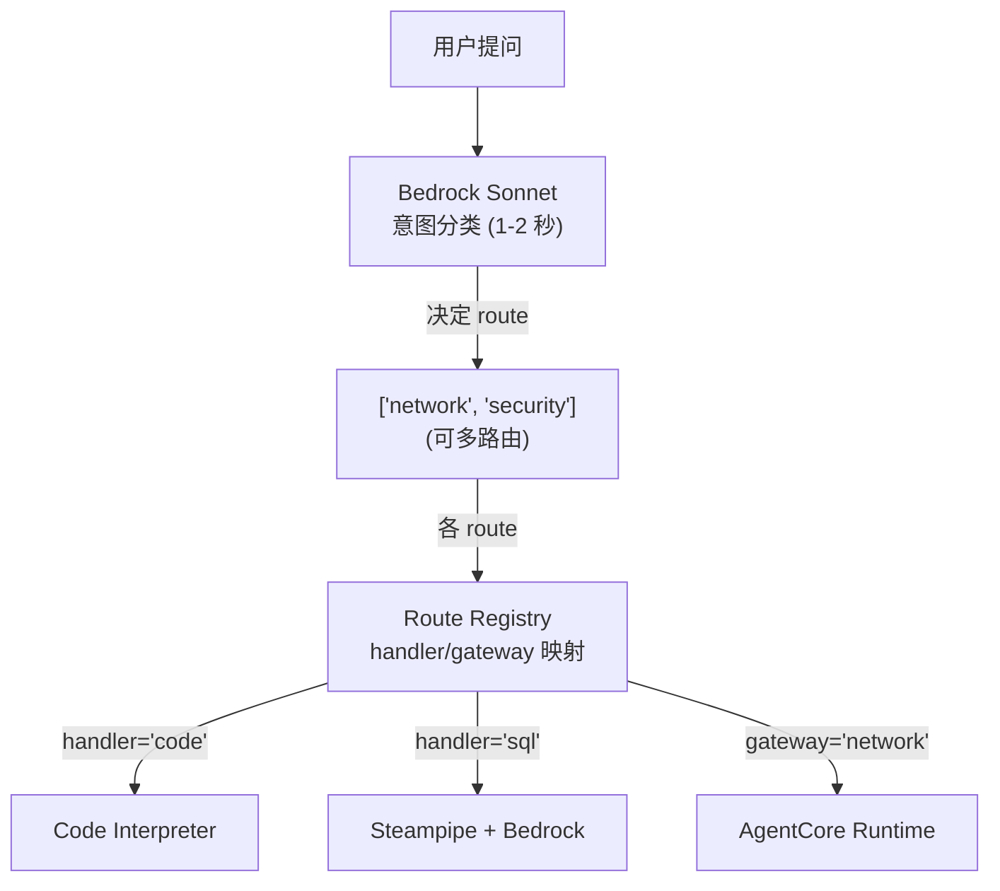

### 分类优先级

Sonnet 分析问题时会参考 Route Registry 的 `tools` 和 `examples`：

| 优先级 | 路由 | 判断依据 |
|----------|--------|----------|
| 1 | code | "执行代码"、"Python"、"计算"、"可视化" |
| 2 | network | "无法连接"、"VPC"、"Security Group"、"TGW" |
| 3 | container | "Pod"、"EKS"、"ECS"、"Istio" |
| 4~8 | iac~cost | 各领域关键词 |
| 9 | aws-data | "列表"、"多少个"、"状态"、"现状"（列举/查询） |
| 10 | general | 不属于以上任何一项的问题 |

### 多路由

一个问题对应多个路由时**同时执行**：

```typescript
// 例: "检查安全组并分析成本影响" → ["security", "cost"]
const results = await Promise.all(
  routes.map(route => invokeHandler(messages, route))
);
// 合并结果后作为一个响应返回
```

</details>

<details>
<summary>Cognito + Lambda@Edge 认证流程是怎样的？</summary>

### 整体流程

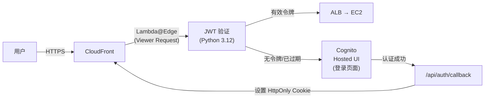

### 各阶段详情

**1. Lambda@Edge（us-east-1）**
- 挂接到 CloudFront 的 **Viewer Request** 事件
- 在每个请求中验证 `awsops_token` Cookie 中的 JWT
- 检查 JWT 签名、过期时间、issuer
- 有效则将请求转发到 Origin（EC2）
- 无效则重定向到 Cognito Hosted UI

**2. Cognito User Pool**
- 用户管理（注册、登录、MFA）
- 支持 OAuth 2.0 / OIDC 标准
- 通过 Hosted UI 提供登录页面

**3. 在 EC2 上识别用户**

```typescript
// src/lib/auth-utils.ts
export function getUserFromRequest(request: NextRequest): UserInfo {
  // 仅解码 awsops_token Cookie 中的 JWT payload
  // 无需重新验证签名 (Lambda@Edge 已完成验证)
  const payload = JSON.parse(Buffer.from(parts[1], 'base64').toString());
  return {
    email: payload.email || payload['cognito:username'],
    sub: payload.sub,  // Cognito 唯一用户 ID
  };
}
```

### HttpOnly Cookie 方式

| 项目 | 说明 |
|------|------|
| **Cookie 名称** | `awsops_token` |
| **HttpOnly** | `true` — JavaScript 无法访问（防御 XSS） |
| **Secure** | `true` — 仅通过 HTTPS 传输 |
| **登出** | `POST /api/auth` — 在服务端删除 Cookie |

### 为什么使用 HttpOnly Cookie？

- 无法通过 `document.cookie` 窃取令牌（防御 XSS）
- 浏览器自动发送 Cookie，客户端代码无需管理令牌
- 缺点：无法通过 `document.cookie` 删除，因此登出需要服务端 API

</details>

<details>
<summary>已经安装了 Prometheus，还能用于其他用途吗？</summary>

### 当前安装状态

通过 `scripts/07-setup-opencost.sh` 安装的 Prometheus 配置：

```bash
helm install prometheus prometheus-community/prometheus \
  --namespace opencost \
  --set server.persistentVolume.enabled=false \
  --set alertmanager.enabled=false \          # 禁用 AlertManager
  --set prometheus-node-exporter.enabled=true \  # 收集 Node 指标
  --set prometheus-pushgateway.enabled=false
```

| 组件 | 状态 | 说明 |
|---------|------|------|
| Prometheus Server | 启用 | 指标收集/存储/查询 |
| Node Exporter | 启用 | 节点 CPU/内存/磁盘/网络 |
| AlertManager | **禁用** | 告警路由（可启用） |
| PushGateway | 禁用 | 批处理作业指标（按需启用） |

### 已在收集的指标

通过 OpenCost + Node Exporter，已经收集了丰富的指标：

| 指标来源 | 收集项目 |
|------------|----------|
| **kube-state-metrics** | Pod 状态、Deployment 状态、Node 条件、资源请求/限制 |
| **Node Exporter** | CPU 使用率、内存、磁盘 I/O、网络流量 |
| **kubelet/cAdvisor** | 各容器 CPU/内存使用量 |
| **OpenCost** | 按 Pod/Namespace 的成本分摊 |

### 额外用途

**1. 直接执行 PromQL 查询（立即可用）**

```bash
# Prometheus 端口转发
kubectl port-forward -n opencost svc/prometheus-server 9090:80

# PromQL 示例
# 各节点 CPU 使用率
100 - (avg by(instance)(rate(node_cpu_seconds_total{mode="idle"}[5m])) * 100)

# Pod 内存使用量 Top 10
topk(10, container_memory_working_set_bytes{container!=""})

# 5 分钟内发生 OOMKill 的 Pod
kube_pod_container_status_last_terminated_reason{reason="OOMKilled"}
```

**2. 对接 Grafana（需额外安装）**

```bash
helm install grafana grafana/grafana \
  --namespace opencost \
  --set datasources."datasources\.yaml".apiVersion=1 \
  --set datasources."datasources\.yaml".datasources[0].name=Prometheus \
  --set datasources."datasources\.yaml".datasources[0].type=prometheus \
  --set datasources."datasources\.yaml".datasources[0].url=http://prometheus-server.opencost:80
```

**3. 收集自定义指标**

应用暴露 `/metrics` 端点后，Prometheus 会自动收集（ServiceMonitor 或 annotations 方式）。

**4. 扩展 AWSops 仪表板**

添加调用 Prometheus HTTP API 的 Next.js API 路由后，可以在 AWSops 仪表板中直接显示 Prometheus 指标：

```typescript
// 例: /api/prometheus/route.ts
const res = await fetch(
  `http://prometheus-server.opencost:80/api/v1/query?query=${encodeURIComponent(promql)}`
);
```

:::tip
Prometheus 默认保留 15 天的指标。如需长期保留，请添加 `--storage.tsdb.retention.time=30d` 设置。
:::

</details>

<details>
<summary>系统出现问题时如何自动接收告警？</summary>

在 AWSops 环境中配置自动告警的 3 种方法。

### 方法对比

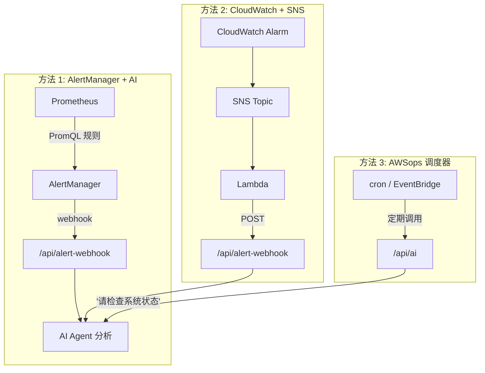

### 方法 1：AlertManager（EKS 监控）

启用当前禁用的 AlertManager 后即可检测 Kubernetes 事件：

```bash
# 启用 AlertManager
helm upgrade prometheus prometheus-community/prometheus \
  -n opencost --set alertmanager.enabled=true
```

**实用的触发场景：**

| 告警 | PromQL 规则 | 严重级别 |
|------|------------|--------|
| Pod 崩溃循环 | `rate(kube_pod_container_status_restarts_total[15m]) > 0` | critical |
| 节点 CPU 90%+ | `node_cpu_utilization > 0.9`（持续 10 分钟） | warning |
| PVC 容量 85%+ | `kubelet_volume_stats_used_bytes / kubelet_volume_stats_capacity_bytes > 0.85` | warning |
| Pod Pending 5 分钟+ | `kube_pod_status_phase{phase="Pending"} == 1`（持续 5 分钟） | warning |
| 发生 OOMKill | `kube_pod_container_status_last_terminated_reason{reason="OOMKilled"}` | critical |

### 方法 2：CloudWatch Alarms（全部 AWS 服务）

AWS 托管服务（EC2、RDS、ALB 等）通过 CloudWatch Alarm 检测：

```bash
# EC2 CPU 告警示例
aws cloudwatch put-metric-alarm \
  --alarm-name "AWSops-EC2-HighCPU" \
  --metric-name CPUUtilization \
  --namespace AWS/EC2 \
  --statistic Average \
  --period 300 \
  --threshold 90 \
  --comparison-operator GreaterThanThreshold \
  --evaluation-periods 2 \
  --alarm-actions $SNS_TOPIC_ARN
```

### 方法 3：定期 AI 健康检查（最简单）

通过 EventBridge 调度定期向 AI 助手请求检查：

```bash
# 每小时系统检查 (EventBridge → Lambda → AWSops AI API)
"请检查整个系统的状态。
 确认 EC2、RDS、EKS 集群的状态，
 如有异常请进行汇总。"
```

AI 通过 Steampipe 查询资源状态，检测到异常时生成报告。

:::tip 推荐配置
推荐 **方法 1 + 方法 2** 组合。EKS 使用 AlertManager 检测，AWS 服务使用 CloudWatch Alarm 检测，两条路径的分析结果都交给 AWSops AI。
:::

</details>

<details>
<summary>可以通过 Slack 自动接收故障报告吗？</summary>

### 架构

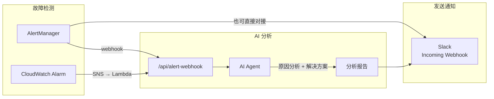

### 方法 1：AlertManager → Slack 直接对接（快速告警）

AlertManager 直接向 Slack 发送告警（无 AI 分析，即时发送）：

```yaml
# alertmanager-config.yaml
receivers:
  - name: 'slack-alerts'
    slack_configs:
      - api_url: 'https://hooks.slack.com/services/T.../B.../xxx'
        channel: '#ops-alerts'
        title: '{{ .GroupLabels.alertname }}'
        text: >-
          *严重级别:* {{ .CommonLabels.severity }}
          *说明:* {{ .CommonAnnotations.description }}
          *开始时间:* {{ .StartsAt }}
        send_resolved: true

route:
  receiver: 'slack-alerts'
  group_wait: 30s
  group_interval: 5m
```

### 方法 2：AI 分析报告 → Slack（深度分析）

AWSops AI 分析原因后将报告发送到 Slack：

```typescript
// src/app/api/alert-webhook/route.ts (新建)
export async function POST(request: NextRequest) {
  const payload = await request.json();

  // 1. 向 AI 请求分析
  const aiResponse = await fetch('http://localhost:3000/awsops/api/ai', {
    method: 'POST',
    headers: { 'Content-Type': 'application/json' },
    body: JSON.stringify({
      messages: [{
        role: 'user',
        content: `请分析以下告警，并给出原因和解决方法:\n${alertSummary}`
      }],
      stream: false,
    }),
  });

  // 2. 向 Slack 发送报告
  await fetch(SLACK_WEBHOOK_URL, {
    method: 'POST',
    body: JSON.stringify({
      blocks: [
        { type: 'header', text: { type: 'plain_text', text: '🚨 AWSops 故障报告' }},
        { type: 'section', text: { type: 'mrkdwn', text: `*告警:* ${alertName}` }},
        { type: 'section', text: { type: 'mrkdwn', text: `*AI 分析:*\n${aiAnalysis}` }},
        { type: 'section', text: { type: 'mrkdwn', text: `*建议措施:*\n${recommendations}` }},
      ],
    }),
  });
}
```

### 方法 3：CloudWatch → SNS → Slack（使用 Lambda）

将 AWS 服务告警发送到 Slack 的 CloudWatch 路径：

```python
# alert-to-slack-lambda.py
import json, urllib3

SLACK_WEBHOOK = 'https://hooks.slack.com/services/T.../B.../xxx'
AWSOPS_WEBHOOK = 'http://<EC2-IP>:3000/awsops/api/alert-webhook'

def handler(event, context):
    sns_message = json.loads(event['Records'][0]['Sns']['Message'])

    # 请求 AWSops AI 分析
    http = urllib3.PoolManager()
    ai_response = http.request('POST', AWSOPS_WEBHOOK,
        body=json.dumps({'alerts': [{'labels': {'alertname': sns_message['AlarmName']}}]}))

    # 发送到 Slack
    http.request('POST', SLACK_WEBHOOK,
        body=json.dumps({'text': f"*{sns_message['AlarmName']}*\n{ai_response.data.decode()}"}))
```

### Slack Incoming Webhook 设置

1. [Slack API](https://api.slack.com/apps) → 创建应用
2. 启用 **Incoming Webhooks**
3. 安装到工作区，选择频道
4. 复制 Webhook URL → 保存到 AlertManager 配置或 Lambda 环境变量

### 3 种方法对比

| 项目 | AlertManager 直接 | AI 分析报告 | CloudWatch + SNS |
|------|-------------------|---------------|-----------------|
| 告警速度 | 即时（30 秒以内） | 1-2 分钟（含 AI 分析） | 1 分钟以内 |
| 分析深度 | 仅告警内容 | 原因分析 + 解决方案 | 告警内容 + AI 分析 |
| 对象 | EKS/K8s 事件 | 所有来源 | AWS 服务 |
| 额外配置 | 启用 AlertManager | 实现 webhook API | 创建 Lambda |

:::tip 推荐配置
**AlertManager 直接 + AI 分析报告** 的组合最为有效：
- 即时告警：AlertManager → Slack（快速感知）
- 深度分析：AlertManager → AI webhook → Slack（原因分析 + 解决方案）
- 两条消息到达同一个 Slack 频道时，可以同时获得即时感知和分析结果。
:::

</details>
