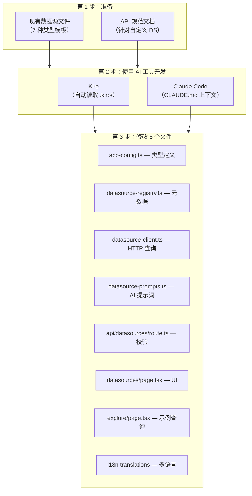

# 数据源开发 FAQ

关于扩展外部数据源类型的常见问题与解答。

<details>
<summary>如何添加新的数据源类型（例如 Elasticsearch、InfluxDB）？</summary>

AWSops 目前支持 7 种外部数据源类型：

| 类型 | 查询语言 | 用途 |
|------|----------|------|
| Prometheus | PromQL | 指标监控 |
| Loki | LogQL | 日志聚合 |
| Tempo | TraceQL | 分布式追踪 |
| ClickHouse | SQL | 分析型数据库 |
| Jaeger | REST API | 分布式追踪 |
| Dynatrace | DQL | APM |
| Datadog | REST API | 监控 |

每种类型都按照跨 **8 个文件**的一致模式实现，借助 AI 编码工具（Kiro 或 Claude Code）可以自动读取现有模式并生成新类型。



### 需要修改的 8 个文件

| # | 文件 | 添加内容 | 模板参考 |
|---|------|----------|------------|
| 1 | `src/lib/app-config.ts` | 在 `DatasourceType` union 中添加类型字面量 | 现有：`'prometheus' \| 'loki' \| ... \| 'datadog'` |
| 2 | `src/lib/datasource-registry.ts` | 在 `DATASOURCE_TYPES` 中添加元数据条目（label、icon、color、queryLanguage、healthEndpoint、defaultPort、placeholder、examples）。在 `detectDatasourceType()`、`detectDatasourceTypes()` 中添加韩语/英语关键词 | 复制 prometheus 块并修改 |
| 3 | `src/lib/datasource-client.ts` | 实现 `queryNewType()` 函数并注册到 `QUERY_HANDLERS` 映射。在 `testConnection()` 中添加健康检查逻辑 | `queryPrometheus()` 或 `queryClickHouse()` 模式 |
| 4 | `src/lib/datasource-prompts.ts` | 添加用于 AI 查询生成的系统提示词 | 参考现有 PromQL/LogQL 提示词 |
| 5 | `src/app/api/datasources/route.ts` | 在 `VALID_TYPES` 数组中添加新类型字符串 | 简单的数组追加 |
| 6 | `src/app/datasources/page.tsx` | 在 `TYPE_ICONS`、`TYPE_COLORS`、`TYPE_BG_COLORS`、`TYPE_LABELS`、`TYPE_PLACEHOLDERS` 中添加条目 | 复制现有 Record 条目 |
| 7 | `src/app/datasources/explore/page.tsx` | 在 `EXAMPLE_QUERIES`、`PLACEHOLDERS`、`TYPE_ICONS`、`AI_PLACEHOLDERS` 中添加条目 | 复制现有 Record 条目 |
| 8 | `src/lib/i18n/translations/{en,ko}.json` | 如有新的 UI 字符串则添加 i18n 键 | 参考现有 `datasources.*` 键 |

:::info 核心模式
所有查询函数都必须返回 `QueryResult` 接口（`columns`、`rows`、`metadata`）。这是 UI 和 AI 分析共同使用的规范化数据格式。
:::

### 使用 Kiro 添加

[Kiro](https://kiro.dev) 会自动读取项目的 `.kiro/` 目录以获取上下文：

- `.kiro/AGENT.md` — 项目架构与规则
- `.kiro/steering/project-structure.md` — 目录结构、数据源文件位置
- `.kiro/steering/coding-standards.md` — 编码规范

对于**知名数据源**（Elasticsearch、InfluxDB、Graphite 等），只需一个简单的提示词即可：

```
请将 Elasticsearch 添加为新的数据源类型。
参照现有 7 种数据源类型的模式，修改全部 8 个文件。
```

Kiro 会分析现有文件，并按照一致的模式生成 Elasticsearch 支持。

### 使用 Claude Code 添加

Claude Code 通过各目录中的 `CLAUDE.md` 文件理解项目：

- 根目录 `CLAUDE.md` — 整体架构、必要规则
- `src/lib/CLAUDE.md` — 库模块详情（datasource-registry.ts、datasource-client.ts 等）
- `src/app/CLAUDE.md` — 页面及 API 路由详情

**提示词示例：**

```
请将 InfluxDB（InfluxQL）添加为新的数据源类型。
参照现有 7 种类型的模式，修改全部 8 个文件。
默认端口是 8086，健康检查端点是 /ping。
```

### 添加不知名的数据源

对于 AI 工具不了解其 API 的**内部系统**或**小众监控工具**，需要**同时提供 API 规范文档**。

#### 需要提供的信息

| 项目 | 说明 | 示例 |
|------|------|------|
| **健康检查端点** | 用于连接测试的路径 | `GET /api/health` |
| **查询 API** | 数据查询请求格式 | `POST /api/v1/query` |
| **请求体** | 查询参数结构 | `{"query": "...", "from": "...", "to": "..."}` |
| **响应格式** | 返回数据结构 | `{"data": [{"timestamp": ..., "value": ...}]}` |
| **认证方式** | 支持的认证类型 | Bearer token、API key、Basic auth |

#### 提示词示例（利用 OpenAPI 规范）

```
请将 "CustomMetrics" 添加为新的数据源类型。
参照现有 7 种类型的模式，修改全部 8 个文件。

API 文档:
- 健康检查: GET /api/health → 200 OK
- 查询: POST /api/v1/query
  Body: {"query": "metric_name", "from": "2024-01-01T00:00:00Z", "to": "2024-01-02T00:00:00Z", "step": "5m"}
  Response: {"status": "ok", "data": [{"timestamp": 1704067200, "value": 42.5, "labels": {"host": "web-1"}}]}
- 认证: 在 Authorization 头中使用 Bearer token
- 默认端口: 9090
```

:::tip 利用 OpenAPI 规范文件
如果有 OpenAPI（Swagger）YAML/JSON 文件，可以生成更准确的代码：

```
请将 CustomMetrics 添加为数据源。
API 规范请参考附带的 openapi.yaml。
```

在 Kiro 中，只需将规范文件放置在项目内即可自动引用；在 Claude Code 中，将文件路径包含在提示词中即可。
:::

:::caution 必须注册 AI 路由关键词
添加新数据源时，必须在 `datasource-registry.ts` 的 `detectDatasourceType()` 函数中同时注册**韩语和英语关键词**。如果缺少这些关键词，AI 助手将无法把与该数据源相关的问题分类到正确的路由。
:::

### 验证清单

添加新数据源类型后，请确认以下各项：

- [ ] TypeScript 编译成功（`npm run build`）
- [ ] 在 Datasources 管理页面的类型下拉框中显示新类型
- [ ] Connection Test 成功（确认健康端点响应）
- [ ] 执行查询后结果被规范化为 `QueryResult` 格式
- [ ] AI 查询生成能以正确的查询语言工作
- [ ] 在 Explore 页面显示示例查询
- [ ] 韩语/英语 i18n 字符串均正常显示

</details>
